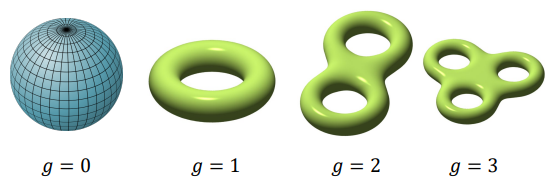
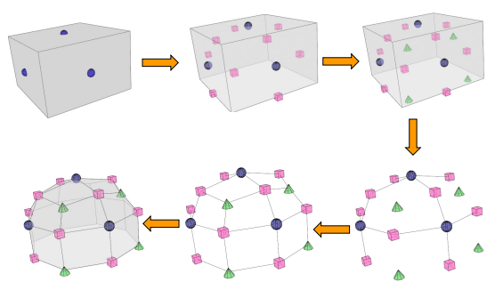
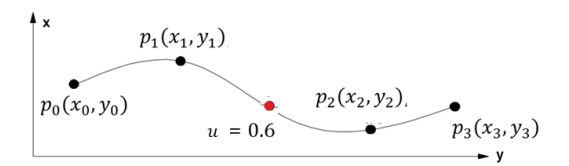
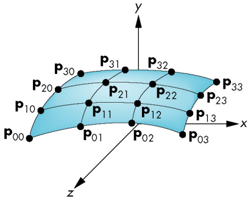
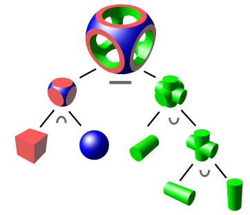
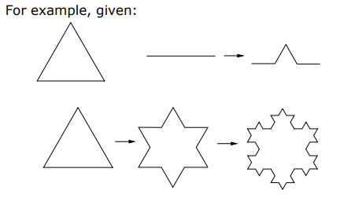

> 简单介绍了对象建模的几种方法与技术，包括从二维图形绘制到三维点云、多边形网格、分割曲面，以及隐式与参数化表面的应用，同时还简述了构造实体几何 (CSG) 和分形的特性及其构建方式。

# CG-01 对象建模

## 1. **二维绘图 (2D Drawing)**

二维绘图是将对象转换为像素模式并更新帧缓冲区中的对应像素。

- 直线绘制
    - 使用算法（如Bresenham算法）优化像素选择，通过整数运算高效绘制直线。
    - 判断线段与像素的接近程度，选择最接近的像素进行着色。
- 圆形绘制
    - 通过对称性减少计算量，逐步绘制圆的像素。
- 区域填充
    - **Flood-fill算法**：递归填充区域，分为4方向和8方向填充。
    - 检查当前像素是否为边界颜色或填充颜色，若不是则填充并递归处理相邻像素。

## 2. **三维点云 (3D Point Clouds)**

三维点云是无结构的三维点样本集合，每个点包含几何信息（如坐标）及其他属性（如颜色、法向量）。

#### 数据采集方式：

- 激光雷达（Lidar）：通过红外光脉冲测量距离。
- 结构光：通过投影光栅图案获取深度信息。
- 多视图计算机视觉：从多个视角重建三维点云。

#### 优势：

- **实时采集**：适合实时应用（如自动驾驶）。
- **无需拓扑信息**：点云本身不包含连接信息，处理简单。

#### 劣势：

- **几何计算困难**：缺乏拓扑结构，难以直接进行表面重建。
- **拓扑连接信息缺失**：需要额外处理以生成网格或其他结构。

#### 特殊处理：

- **结构化点云**：将点云表示为二维图像，利用成熟的图像处理技术进行分析。

## 3. **多边形网格 (Polygon Meshes)**

多边形网格通过顶点 (V)、边 (E)、面 (F) 表示多面体对象的形状。

- 每个面可以通过定义顶点的排列顺序来指定方向。
    - 方向可以是**逆时针 (counter-clockwise) **或**顺时针 (clockwise) **。
- 方向决定了面的法向方向。通常，逆时针顺序是“正面”。
- 可以使用**右手法则** (Right-hand rule) 来进行判断。

- 如果一个网格的所有面都能保持一致的方向（全部逆时针或全部顺时针），并且每条边在其相邻的两个面中有相反的方向，则该网格是**可定向的 (orientable) **。
- 并非所有网格都是可定向的。
    - 例如：
        - 莫比乌斯带 (Möbius strip)
        - 克莱因瓶 (Klein bottle)
        - ……

- **欧拉公式**：
    对于闭合无孔的凸多面体，顶点数 V、边数 E、面数 F 满足关系：
    $$
    V−E+F=2
    $$

对于具有孔洞或边界的网格，公式需根据曲面属 (Genus) 和边界调整。

- **曲面属 (Genus)**：
    定义为：可以在曲面上绘制的不相交的**简单闭合曲线的最大数量**，并且这些曲线不会将曲面分割为多个部分。

    表示曲面的孔洞数量，影响欧拉公式的计算。

    

- 对于具有曲面属 g 的**封闭且可定向的流形网格**，顶点 (V)、边 (E) 和面 (F) 的数量之间的关系, 由欧拉公式给出：$V-E+F=2-2g=χ$, 其中 $χ$ 被称为**欧拉示性数 (Euler characteristic)**。

- 对于具有曲面属 g 和 b 个边界的**可定向流形网格 (orientable manifold mesh)**，欧拉公式为：$V-E+F=2-2g-b$

#### 数据结构：

- **面-顶点表**：记录顶点坐标和面信息。
- **半边结构**：支持高效的拓扑操作。
- **其他结构**：如翼边结构、四边结构等。

#### 优势：

- 支持任意几何和拓扑结构。
- 可表示锐边特征，支持自适应细化。
- 渲染效率高。

#### 劣势：

- 平滑变形困难。
- 多边形边界在近距离观察时可能明显。

## 4. **分割曲面 (Subdivision Surfaces)**

分割曲面通过递归细化生成平滑曲面。

#### 常见方法：

- **Catmull-Clark算法**：适用于四边形网格，生成平滑曲面。

    

- **Loop算法**：适用于三角形网格。

- **Doo-Sabin算法**：生成平滑的多边形曲面。

- **Butterfly算法**：插值细分算法。

#### 应用：

- 复杂曲面建模，适合需要高平滑度的场景。

## 5. **隐式表面 (Implicit Surfaces)**

隐式表面通过隐式函数 $f(x,y,z)=0$ 定义，表示满足该方程的点集合。

#### 特性：

- Signed Distance Field (SDF)
    - 定义点到表面的最近距离。
    - $f(x)=0$ 表示表面，$f(x)<0$ 表示在内部，$f(x)>0$ 表示在外部。

#### 优势：

- 高效判断点是否在表面内。

#### 劣势：

- 难以生成表面上的具体点。
- 难以拼接多个隐式表面并保持连续性。
- 难以表示隐式表面的有限部分。

## 6. **参数化表面 (Parametric Surfaces)**

参数化表面通过参数化方程定义，通常使用两个参数 s,t 控制表面形状。

#### 参数化曲线 (三次参数多项式)

$$
\widetilde{P}(u)=U×M×P
$$

- **U** 是一个 1×4 的参数矩阵，形式为：
    $$
    U=[u^3\ \ u^2\ \ u\ \ 1]
    $$
    其中 $0≤u≤1$

- **P** 是一个 4×1 的矩阵，称为**几何矩阵** (geometry matrix)：
    $$
    P=[p_0\ \  p_1\ \  p_2\ \  p_3]
    $$
    它表示一组控制点，用于操控曲线的形状。

- **M** 是一个 4×4 的矩阵，称为**基矩阵** (basis matrix)：
    它定义了曲线的基本属性，例如曲线的类型、控制点的影响区域，以及曲线是否通过两个端点的控制点。

- 假设 $p_0(x0,y0)、p_1(x1,y1)、p_2(x2,y2)、p_3(x3,y3) $是四个控制点。给定基矩阵 M 的值，我们可以通过改变参数 u 的值，计算出曲线上任意点的 x 和 y 坐标，生成曲线图形。

    

#### 参数化曲面 (Parametric Surfaces)

$$
\widetilde{P}(s,t)=S×M×P×M^T×T^T
$$

- **S 和 T** 是参数 $s$ 和 $t$ 的 1×4 矩阵，形式为：$S=[s^3\ \  s^2\ \  s\ \  1]$, $T=[t^3\ \  t^2\ \  t\ \  1]$, 其中 $0≤s,t≤1$。

- **P** 是一个 4×4 的矩阵，称为**几何矩阵 (geometry matrix)**。
    它是一组控制点的集合，用于操控曲面形状。

- **M** 是一个 4×4 的矩阵，称为**基矩阵 (basis matrix)**。
    它定义了曲面的基本属性，例如：曲面的类型、每个控制点的影响范围，以及曲面是否通过两端的控制点。

    

#### 优势：

- 易于实现平滑变形，通过修改控制点即可调整表面形状。

#### 劣势：

- 渲染开销较高，需要对每个参数组合进行计算。

## 7. **体素表示 (Voxel Representation)**

> 没讲

体素是三维像素，用于表示对象的体积。

#### 特性：

- 适合体积建模和体绘制。
- 常用于医学成像、地形建模等领域。

## 8. **构造实体几何 (Constructive Solid Geometry, CSG)**

通过布尔操作（如并集、交集、差集）组合简单对象生成复杂实体。

#### 关键操作：

- **并集 (Union)**：合并两个对象。
- **交集 (Intersection)**：保留两个对象的公共部分。
- **差集 (Difference)**：从一个对象中减去另一个对象。

#### 优势：

- 操作可逆，易于修改。
- 适合复杂实体的建模。

#### 劣势：

- 修改后需重新计算所有操作。
- 计算开销较大。

## 9. **分形 (Fractals)**

分形对象具有自相似性，适用于自然场景（如山脉、树木、海岸线等）的建模。

#### 生成方法：

- 通过递归函数生成细节。
- 引入随机因子（如随机调整宽度、高度、位置）以提高真实感。

#### 优势：

- 生成细节丰富的对象。

#### 劣势：

- 无限分辨率的细节可能不符合真实物体的特性。