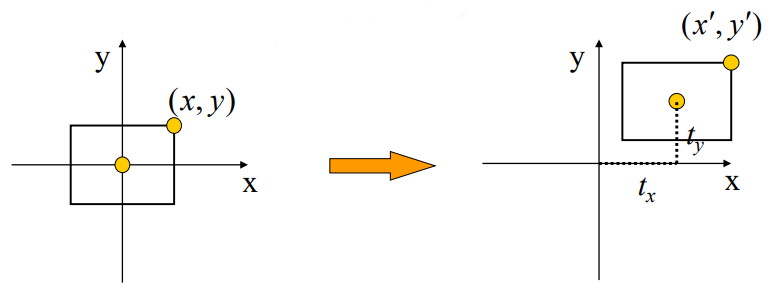
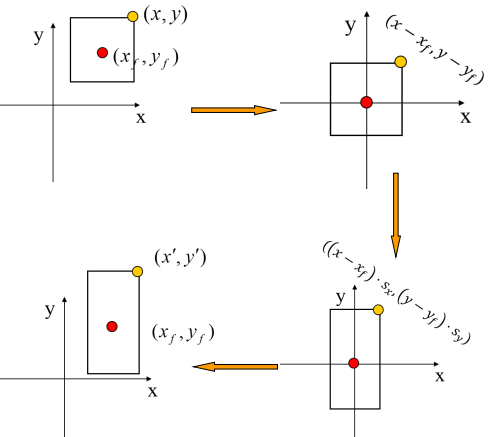
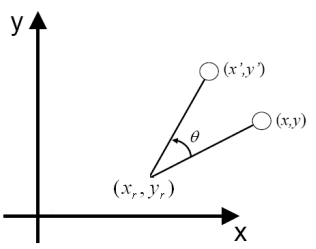
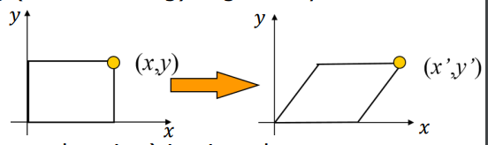
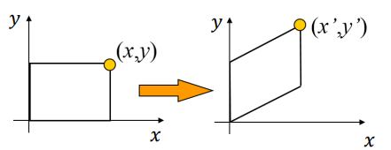
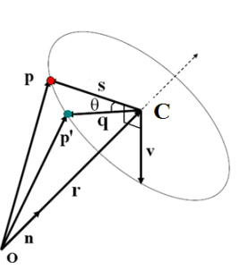
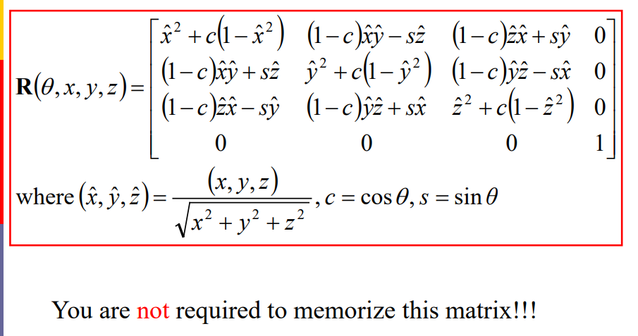

> 这一块内容可以直接看Games101课程关于Transformation的讲解，更容易理解一些。齐次坐标是精华。二编补充了习题部分。

# CG-02 变换

## 1. 基础数学

### 1.1 三角学
- **定义 (Definition)**: 研究三角形的边长和角度之间的关系
  
- **公式 (Formulas)**:
  $$
  a = c \cdot \cos \alpha, \quad b = c \cdot \cos \beta
  $$
  $$
  a = c \cdot \sin \beta, \quad b = c \cdot \sin \alpha
  $$
  $$
  b = a \cdot \tan \alpha, \quad a = b \cdot \tan \beta
  $$

### 1.2 三角学性质
- $$ \sin^2 \alpha + \cos^2 \alpha = 1 $$
- $$ \sin(-\alpha) = -\sin \alpha $$
- $$ \cos(-\alpha) = \cos \alpha $$
- $$ \cos \alpha = \sin \left( \frac{\pi}{2} - \alpha \right) $$
- $$ \sin(\alpha + \beta) = \sin \alpha \cos \beta + \cos \alpha \sin \beta $$
- $$ \cos(\alpha + \beta) = \cos \alpha \cos \beta - \sin \alpha \sin \beta $$

## 2. 矩阵 ⭐

### 2.1 矩阵定义
- 矩阵是一个矩形数组，可以包含数值、表达式或函数。 
  
- 在计算机图形学中，通常只考虑数值矩阵。 
  
- 方阵 (Square Matrix): 当矩阵的行数和列数相等时，称为方阵。  

### 2.2 基本矩阵运算

#### 2.2.1 矩阵加法与减法 (Addition/Subtraction)
- 对应元素相加或相减。

#### 2.2.2 标量乘法
- 每个矩阵元素乘以标量 $\lambda$。

#### 2.2.3 转置 (Transpose)
- 行列互换。 

#### 2.2.4 矩阵乘法
- 左矩阵的列数必须等于右矩阵的行数。  
  
  公式：
  $$
  c_{ij} = \sum_{k=1}^n a_{ik} \cdot b_{kj}
  $$
  

#### 2.2.5 逆矩阵
- 如果方阵的逆矩阵存在，则称该矩阵为非奇异矩阵或可逆矩阵。
  - 矩阵 $A$ 的逆记为 $A^{-1}$，满足 $A \cdot A^{-1} = I$  

- 正交矩阵 (Orthogonal Matrix): 一个矩阵的转置等于其逆矩阵。 
  - 满足 $Q \cdot Q^T = I$

## 3. 二维变换 (2D Transformations)

### 3.1 平移 (Translation)

- **公式**:
  $$
  x' = x + t_x, \quad y' = y + t_y
  $$

- **矩阵形式**:
  $$
  \begin{bmatrix}
  x' \\ y' \\ 1
  \end{bmatrix}
  =
  \begin{bmatrix}
  1 & 0 & t_x \\
  0 & 1 & t_y \\
  0 & 0 & 1
  \end{bmatrix}
  \cdot
  \begin{bmatrix}
  x \\ y \\ 1
  \end{bmatrix}
  $$
  $$P'=T(t_x,t_y)\cdot P$$

### 3.2 缩放 (Scaling)

- **公式**:
  $$
  x' = x \cdot s_x, \quad y' = y \cdot s_y
  $$

- **矩阵形式**:
  $$
  \begin{bmatrix}
  x' \\ y' \\ 1
  \end{bmatrix}
  =
  \begin{bmatrix}
  s_x & 0 & 0 \\
  0 & s_y & 0 \\
  0 & 0 & 1
  \end{bmatrix}
  \cdot
  \begin{bmatrix}
  x \\ y \\ 1
  \end{bmatrix}
  $$
  $$P'=S(s_x,s_y)\cdot P$$
  
- **关于任意参考点的缩放**:
  
  1. 平移参考点到原点。
  2. 关于原点缩放。
  3. 平移回原位置。
  
  $$P'=T(x_f,y_f)\cdot S(s_x,s_y) \cdot T(-x_f,-y_f) \cdot P$$

### 3.3 旋转 (Rotation)

- **关于原点的旋转**:
  $$
  x' = x \cdot \cos \theta - y \cdot \sin \theta
  $$
  $$
  y' = x \cdot \sin \theta + y \cdot \cos \theta
  $$

- 矩阵形式:
  $$
  \begin{bmatrix}
  x' \\ y' \\ 1
  \end{bmatrix}
  =
  \begin{bmatrix}
  \cos \theta & -\sin \theta & 0 \\
  \sin \theta & \cos \theta & 0 \\
  0 & 0 & 1
  \end{bmatrix}
  \cdot
  \begin{bmatrix}
  x \\ y \\ 1
  \end{bmatrix}
  $$
  $P'=R(\theta)\cdot P$
  
- **关于任意点的旋转**:
  
  1. 平移旋转点到原点。
  2. 关于原点旋转。
  3. 平移回原位置。
  
  $$x' = x_r + (x - x_r) \cdot \cos \theta - (y - y_r) \cdot \sin \theta$$  
  
  $$y' = y_r + (x - x_r) \cdot \sin \theta + (y - y_r) \cdot \cos \theta$$
  
  $$P'=T(x_r,y_r)\cdot R(\theta) \cdot T(-x_r,-y_r) \cdot P$$

### 3.4 错切 (Shearing)
- **水平错切 (Horizontal Shearing)**:
  
  
  $$
  x' = x + \lambda_x \cdot y, \quad y' = y
  $$
  
- **垂直错切 (Vertical Shearing)**:
  
  
  $$
  x' = x, \quad y' = y + \lambda_y \cdot x
  $$
  
- **矩阵形式**:
  $$
  \text{水平错切 (Horizontal Shearing): }
  \begin{bmatrix}
  1 & \lambda_x & 0 \\
  0 & 1 & 0 \\
  0 & 0 & 1
  \end{bmatrix}
  $$
  $$
  \text{垂直错切 (Vertical Shearing): }
  \begin{bmatrix}
  1 & 0 & 0 \\
  \lambda_y & 1 & 0 \\
  0 & 0 & 1
  \end{bmatrix}
  $$

## 4. 三维变换 (3D Transformations)

### 4.1 平移 (Translation)
- **公式**:
  $$
  x' = x + t_x, \quad y' = y + t_y, \quad z' = z + t_z
  $$

- **矩阵形式**:
  $$
  \begin{bmatrix}
  x' \\ y' \\ z' \\ 1
  \end{bmatrix}
  =
  \begin{bmatrix}
  1 & 0 & 0 & t_x \\
  0 & 1 & 0 & t_y \\
  0 & 0 & 1 & t_z \\
  0 & 0 & 0 & 1
  \end{bmatrix}
  \cdot
  \begin{bmatrix}
  x \\ y \\ z \\ 1
  \end{bmatrix}
  $$

### 4.2 缩放 (Scaling)
- 公式:
  $$
  x' = x \cdot s_x, \quad y' = y \cdot s_y, \quad z' = z \cdot s_z
  $$

- 矩阵形式:
  $$
  \begin{bmatrix}
  x' \\ y' \\ z' \\ 1
  \end{bmatrix}
  =
  \begin{bmatrix}
  s_x & 0 & 0 & 0 \\
  0 & s_y & 0 & 0 \\
  0 & 0 & s_z & 0 \\
  0 & 0 & 0 & 1
  \end{bmatrix}
  \cdot
  \begin{bmatrix}
  x \\ y \\ z \\ 1
  \end{bmatrix}
  $$

### 4.3 旋转 (Rotation) :whale2:
- **关于坐标轴的旋转**:
  
  - **绕 $x$ 轴旋转 (Rotation About $x$-Axis)**:
    $$
    \begin{bmatrix}
    1 & 0 & 0 & 0 \\
    0 & \cos \theta & -\sin \theta & 0 \\
    0 & \sin \theta & \cos \theta & 0 \\
    0 & 0 & 0 & 1
    \end{bmatrix}
    $$
    旋转90度的矩阵为：
    $$
    \begin{bmatrix}
    1 & 0 & 0 & 0 \\
    0 & 0 & -1 & 0 \\
    0 & 1 & 0 & 0 \\
    0 & 0 & 0 & 1
    \end{bmatrix}
    $$
    
  - **绕 $y$ 轴旋转 (Rotation About $y$-Axis)**:
    $$
    \begin{bmatrix}
    \cos \theta & 0 & \sin \theta & 0 \\
    0 & 1 & 0 & 0 \\
    -\sin \theta & 0 & \cos \theta & 0 \\
    0 & 0 & 0 & 1
    \end{bmatrix}
    $$
    旋转90度的矩阵为：
    $$
    \begin{bmatrix}
    0 & 0 & 1 & 0 \\
    0 & 1 & 0 & 0 \\
    -1 & 0 & 0 & 0 \\
    0 & 0 & 0 & 1
    \end{bmatrix}
    $$
    
  - **绕 $z$ 轴旋转 (Rotation About $z$-Axis)**:
    $$
    \begin{bmatrix}
    \cos \theta & -\sin \theta & 0 & 0 \\
    \sin \theta & \cos \theta & 0 & 0 \\
    0 & 0 & 1 & 0 \\
    0 & 0 & 0 & 1
    \end{bmatrix}
    $$
    旋转90度的矩阵为：
    $$
    \begin{bmatrix}
    0 & -1 & 0 & 0 \\
    1 & 0 & 0 & 0 \\
    0 & 0 & 1 & 0 \\
    0 & 0 & 0 & 1
    \end{bmatrix}
    $$
  
- **任意轴旋转 (Rotation About an Arbitrary Axis)**:
  
  绕任意轴旋转需要使用角轴参数法，并将其转化为矩阵表示。
  
  
  
  1. **旋转轴**
  
      - 旋转轴由一个单位向量 $n=(n_x,n_y,n_z)$ 表示，定义了旋转的方向。
  
      - 该向量通常是一个归一化向量，即满足：
  
          $∥\textbf{n}∥=n_x^2+n_y^2+n_z^2=1$
  
          $\textbf{n}=\frac{(x,y,z)}{\sqrt{x^2+y^2+z^2}}$
  
  2. **旋转角度**
  
      - 旋转角度 $θ$ 表示绕旋转轴旋转的角度，通常以弧度为单位。
  
  3. **旋转点**
  
      - 被旋转的点 $\textbf{p}=(x,y,z)$ 是旋转操作的输入。
  
  4. **旋转公式**：
      $$
      \textbf{n}=\frac{(x,y,z)}{\sqrt{x^2+y^2+z^2}}
      $$
      
      $$
      \textbf{r} = (\textbf{n}⋅\textbf{p})\textbf{n}
      $$
      
      $$
      \textbf{s} = \textbf{p}-\textbf{r}
      $$
  
      $$
      \textbf{v} = \textbf{n}×\textbf{s} = \textbf{n}×\textbf{p}
      $$
      
      $$
      \textbf{q} = \cos ⁡θ\textbf{s} + \sin ⁡θ\textbf{v}
      $$
      
      $$
      \textbf{p}′=\textbf{r}+\textbf{q}
      $$
      
      $$
      =(\textbf{n}⋅\textbf{p})\textbf{n}+\cos ⁡θ(\textbf{p}-(\textbf{n}⋅\textbf{p})\textbf{n})+\sin ⁡θ(\textbf{n}×\textbf{p})
      $$
      
      $$
      =\cos ⁡θ⋅\textbf{p}+(1−\cos ⁡θ)(\textbf{n}⋅\textbf{p})\textbf{n}+\sin ⁡θ(\textbf{n}×\textbf{p})
      $$
      
      
      
      
      - **第一项**: $\cos⁡θ⋅p$
          表示点 $p$在旋转过程中保持的分量。
      - **第二项**: $(1−\cos⁡θ)(n⋅p)n$
          表示点 $p$ 在旋转轴方向上的投影分量。
      - **第三项**: $\sin⁡θ(n×p)$
          表示点 $p$ 在旋转平面内的分量。
  
  

## 5. 变换的顺序
- 矩阵乘法不满足交换律，变换的顺序会影响结果。 
  
- **公式**:
  $$
  AB \neq BA
  $$
  
- $$P' = M_n \cdot M_{n-1} \cdot \dots \cdot M_1 \cdot P$$  

- 可以先将多个变换矩阵合并为一个矩阵，再应用到点上，以减少计算成本 。

- 逆变换：$$P'=M \cdot P \iff P=M^{-1} \cdot P' $$

## 6. 齐次坐标 (Homogeneous Coordinates)
- **定义 (Definition)**: 在二维中，点 $(x, y)$ 的齐次坐标为 $(x, y, 1)$；在三维中，点 $(x, y, z)$ 的齐次坐标为 $(x, y, z, 1)$。  
- **优势 (Advantages)**:
    - 使用齐次坐标可以将多个变换组合成一个矩阵运算 。

---

## Ex

### 1.Write Transformation Matrix

A 3D object is rotated by 90 degrees about an axis passing from (0, 1, 1) to (2, 1, 1). Write out the transformation matrix.

写出绕轴(0,1,1)至(2,1,1)旋转90°的变换矩阵。

#### **Answer**

先计算旋转轴向量为 $u=(1,0,0)$，实际上就是x轴正方向，然后逆时针（默认）旋转90度。

根据矩阵旋转公式，计算每个分量

- $$u_x=1,u_y=0,u_z=0$$
- $$\cos ⁡θ=\cos ⁡(90∘)=0$$
- $$\sin⁡θ=\sin⁡(90∘)=1$$

将上述值代入旋转矩阵公式，矩阵 $R$ 变为：
$$
R =   
 
\begin{bmatrix}  
\cos\theta + u_x^2(1 - \cos\theta) & u_x u_y (1 - \cos\theta) - u_z \sin\theta & u_x u_z (1 - \cos\theta) + u_y \sin\theta \\
u_y u_x (1 - \cos\theta) + u_z \sin\theta & \cos\theta + u_y^2(1 - \cos\theta) & u_y u_z (1 - \cos\theta) - u_x \sin\theta \\
u_z u_x (1 - \cos\theta) - u_y \sin\theta & u_z u_y (1 - \cos\theta) + u_x \sin\theta & \cos\theta + u_z^2(1 - \cos\theta)  
\end{bmatrix}
$$
得到
$$
R =   
 
\begin{bmatrix}  
1 & 0 & 0 \\
0 & 0 & -1 \\
0 & 1 & 0
\end{bmatrix}
$$
由于做旋转，是**先平移做旋转再平移**，所以齐次化的旋转矩阵是：
$$
T =  
\begin{bmatrix}  
1 & 0 & 0 & 0 \\
0 & 0 & 1 & 0 \\
0 & -1 & 0 & 0 \\
0 & 0 & 0 & 1  
\end{bmatrix}  
$$
总的变换矩阵为：
$$
\begin{bmatrix}  
1 & 0 & 0 & 0 \\
0 & 1 & 0 & 1 \\
0 & 0 & 1 & 1 \\
0 & 0 & 0 & 1  
\end{bmatrix}  
\cdot  
\begin{bmatrix}  
1 & 0 & 0 & 0 \\
0 & 0 & -1 & 0 \\
0 & 1 & 0 & 0 \\
0 & 0 & 0 & 1  
\end{bmatrix}  
\cdot  
\begin{bmatrix}  
1 & 0 & 0 & 0 \\
0 & 1 & 0 & -1 \\
0 & 0 & 1 & -1 \\
0 & 0 & 0 & 1  
\end{bmatrix}  
$$

### 2. Describe Transformation Matrix

Describe what transformation the matrix $M$ performs when applied to a 3D object:
$$
M =  

\begin{bmatrix}  
1 & 0 & 0 & 0 \\
0 & 0 & -2 & 0 \\
0 & 3 & 0 & 0 \\
0 & 0 & 0 & 1  
\end{bmatrix}
$$
描述这个3D变换矩阵做什么操作。

#### **Answer**

##### 1. 观察矩阵结构

矩阵 $M$ 是一个 **4×4 的齐次变换矩阵**，其常用于表示三维空间的几何变换，齐次变换矩阵的结构通常如下：
$$
\begin{bmatrix}
r_{11} & r_{12} & r_{13} & t_x \\
r_{21} & r_{22} & r_{23} & t_y \\
r_{31} & r_{32} & r_{33} & t_z \\
0 & 0 & 0 & 1
\end{bmatrix}
$$

- 其中，左上 \( $3 \times 3$ \) 的矩阵定义了旋转和缩放（线性变换部分）。
- 最后一列位置放入 $( t_x, t_y, t_z )$，用于表示平移。

具体到矩阵 $M$：

$$
M = 
\begin{bmatrix}
1 & 0 & 0 & 0 \\
0 & 0 & -2 & 0 \\
0 & 3 & 0 & 0 \\
0 & 0 & 0 & 1
\end{bmatrix}
$$

- 从矩阵第四列 $[ 0, 0, 0, 1 ]^T$ 可以看出：没有平移分量，仅包含旋转和缩放。
  只需要研究左上的 $ 3 \times 3 $ 矩阵部分：
  $$
  \begin{bmatrix}
  1 & 0 & 0 \\
  0 & 0 & -2 \\
  0 & 3 & 0
  \end{bmatrix}
  $$

---

##### 2. 如何判断旋转
旋转矩阵有一些特点和作用：
- 旋转矩阵**表示轴的重定义**，它会重新定义 \( x \)、\( y \)、\( z \) 三个坐标轴的方向。
- 而矩阵总体的作用是将物体在局部坐标系中的点（列向量形式）变换到新的坐标系中。

观察矩阵的形式：
1. 第一列是 $[1, 0, 0]^T$，说明 $x$ 轴没有变化（保持原来方向）。
2. 第二列是 $[0, 0, 3]^T$，说明旧 $z$ 轴变为新的 $y$ 轴方向。
3. 第三列是 $[0, -2, 0]^T$，说明旧 $y$ 轴变为新的 $z$ 轴方向，但符号被翻转。

这说明，**$y$ 与 $z$ 发生了互换，且 $z$ 方向翻转了符号**。  
这是经典的绕  $x$ 轴旋转 90° 的结果。

对比绕 $x$ 轴旋转的矩阵：
$$
R_x(90^\circ) =
\begin{bmatrix}
1 & 0 & 0 \\
0 & 0 & -1 \\
0 & 1 & 0
\end{bmatrix}
$$
基础形式与 $M$ 对应的矩阵相符，因此可以认定矩阵包 $M$ 含 **绕 $x$ 轴旋转 90 度** 的操作。  

##### 3. 如何判断缩放
旋转矩阵本身是一个正交矩阵，其列向量是单位化的正交向量，然而在矩阵 \( M \) 的左上部分：

$$
\begin{bmatrix}
1 & 0 & 0 \\
0 & 0 & -2 \\
0 & 3 & 0
\end{bmatrix}
$$
第二列和第三列的长度分别为：
- 第二列：$\sqrt{0^2 + 0^2 + 3^2} = 3$
- 第三列：$\sqrt{0^2 + (-2)^2 + 0^2} = 2$

这说明**旋转操作之后同时有缩放操作**：
- 在新的 $y$ 轴方向缩放了3倍。
- 在新的 $z$ 轴方向缩放了2倍。
- 而 $x$ 轴的缩放因子是1（保持不变）。

因此可以得出，矩阵还包含了**非均匀缩放**，在 \( x, y, z \) 方向上的缩放因子分别为 \( 1, 2, 3 \)。

##### 4. 总结
结合对旋转和缩放的分析，矩阵 $M$ 的变换顺序是：
1. 先绕 $x$ 轴旋转 90°；
2. 再在 \( x, y, z \) 方向分别进行非均匀缩放（缩放因子 \( 1, 2, 3 \)）。

$$
\begin{bmatrix}  
1 & 0 & 0 & 0 \\
0 & 0 & -2 & 0 \\
0 & 3 & 0 & 0 \\
0 & 0 & 0 & 1  
\end{bmatrix}  
=  
\begin{bmatrix}  
1 & 0 & 0 & 0 \\
0 & 2 & 0 & 0 \\
0 & 0 & 3 & 0 \\
0 & 0 & 0 & 1  
\end{bmatrix}  
\begin{bmatrix}  
1 & 0 & 0 & 0 \\
0 & 0 & -1 & 0 \\
0 & 1 & 0 & 0 \\
0 & 0 & 0 & 1  
\end{bmatrix}
$$

First rotate 90 degrees around the x-axis 

And then perform the non-uniform scaling around the x-, y-, and z-axes with factors 1, 2, and 3, respectively.
