> 这一块是关于投影和裁剪的，内容不多，矩阵需要理解

# CG-03 Projection and Clipping  
## 1. Projection 投影 📹

### 1.1 目的  
由于计算机屏幕只能显示二维图像，我们需要将三维场景转换为二维图像。这是通过将场景中的每个对象投影到二维平面上完成的。  

### 1.2 投影类型  

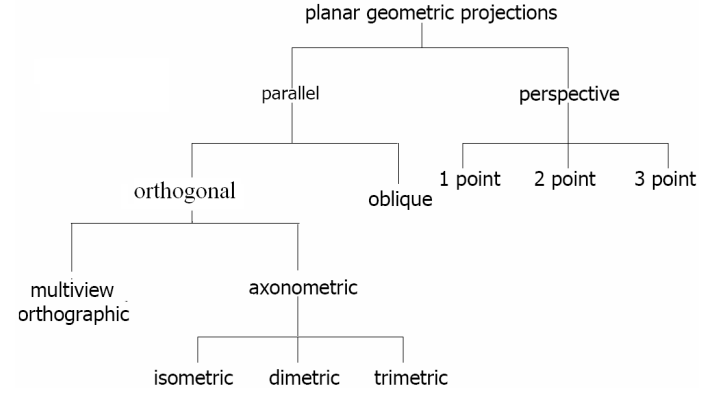

#### 1.2.1  平行投影 (Parallel Projection)

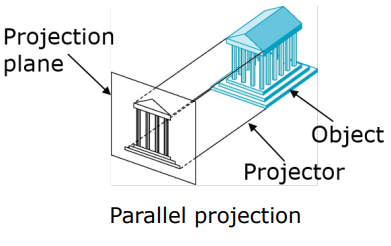

- 投影中心 (center of projection, COP) 位于无穷远处。  
- 所有投影线平行。  
- 平行性得以保持。  

#### 1.2.2  透视投影 (Perspective Projection) 

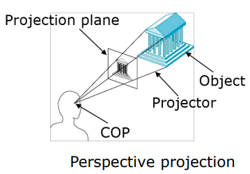

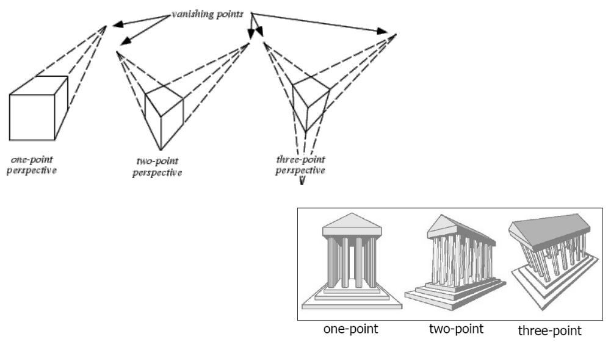

- COP 位于投影平面的一定距离处。  
- 所有投影线在 COP 汇聚。  
- 平行性通常不保留。  

---

### 1.3 平行投影  
#### 1.3.1  正投影 (Orthographic Projection) 

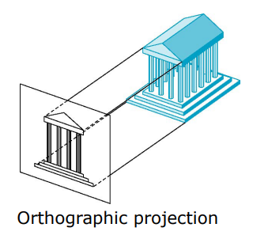

- 投影线垂直于投影平面。  

- 多视图正投影 (Multi-view Orthographic Projection): **投影平面** 平行于 **某一个坐标平面**

    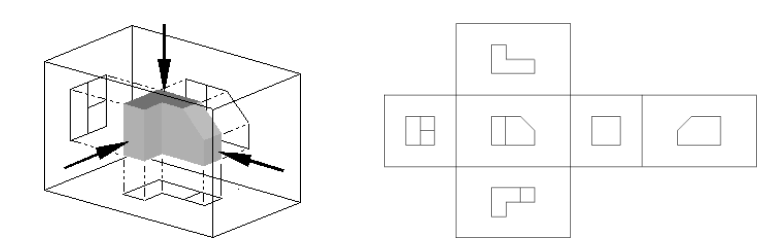

#### 1.3.2  斜投影 (Oblique Projection)

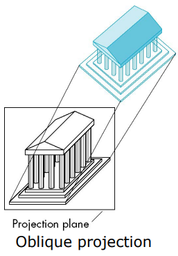

- 投影线不垂直于投影平面。  

---

### 1.4 轴测投影 (Axonometric Projection)  

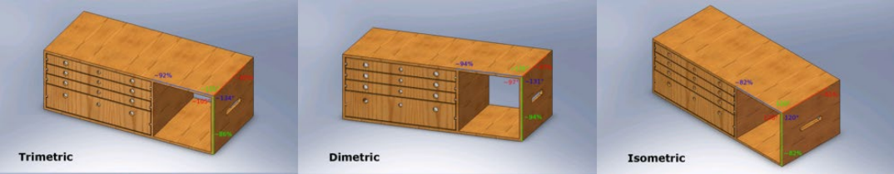

- 投影平面不平行于任何坐标平面。  
- 类型：  
  - **三轴测投影 (Trimetric)**：三个主轴之间的角度不同。  
  - **二轴测投影 (Dimetric)** ：两个主轴之间的角度相等。  
  - **等轴测投影 (Isometric)** ：三个主轴之间的角度相等。  

---

### 1.5 投影矩阵  
#### 1.5.1 正投影矩阵  
假设观察者位于原点 $(0, 0, 0)$，投影平面位于 $(0, 0, d)$ 并平行于 $XY$ 平面。  

给定点 $(x, y, z)$，投影点 $(x', y', z')$ 为：  

$$x' = x, \, y' = y, \, z' = d$$  

投影矩阵为：  
$$
\begin{bmatrix}   
1 & 0 & 0 & 0 \\   
0 & 1 & 0 & 0 \\   
0 & 0 & 0 & d \\   
0 & 0 & 0 & 1   
\end{bmatrix}  
$$

#### 1.5.2 透视投影矩阵  

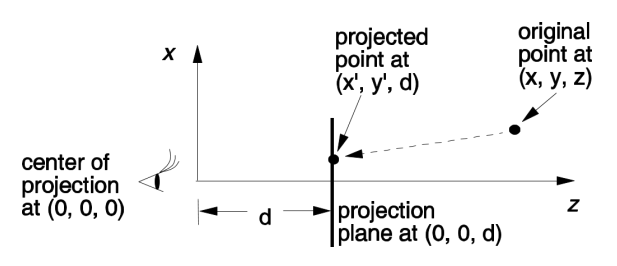

假设观察者位于原点 $(0, 0, 0)$，投影平面位于 $(0, 0, d)$ 并平行于 $XY$ 平面。  

给定点 $(x, y, z)$，投影点 $(x', y', z')$ 为：  

$$x' = d \cdot x / z, \, y' = d \cdot y / z, \, z' = d$$  

投影矩阵为：  
$$
\begin{bmatrix}   
d/z & 0 & 0 & 0 \\   
0 & d/z & 0 & 0 \\   
0 & 0 & 1 & 0 \\   
0 & 0 & 1/d & 0   
\end{bmatrix}  
$$

---

## 2. Clipping 裁剪 :scissors:

### 2.1 目的  
裁剪用于确定对象在定义区域（裁剪区域）内或外的部分。  

### 2.2 算法  
#### 2.2.1 科恩-萨瑟兰线裁剪算法 (Cohen-Sutherland Line-Clipping Algorithm)

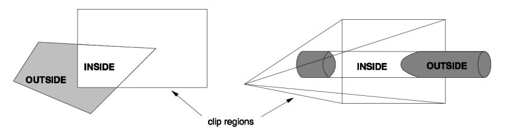

- 为线段的每个端点分配一个4位代码。  
- **简单接受 (Trivial Accept)**：如果两端点的代码均为“0000”，线段完全在裁剪区域内。  
- **简单拒绝 (Trivial Reject)**：如果两端点代码的按位与(AND)不为零，线段完全在裁剪区域外。  
- 否则，计算交点并迭代更新代码。  

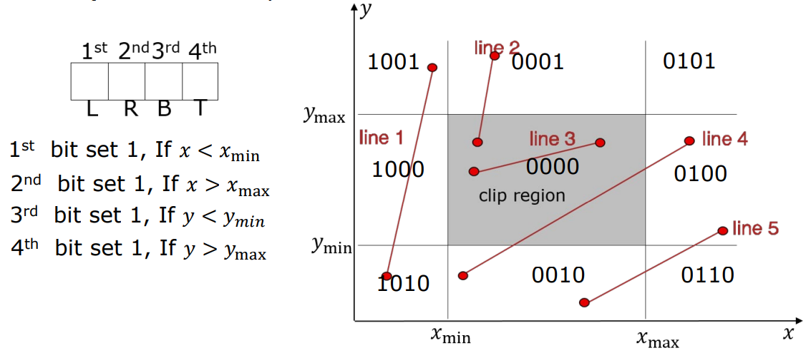

#### 2.2.2 萨瑟兰-霍奇曼多边形裁剪算法 (Sutherland-Hodgman Polygon-Clipping Algorithm)

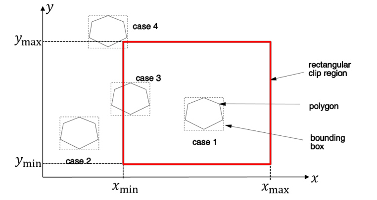

- 输入：二维多边形；输出：裁剪后的多边形顶点。  
- 步骤：  
  1. 根据顶点相对于裁剪区域的位置标记为“内部”或“外部”。  
  2. 计算穿过裁剪边界的边的交点。  
  3. 用交点替换外部顶点，并对所有边重复操作。  
  4. 对裁剪区域的每条边界重复该过程。

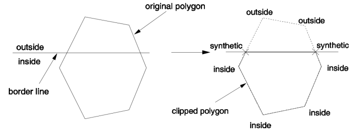

---

## Ex

### 1. 

Please show the main idea for extending the line clipping algorithm in 3D space, i.e., clipping a line against a 3D cubic. 将2D线裁剪算法扩展到3D空间。例如，相对于3D立方体裁剪一条线。

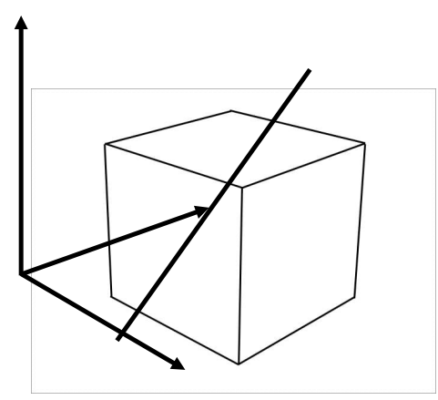

##### 解答

- 在3D空间中，裁剪区域是一个立方体，有6个边界（上、下、左、右、前、后）。
- 需要定义6位编码来表示线段的端点与立方体的位置关系。
- **完全接受**：线段两个端点都在立方体内。
- **完全拒绝**：线段两个端点都在立方体的同一侧外部。

There are 6 borders (i.e., the 6 faces of the 3D cube), top, bottom, left, right, front, back, 27 sub-regions, and thus the 6-bit code-words should be defined. Define the trivial accept and trivial reject criteria

### 2.

Show how you would clip each of the two polygons against the clip region using the Sutherland-Hodgman Polygon-Clipping Algorithm. 展示如何使用Sutherland-Hodgman 多边形裁剪算法对两个多边形进行裁剪，裁剪区域为上方的多边形。

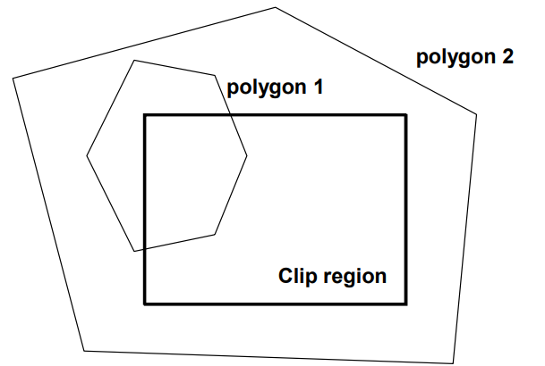

##### 解答

1. **初始化**：使用多边形x的顶点列表。
2. **遍历裁剪区域的每一边**：对于每一条裁剪边，调用裁剪算法检查多边形x的每一条边。
3. 判断每一顶点的关系
    - 如果顶点在裁剪区域内，保留该顶点。
    - 如果顶点在裁剪边外，检查与裁剪边的交点，并将交点添加到新顶点列表。
4. **组合最终顶点**：通过稳定的顺序保留的顶点，得到裁剪后的多边形x。

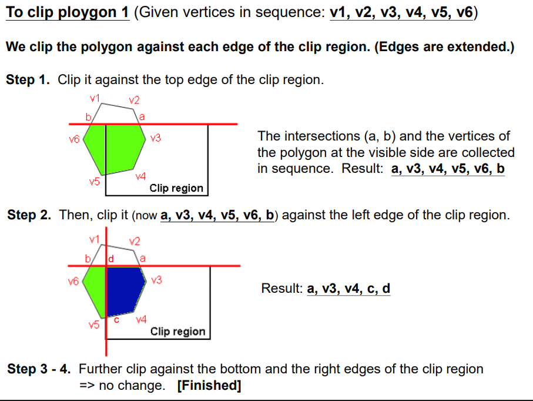

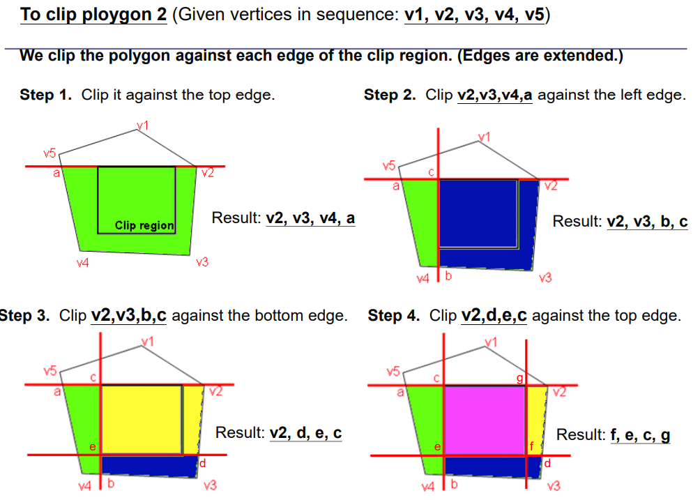

### 3.

Suggest a method to clip the following polygon against the circular clip region. 

提出一种方法来将以下多边形裁剪到圆形裁剪区域内。

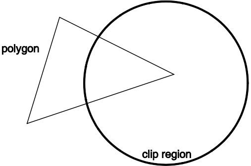

##### 解答

将圆形转化成多边形，再使用裁剪算法。

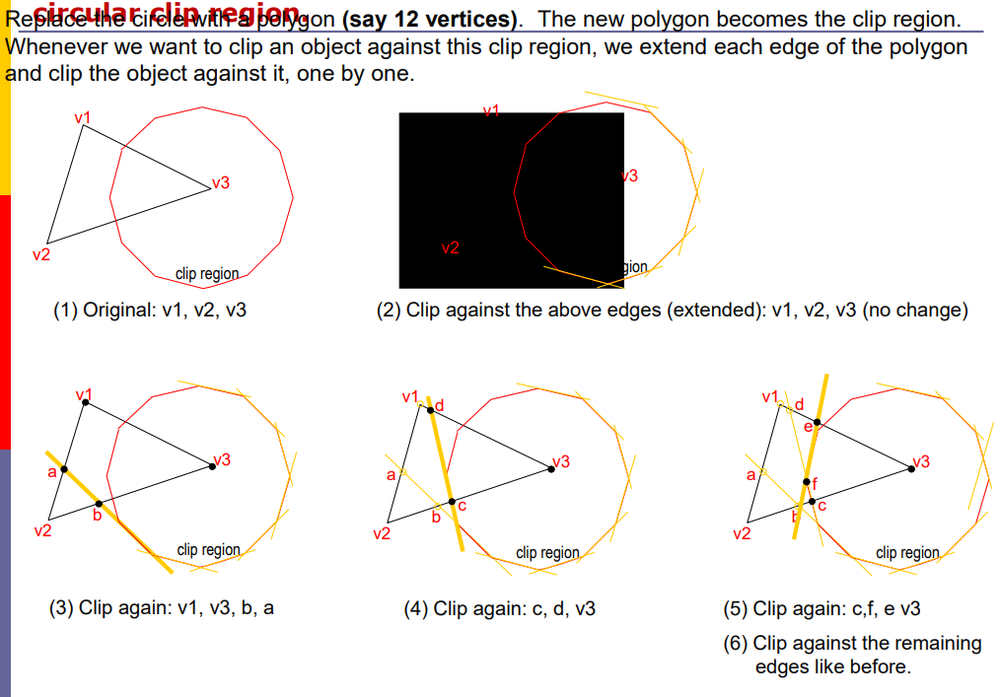

**法2**

裁剪一个多边形到圆形裁剪区域可以使用以下方法：

1. **确定圆的中心和半径**：
    - 定义圆形裁剪区域的中心点（C）和半径（r）。
2. **遍历多边形的每条边**：
    - 对于多边形的每一条边，检查其两个端点是否在圆形裁剪区域内。
3. **判断顶点位置**：
    - 对于多边形的每一个顶点（P）：
        - 计算点 P 到圆心 C 的距离：$$d=\sqrt{(P_x−C_x)^2+(P_y−C_y)^2}$$
    - 如果$d \leq r$，则该点在圆内部，保留该顶点。  
     - 如果$d > r$，则该点在圆的外部，需要进行裁剪。  

4. **检查边与圆的交点**：
    - 对于在圆外的边，计算该边与圆的交点：
        - 使用参数方程表示边：如果边的两个点是P1和P2，可以表示为：$$P(t)=P_1+t(P_2−P_1),0≤t≤1$$
        - 将这个方程代入圆的方程：$$(P_x(t)−C_x)^2+(P_y(t)−C_y)^2=r^2$$
        - 解这个方程来找到交点$P_{intersection}$。  
5. **构建裁剪后的多边形**：
    - 将保留的顶点和交点组合成一个新的顶点列表，构成裁剪后的多边形。