> 讲了一些成像后的处理，隐藏面消除和着色。

# CG-04 Hidden Surface Removal Illumination & Shading

## 1. 隐藏面消除 (Hidden Surface Removal) 🏈

### 1.1 定义
可见性算法或隐藏面消除的目的是确定从选定的观察位置可以看到场景中的哪些部分。  

### 1.2 目的
正确的渲染需要正确的可见性计算。当多个不透明多边形覆盖同一屏幕区域时，只有最前面的多边形是可见的（移除隐藏面）。  

### 1.3 算法类型

#### 1.3.1 对象空间算法 (Object Space Algorithms)
- 确定哪些三维对象位于其他对象的前面。  
- 在对象被转换为帧缓冲区中的像素之前对三维对象进行操作。  
- 示例：背面剔除算法。  

#### 1.3.2 图像空间算法 (Image Space Algorithms)  
- 确定每个像素的颜色。  
- 在对象被转换为帧缓冲区中的像素时进行操作。  
- 示例：深度排序（画家算法）、Z缓冲算法。  

### 1.4 背面剔除算法 (Back-face Culling Algorithm)
- 仅绘制面向摄像机的多边形，隐藏背向摄像机的多边形。  

- 对于每个多边形面 $f$，计算从视点 $\mathbf{v}$ 到 $f$ 上任意点 $\mathbf{p}$ 的向量：  
  - 如果 $\mathbf{n} \cdot (\mathbf{p} - \mathbf{v}) \geq 0$，则不可见。  
  - 如果 $\mathbf{n} \cdot (\mathbf{p} - \mathbf{v}) < 0$，则可见。  
  
- $\mathbf{n}$ 是面的法向量：  

  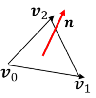

  $$\mathbf{n} = (\mathbf{v}_1 - \mathbf{v}_0) \times (\mathbf{v}_2 - \mathbf{v}_0)$$  

- **优点**：易于实现且效率很高；其复杂度为 $O(n)$ ，其中 $n$ 是多边形的数量。

- **缺点**：对凹多面体无效。

### 1.5 深度排序/画家算法 (Depth-sorting (Painter’s) Algorithm)  
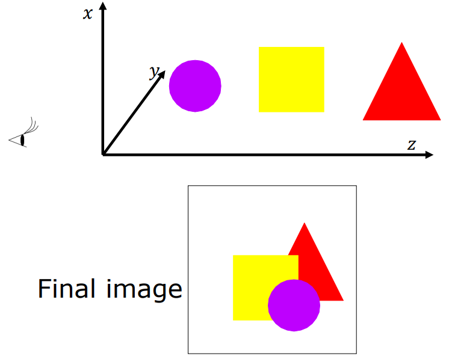

- 按照表面到视点的距离排序。  

- 从最远的表面开始渲染，逐渐到最近的表面。  

- 后绘制的表面会覆盖之前绘制的重叠表面。  

- 对于相交多边形或循环重叠，复杂性会增加。  

    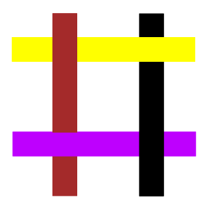

### 1.6 Z缓冲算法 (Z-buffering Algorithm)  

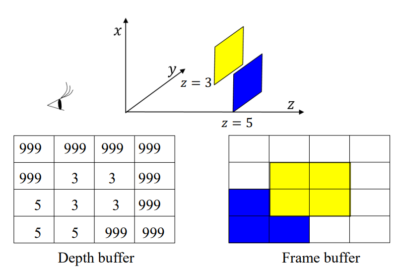

- 需要两个缓冲区：帧缓冲区和深度缓冲区（Z缓冲区）。  
- 深度缓冲区存储可见表面的深度值。  
- 对于每个像素：  
  1. 初始化深度缓冲区为最大值。  
  2. 逐个渲染表面。  
  3. 将每个像素的深度值与深度缓冲区比较。  
  4. 如果新的深度值更小，则更新深度缓冲区和帧缓冲区。  

---

## 2. 光照 (Illumination)  

### 2.1 光源 (Light Sources)  
- **环境光 (Ambient Light)** ：从各个方向均匀发出的光，使物体均匀受光。  

- **点光源 (Point Light Source)**：发出定向光线。如远距离太阳光，近距离台灯。

    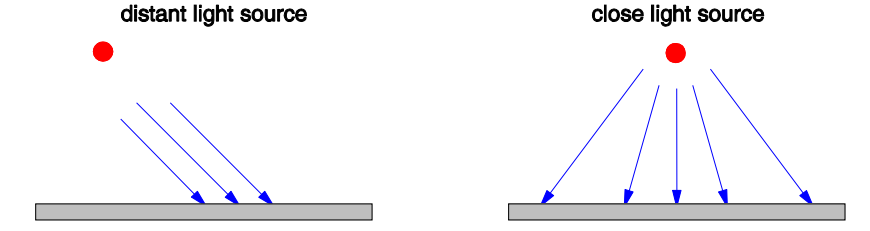

- **聚光灯 (Spotlight)**：在特定方向投射强光束。  

- **区域光源 (Area Light Source)**：占据有限区域，并投射柔和阴影。  

    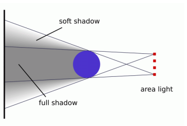

---

### 2.2 Phong光照模型

一个**光照模型**（又称照明模型）通过模拟某些光照属性（即，光能从光源通过直接和间接路径传递到场景中的物体）来确定表面点的颜色。

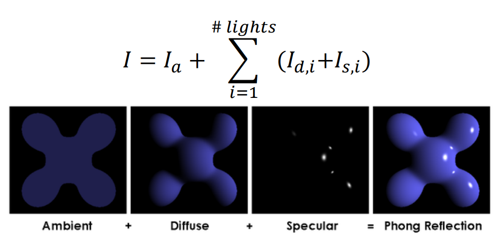

#### 2.2.1 环境反射 (Ambient Reflection)  
- **环境光强度** $I_c$ 在所有方向上均相等。

- 对于给定的表面，可以指定该表面反射的背景光强度为 $I_a$：

    $I_a=k_a⋅I_c$

    其中，$k_a$是环境反射系数，并且 $0 < k_a < 1$。

- 由表面的属性决定，与表面的位置和方向无关。

#### 2.2.2 漫反射 (Diffuse Reflection)  

* 由于表面的微观变化，入射光线在半球范围内各个方向上都会**均匀**反射

    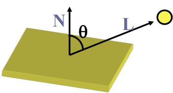

- **朗伯定律 (Lambert’s Law)** 每个点处的反射强度与 $cos⁡θ$ 成正比：
  
  $$I_d=k_d⋅I_L⋅ \cos ⁡θ=k_d⋅I_L⋅(N⋅L)$$
  
  * $k_d$：漫反射系数。  
  
  - $\mathbf{N}$：表面法向量。  
  - $\mathbf{L}$：光线方向。  

#### 2.2.3 镜面反射 (Specular Reflection)  

- 解释了光滑、光亮表面上的亮点（如金属和塑料）。

- 镜面高光是由微观上光滑的表面引起的。

- 当观察视角改变时，光亮表面的外观也会随之变化。

    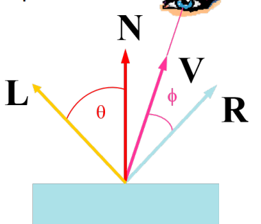

- $$I_s = k_S⋅I_L⋅\cos ^n φ = k_s \cdot I_L \cdot (\mathbf{V} \cdot \mathbf{R})^n$$  
  - $k_s$：镜面反射系数。  
  - $n$：镜面指数（控制高光锐度）。  
  - *φ*：观察向量 $V$ 和反射向量 $R$之间的夹角。
  - $\mathbf{V}$：观察方向。  
  - $\mathbf{R}$：反射光方向。  
  
  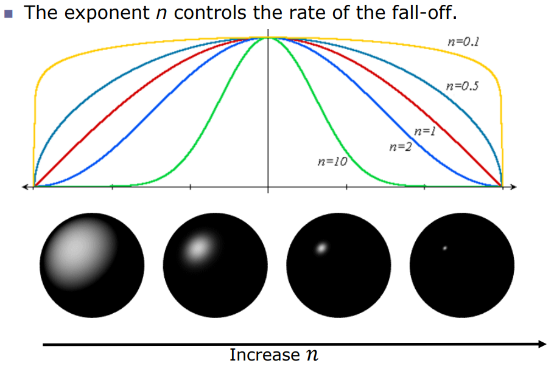

---

## 3. 着色 (Shading)

着色方法（也称为表面渲染方法）使用来自光照模型的颜色计算来确定场景中所有投影位置的像素颜色。

### 3.1 平面着色 (Flat Shading)  

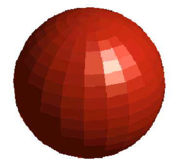

- 每个多边形只计算一次光强。  
- 快速但会导致多边形之间的光强不连续。  

### 3.2 平滑着色 (Smooth Shading)  
#### 3.2.1 Gouraud 着色 (Gouraud Shading)  

##### **核心思想**

- 基于 **顶点插值** 的光照着色方法。
- 先在三角形的每个顶点上计算光照强度（根据光源、法线、材质等），然后将这些顶点的光照颜色**插值**到片元（像素）。**【光照强度或颜色值(非线性)->顶点插值(线性)】**

1. 每个顶点的表面法向量可以通过相邻面法向量的平均值估计：

    $$n= \frac{n_1+n_2+n_3+n_4}{∥n_1+n_2+n_3+n_4∥}$$

    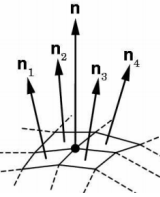

2. 对多边形内其余点进行线性插值顶点光强值。

    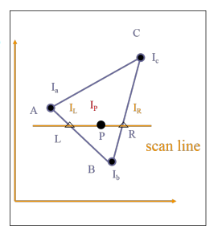

    - 找到左右端点 $L$ 和 $R$。

    - 计算：

        $α= \frac{∣AL∣}{∣AB∣}$, $β=\frac{∣CR∣}{∣CB∣}$, $γ=\frac{∣LP∣}{∣LR∣}$

    - 计算：

        $I_L=(1−α)I_a+αI_b$, $I_R=(1−β)I_c+βI_b$

    - 最后：

        $I_P=(1−γ)I_L+γI_R$

##### 特点

- 优点

    - 计算效率高，光照计算只在顶点进行，可以大幅减少计算量。
    - 表面呈现平滑的过渡，消除了多边形的硬边效果。

- 缺点

    - 光照精度较低，尤其是高光区域（如镜面反射）可能被平滑掉，因为高光区域可能出现在多边形内部，顶点插值无法准确表现。

    * **Gouraud 着色不能很好地处理镜面高光**，特别是当 $n$ 参数较大（高光区域较小时）。这是因为颜色是线性插值的，但镜面反射部分是非线性的。

        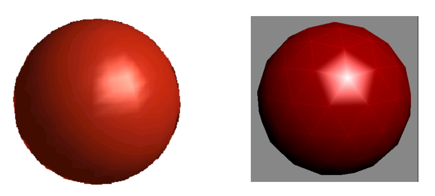

#### 3.2.2 Phong着色 (Phong Shading)  

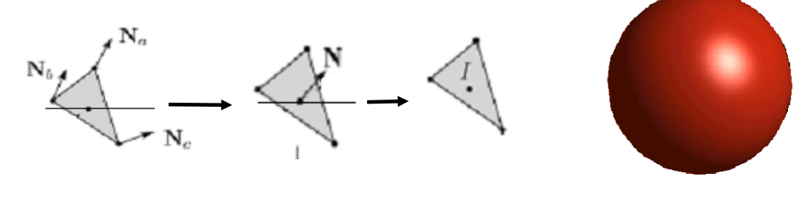

##### 核心思想

- 基于 **逐片元插值** 的光照着色方法。
- 对每个片元（像素点）计算光照，使用插值得到的法向量进行光照计算，从而提高光照效果的真实感。**【顶点插值(线性)->光照强度或颜色值(非线性)】**

1. 确定每个多边形顶点的单位法向量。
2. 使用重心坐标在线性插值多边形表面上的顶点法向量，并归一化。
3. 沿每条扫描线应用光照模型，计算每个表面的像素光强。

##### 特点

- 优点
    - 光照更加精确，高光效果在物体表面更加真实，光滑过渡的效果更好。
    - 特别适合表现复杂表面材质，如金属反光或镜面材质。
- 缺点
    - 计算量较大，因为光照计算需要对每个片元执行。
    - 渲染时间较长，不适合实时应用的大规模计算。

#### 3.2.3 比较表格

| **对比点**   | **Gouraud Shading**                              | **Phong Shading**                                      |
| :----------- | :----------------------------------------------- | :----------------------------------------------------- |
| **计算位置** | 光照计算只在顶点进行。                           | 光照计算在每个片元进行。                               |
| **法向插值** | 插值颜色（光强）到片元。                         | 插值法向量到片元，片元基于插值法向量计算光照。         |
| **高光表现** | 高光区域可能无法表现（被平滑掉）。               | 高光区域精确，光滑且真实。                             |
| **计算效率** | 计算效率高，适合实时渲染。                       | 计算量大，适合高精度离线渲染。                         |
| **视觉效果** | 适合表现漫反射材质，细节效果较差，可能显得模糊。 | 表面光滑效果更真实，尤其适合镜面反射材质。             |
| **典型应用** | 早期 3D 游戏、低性能设备上的实时渲染。           | 现代图形学中的高质量渲染，如电影特效、复杂材质的表现。 |

插值：interpolation