> 这节课回顾了整个渲染管线的流程，期中考点

# CG-05 The Rendering Pipeline 

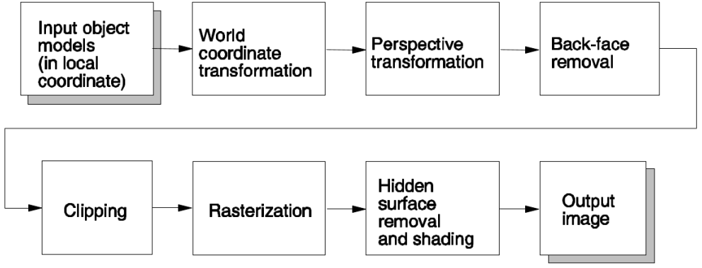

- 表面图元（如多边形）表示连续的物体，并作为一组离散像素逐一处理，通常以随机顺序进行。
- 这一过程由多个阶段组成，称为渲染管线。

**注意**：渲染管道的操作顺序可能略有不同，以优化性能。

### 1 输入对象模型 (Input object models)

#### 对象模型和图元

- 场景中的每个对象首先使用软件（如 3D Studio Max）创建。对象模型可能具有以下属性：
    - 它可能由许多图元组成，例如点、线、平面、圆等。
    - 图元可能需要缩放、旋转和平移，以形成完整的对象。
    - 每个对象模型都有其自己的坐标系，称为局部坐标系。
    - 为了渲染图像，图元会一个接一个地发送到渲染管道中，通常是随机顺序。

#### 对象建模（Recall）

- **2D 绘图**：线条、圆
- **人工 3D 建模**：使用软件创建
- **3D 扫描**
- **3D 生成**
- **3D 表示**：点云、多边形网格、细分曲面等

### 2 世界坐标变换 (World Coordinate Transformation)

- 这一步骤将每个对象从其局部坐标系转换到一个通用的坐标系，称为世界坐标系。
- 通过这种转换，所有对象之间形成几何关系，从而构成场景。

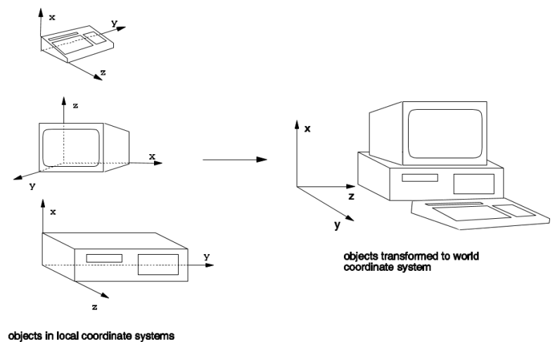

#### 变换 (Recall)

- **齐次坐标**
- 2D 变换
    - 平移
    - 缩放
        - 均匀/非均匀，简单/一般情况
    - 旋转
        - 旋转方向，简单/一般情况，三步技巧
    - 错切
- 3D 变换
    - 平移、缩放、绕 x、y 或 z 轴旋转
- **逆变换**
- **变换顺序**

### 3 透视变换 (Perspective Transformation)

- 这一步骤通过透视变换使远处的物体看起来更小。

- 变换后，视景体（截锥体）将变为一个规则的平行六面体。

- 给定输入顶点的位置 $(x,y,z)$ 变换后的顶点位置 $(x′,y′,z′)$  计算如下：

    $$x′=d⋅x/z,y′=d⋅y/z,z′=z $$

    其中 $d$ 是图像平面到投影中心的距离。

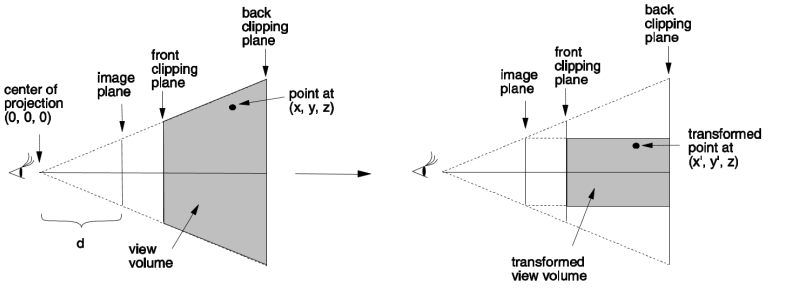

#### 透视变换(PT) vs 透视投影(PP) vs 平行投影(OP)

- 透视变换与透视投影不同，透视变换保留了每个变换顶点的深度值，而透视投影则不保留。
- 在透视变换之前，所有投影线会汇聚到投影中心。透视变换之后，所有投影线变得相互平行。
- 前裁剪平面和后裁剪平面用于移除不在视图范围内的对象。

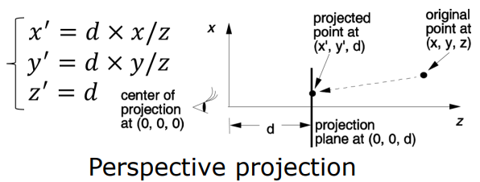

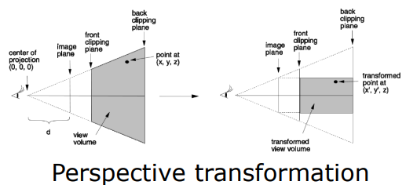

##### **透视变换 (PT)**

- 透视变换是一种将三维场景中的点映射到二维平面（图像平面）上的变换，同时保留深度信息（$z$ 值）。

- 特点

    - 远处的物体看起来更小，近处的物体看起来更大，符合人类视觉的透视效果。
    - 变换后，视景体（截锥体）会变成一个规则的平行六面体。
    - 投影线在变换前会汇聚到投影中心，变换后变为平行。
    - 深度值 $z$ 被保留，用于后续的深度测试（如隐藏面去除）。

- 公式

    - 输入点：$(x,y,z)$

    - 输出点：$(x′,y′,z′)$

    - $$x′=d⋅x/z,y′=d⋅y/z,z′=z$$

        其中 $d$ 是图像平面到投影中心的距离。

##### **透视投影 (PP)**

- 透视投影是将三维场景中的点直接投影到二维平面上，丢弃深度信息 $z$。

- 特点

    - 远近物体的大小变化与透视变换一致，符合人类视觉的透视效果。
    - 投影线会汇聚到投影中心。
    - 深度信息 $z$ 不保留，无法用于后续的深度测试。

- 公式

    - 输入点：$(x,y,z)$

    - 输出点：$(x′,y′)$

    - $$x′=d⋅x/z,y′=d⋅y/z$$

        深度值 $z$ 被丢弃，仅保留二维坐标。

##### **平行投影 (OP)**

- 平行投影是一种将三维场景中的点沿平行线投影到二维平面上的方法。

- 特点

    - 物体的大小与其距离无关，远近物体的比例保持一致。
    - 投影线始终平行。
    - 常用于工程制图或CAD场景中，强调物体的真实比例而非视觉效果。

- 公式

    - 输入点：$(x,y,z)$

    - 输出点：$(x′,y′)$

    - $$x′=x,y′=y$$

        投影线平行于 $z$ 轴，深度值 $z$ 被丢弃。

##### 比较

| **对比点**       | **透视变换 (PT)**                              | **透视投影 (PP)**            | **平行投影 (OP)**            |
| :--------------- | :--------------------------------------------- | :--------------------------- | :--------------------------- |
| **投影线**       | 变换前汇聚到投影中心，变换后平行               | 汇聚到投影中心               | 始终平行                     |
| **深度信息 (z)** | 保留，用于后续深度测试                         | 丢弃                         | 丢弃                         |
| **物体大小**     | 远近物体大小符合透视效果                       | 远近物体大小符合透视效果     | 远近物体大小一致             |
| **视景体**       | 截锥体变换为平行六面体                         | 截锥体直接投影到二维平面     | 平行六面体直接投影到二维平面 |
| **应用场景**     | 渲染管道中的中间步骤，用于深度计算和隐藏面去除 | 最终的二维投影，用于生成图像 | 工程制图、CAD，强调真实比例  |

#### EX

图形透视变换以下两个对象：

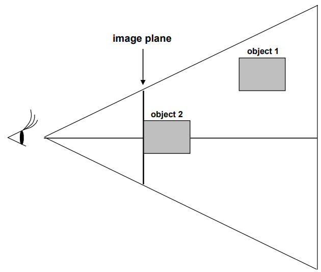

**Answer**

先变换 object 1:

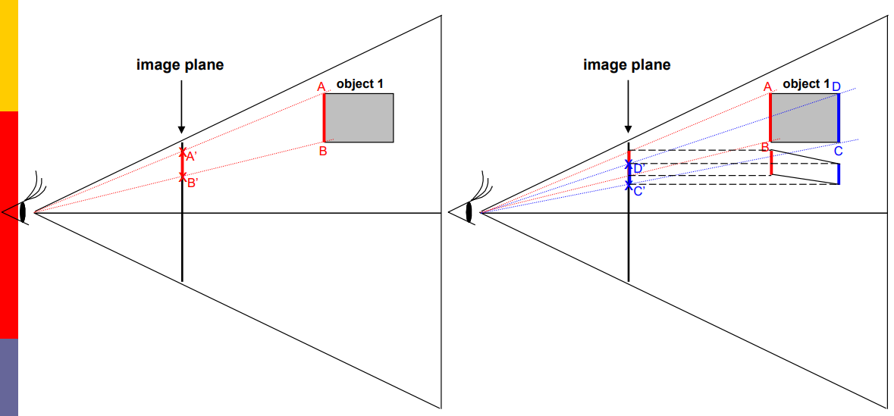

边 AB 投影到图像平面上，成为边 A'B'。
边 CD 投影到图像平面上，成为边 C'D'。
通过考虑顶点的深度，结果是：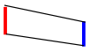

再变换 object 2:

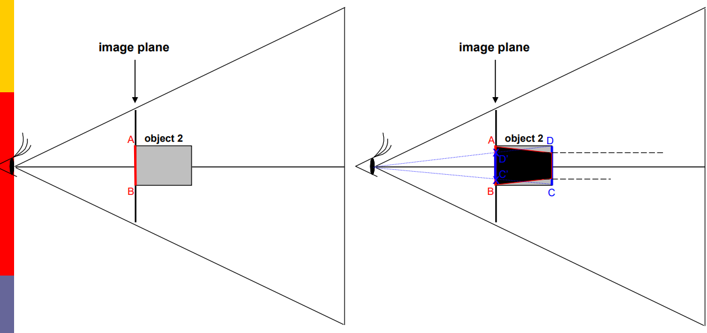

边 AB 本身已经位于图像平面上。
边 CD 投影到图像平面上，成为边 C'D'。
通过考虑顶点的深度，结果是：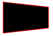

### 4 背面剔除 (Back-face removal)

- 在固体物体中，一些表面可能面向观察者（正面）；而另一些可能背离观察者（背面）。这些背面大约占表面总数的一半。由于我们无法看到这些表面，因此希望将它们剔除以节省处理时间。

- **背面剔除算法**

    - 对于每个多边形面 $f$，计算从视点 $v$ 到 $f$ 上任意点 $p$ 的向量：
        - 如果 $\vec{n}⋅(p−v)≥0$，则不可见；否则，可见

    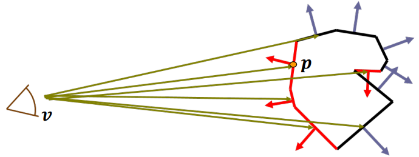

- 正如前面提到的，透视变换后，投影变为平行投影。测试变得非常简单。如果法向量的$z$分量为正，则为背面；如果为负，则为正面。

    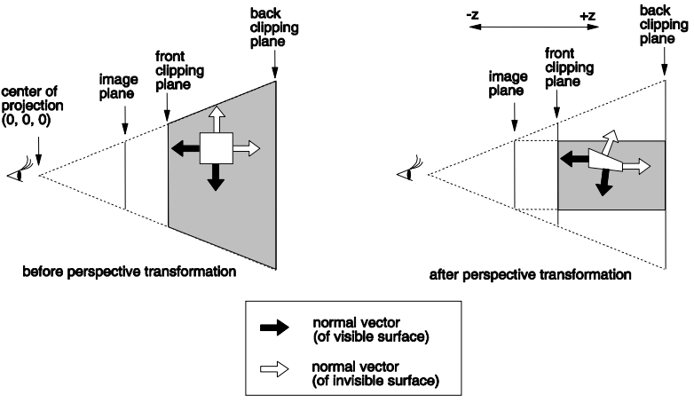

### 5 剪裁 (Clipping)

- 该步骤移除所有在视图体积外的图元及其部分。
- 如果在透视变换之前进行剪裁，这一操作将需要对图元进行任意平面的剪裁。然而，在透视变换之后，形成平行六面体的 6 个剪裁平面变为与三个轴平行。因此，剪裁变得简单，可以在 2D 中进行。
- 假设原点位于投影中心，透视变换后的六个剪裁平面变为：x=−A, x=A, y=−B, y=B, z=d, z=C

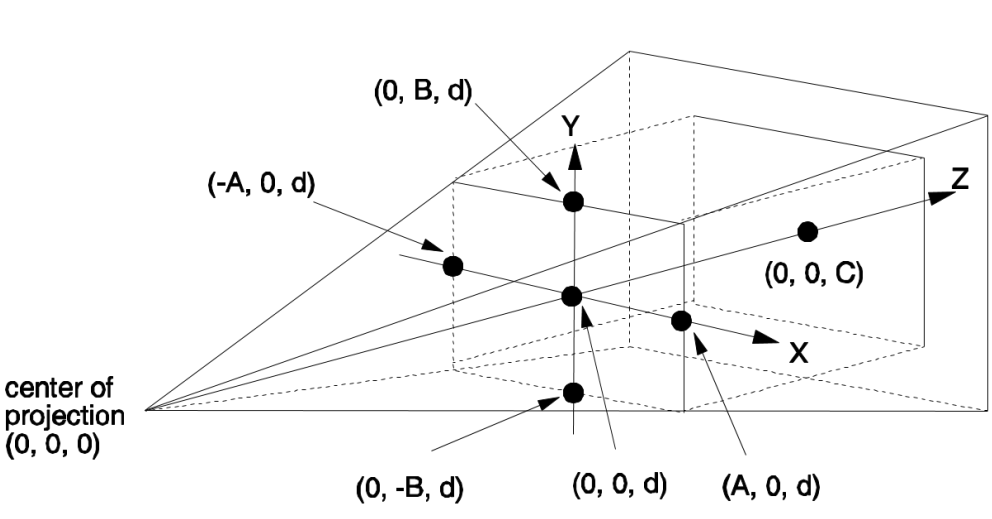

### 6 光栅化 (Rasterization)

- 对一个图元进行处理并计算其覆盖哪些像素的过程称为光栅化。

- 考虑对一个三角形 (v1,v2,v3)(*v*1,*v*2,*v*3) 进行光栅化。

    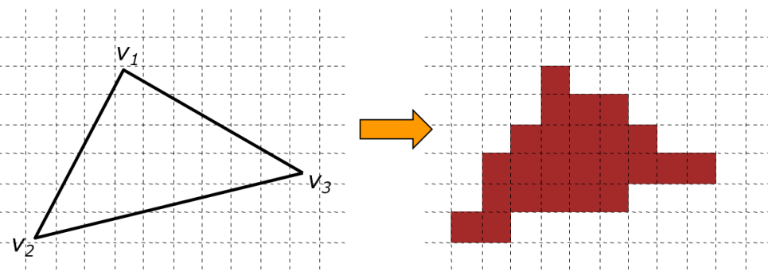

- 三角形的内部是由这三条线定义的所有三个半空间内的点的集合。

    $$E_i(x,y)=a_ix+b_iy+c_i(i=1,2,3)$$

    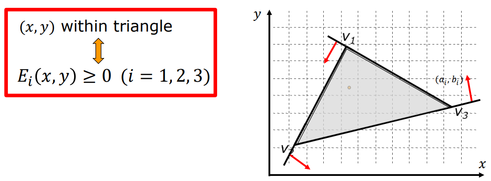

### 7 隐藏面消除和阴影 (Hidden surface removal and Shading)

#### 隐藏表面移除

- 隐藏表面移除步骤删除被其他图元遮挡的图元或部分图元。
- 为此目的开发了许多方法：
    - **深度排序**：一个帧缓冲，对于相交多边形或循环重叠的条件失败。
    - **Z缓冲**：两个缓冲区（帧缓冲和深度缓冲）。
- 最流行的方法是 Z 缓冲法，它被大多数现有图形加速器实现。

#### 阴影

- 使用光照模型中的颜色计算来确定场景中所有投影位置的像素颜色。
- **平面阴影**
    - 计算整个多边形的一个强度值。
- **平滑阴影**
    - **Gouraud 阴影**：在三角形之间插值颜色。
    - **Phong 阴影**：在三角形之间插值法线。

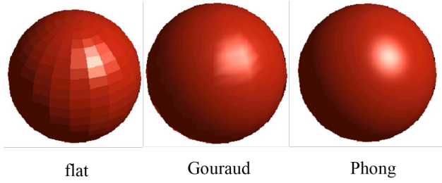