> 这节课介绍了CG中的走样（锯齿）现象与反走样（抗锯齿）技术。

# CG-06 Aliasing and Anti-aliasing in CG

## 1. 走样（Aliasing）
- **定义**：在信号处理（signal processing, SP）中，走样是一个特定的术语，而在计算机图形学（CG）中，它指的是任何不希望出现的视觉伪影。
- **表现**：在2D绘图中，直线可能看起来有锯齿状，字符可能看起来是离散的。伴随有信息丢失的情况。
- **解决**
    - 使用更高阶重构
    - 使用更多的样本（需要多少样本？）

## 2. 采样定理（The Sampling Theorem）
- **Nyquist采样定理**：一个连续的带限函数可以通过一组均匀间隔的样本完全表示，如果样本的频率超过最高频率成分的两倍。即为了充分捕捉最大频率为 $F$ 的函数，我们需要以频率 $N = 2F$ 进行采样。

## 3. 走样(锯齿)现象的类型
- **空间走样（Spatial Aliasing）**：在静态图像中产生的走样现象，主要由于大多数绘制/渲染算法的点采样特性。
    * (a)，直线边缘看起来像是楼梯状的。
    
        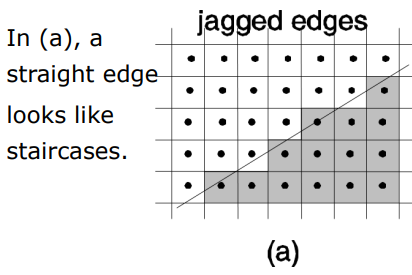
    
    * (b)，因为三角形并没有落入任何采样点，所以它们就消失了。
    
        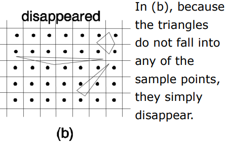
    
    * (c)，薄三角形的某些部分没有落入采样点，而其余部分则落入了。这个三角形被分碎成许多部分。
    
        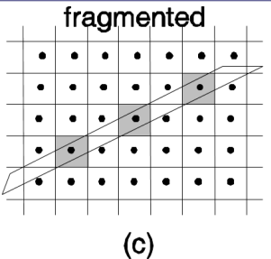
    
    * (d)，尽管我们有两个相同的三角形，其中一个看起来是矩形，另一个看起来是正方形。因此，小物体的外观受到它们在像素网格上的物理位置的影响。
    
        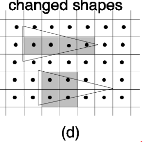
    
- **时间走样（Temporal Aliasing）**：在视频序列中观察到的走样现象，主要由于空间走样和时间域的欠采样。简单地说就是，同一形状在不同时间的采样结果不一样，连续地看就会觉得图像异常。
    * (a)，边缘沿线的台阶可能看起来像是在跳动。
    
        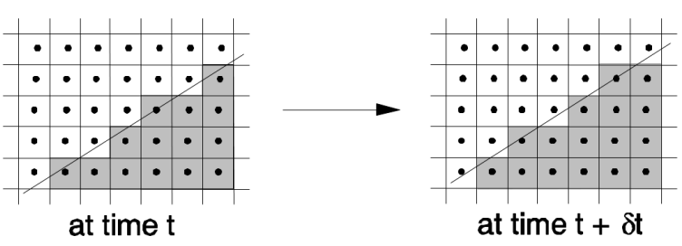
    
    * (b)，整体效果是物体在移动时似乎在闪烁。
    
        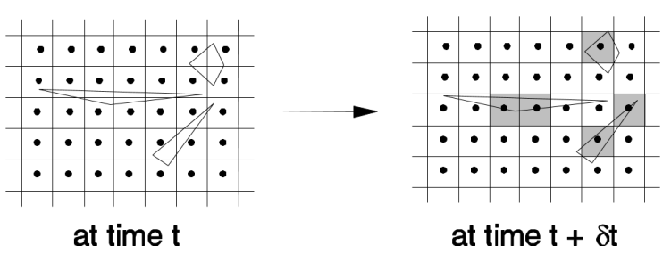
    
    * (c)，整体效果是物体在移动时不断分解和合并。
    
        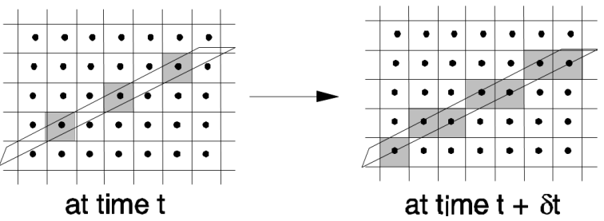
    
    * (d)，这两个三角形在移动时似乎不断改变形状。
    
        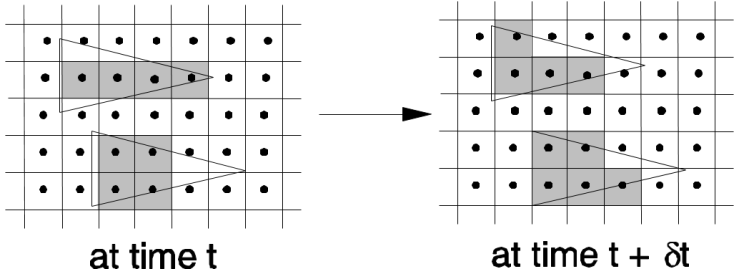

## 4. 反走样(抗锯齿)技术（Anti-aliasing）
抗锯齿方法是解决或减少锯齿问题的技术，包括超采样、累积缓冲区、随机采样、Catmull算法、A-Buffer算法。

### 4.1 超采样（Supersampling）

**增加样本数量**以减少锯齿效应。

- **过程**：
  1. 创建一个比最终图像更高分辨率的虚拟图像。
  2. 应用低通滤波器 (low-pass filter)。
  3. 重新采样过滤后的图像。
- **优点**：易于在硬件中实现。
- **缺点**：需要大量内存和处理时间，且无法完全消除锯齿。

#### Ex

Describe how to extend the ray-tracing method to supersampling to address spatial aliasing problem. 

描述如何扩展光线追踪方法，以进行超采样来解决空间锯齿问题。

**Answer**

1. **增加采样点** (Increase Sampling Points)：在每个像素内创建多个采样点，而不是仅使用一个中心点。可以在像素的区域内均匀分布这些采样点，形成一个更高分辨率的虚拟图像。
2. **光线追踪** (Ray Tracing)：对于每个采样点，发射光线并计算与场景中物体的交点。这意味着对于每个像素，光线追踪算法将被执行多次，每次针对不同的采样点。
3. **颜色计算** (Color Calculation)：对于每个采样点，计算其颜色值。这可以通过考虑光照、材质和其他影响因素来完成。
4. **颜色合成** (Color Composition)：将所有采样点的颜色值进行平均，以获得最终像素的颜色。这种方法可以有效减少锯齿现象，因为它考虑了更多的细节信息。
5. **后处理** (Post-processing)：可以应用低通滤波器等后处理技术，以进一步平滑最终图像，减少可能的噪声和锯齿效果。

### 4.2 累积缓冲区（Accumulation Buffer）

通过逐个渲染子像素来解决超采样的内存成本。

* **优点**

    - 只需要一个正常分辨率的额外缓冲区。

    - 可以轻松集成到现有的图形硬件中。

    - 通过在时间轴上累积多帧图像，可以模拟运动模糊。

    - 其他效果，例如景深，也可以通过在每次渲染时改变相机位置来实现。

* **缺点**

    - 生成一幅图像需要许多渲染通道。

    - 为了避免溢出，累积缓冲区需要每个像素有更多的位数。

### 4.3 随机采样（Stochastic Sampling）

使用随机样本点代替规则网格，以减少锯齿。

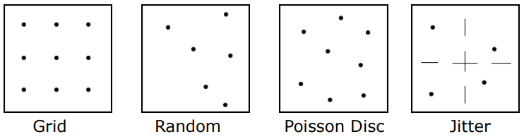

- **优点**：可以用更少的样本数量更好地减少锯齿；当样本数量足够大时，理论上可以消除混叠。
- **缺点**：会在图像中增加随机噪声；仍然需要相当数量的内存和处理时间。

### 4.4 Catmull算法

通过对每个像素进行多边形裁剪来计算多边形对像素的颜色贡献。

- 将每个多边形剪裁到每个像素，以形成多边形片段。
- 确定可见片段。
- 找到片段面积。
- 乘以片段颜色。
- 计算最终像素颜色的总和。

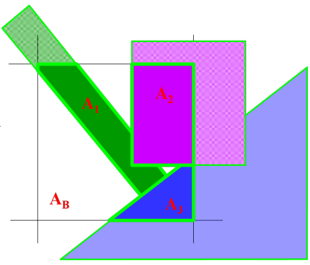

- **优点**：准确计算多边形覆盖像素的程度。
- **缺点**：计算开销大。

### 4.5 A-buffer方法

使用子像素采样简化面积求和。

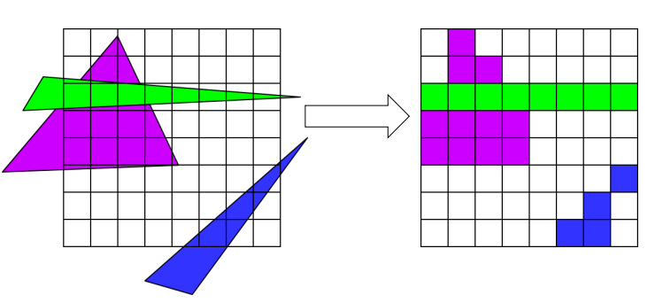

- **优点**：每个像素的处理仅依赖于可见片段的数量。
- **缺点**：仍然基本上是超采样算法。