> 介绍了一种渲染方法：光线追踪方法，以及经常和它结合使用的辐射度法... 
>
> 从这里开始，我就没怎么听进去了

# CG-07 Ray Tracing and Radiosity

## 1. 两种渲染方法

- **从几何体出发 (geometry) -> Rasterization rendering**
    - 对每个多边形/三角形：
        - 它是否可见？
        - 它在哪里？
        - 它是什么颜色？
    - 极快，但难以计算准确的阴影、反射和折射。
    - 不能处理物体间的光散射。
- **从像素出发 (pixels) -> Ray tracing**
    - 对最终图像中的每个像素：
        - 哪个物体在该像素处可见？
        - 它是什么颜色？

## 2. Ray Tracing

### 2.1 定义

* 光线追踪通过追踪场景中光线的流动来生成图像，通常是从观察点向后追踪，经过表面直到光源。

### 2.2 分类

* 反向追踪

* 正向追踪，效率低，因为许多光线不会穿过摄像机，不对图像产生贡献。

    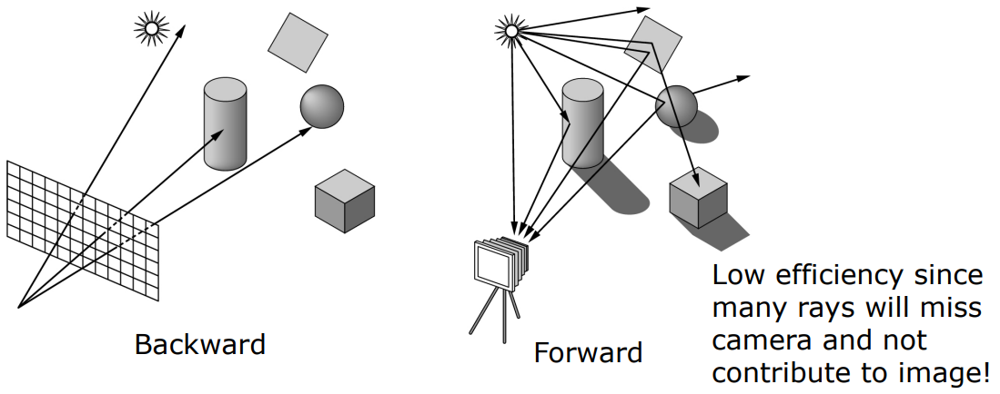

### 2.3 过程

* 对图像平面上的每个像素，从投影中心通过该像素投射一条光线进入场景。确定该光线首次相交的物体。

* 确定光线击中物体的点（即光线交点），然后根据表面法线和光源信息计算颜色值。

    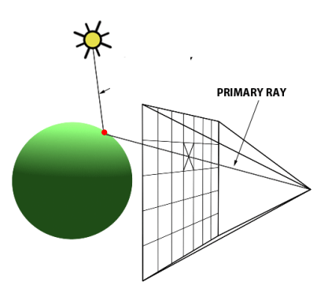

* 如果某物体位于光源和光线交点之间，则该点处于阴影中，不考虑该光源的光照贡献。

* 然后光线被反射（若表面透明，则还会发生折射），此过程持续重复。

    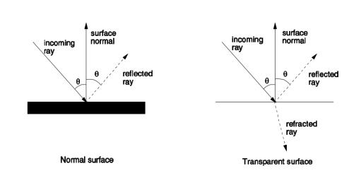 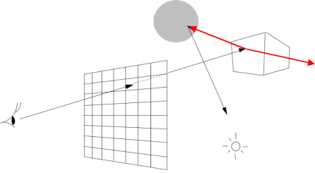

* 确定反射/折射光线击中第二个物体的位置，并像第一个物体一样计算颜色。

* 该过程持续进行，直到达到最大反射次数或后续颜色贡献变得微不足道。

* 所有与光线相交物体计算出的颜色值按照衰减因子（依赖表面反射率）加权后累加得到最终像素颜色。

### 2.4 计算

* 设物体基本单元$S_1$和$S_2$的反射系数分别为$r_1$和$r_2$，表面法线为$N_1$和$N_2$。

* 在由观察光线$E_1$与$S_1$交点处的光照向量为$L_1$，计算颜色$C_1$。

* 在由反射光线$E_2$与$S_2$交点处的光照向量为$L_2$，计算颜色$C_2$。

* 像素颜色计算公式为：
    $$C_p=r_1C_1+r_1r_2C_2+…$$

    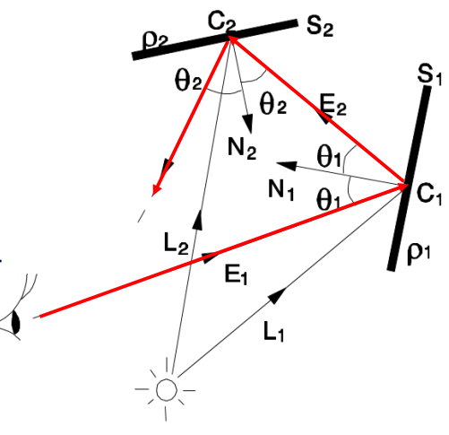

### 2.5 优点

* 跟踪光线流动，考虑直接镜面 (direct specular) 反射、直接漫反射 (direct diffuse) 和间接镜面 (indirect specular ) 反射。
* 考虑光折射 (s light refraction) 和阴影 (shadowing)。

### 2.6 缺点

* 因大量昂贵的光线与物体交点测试及颜色计算 (costly ray-surface intersection tests and color calculations) 而速度慢。
* 不考虑间接漫反射（表面间的漫反射），此内容由辐射度法处理 (Radiosity)。

## 3. 光线追踪加速

光线追踪消耗大量时间在检测光线与物体的交点，减少交点测试次数能显著降低计算时间。

- 包围体（Bounding volumes）
- 空间划分（Space subdivision）

### 3.1 包围体 Bounding volumes

- 为场景中每个物体构建包围体

    - 轴对齐包围盒AABBs (axis-aligned bounding boxes)

    - 定向包围盒OBBs (oriented bounding boxes)

        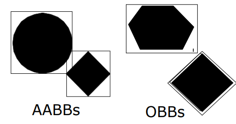

- 先检测光线与包围体的交点，而不是每个物体，提高效率。

    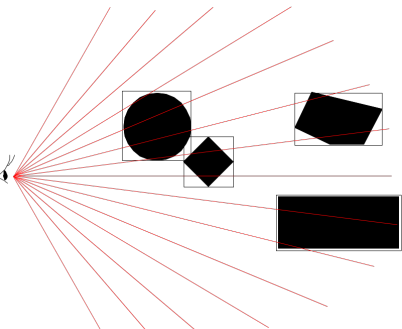

- 层次化包围体 (hierarchical bounding volume)

    - 构建物体的层次化包围体。
    - 若光线未与任意层次的包围体相交，则不会与包围体内的任何物体相交。

    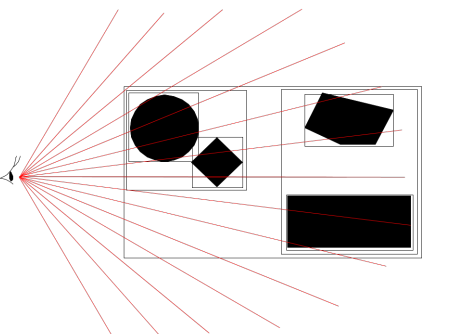

### 3.2 空间划分 Space subdivision

- 均匀 (uniform) 划分：

    - 每个体素存储相交的物体列表，光线遍历规则网格，对每个体素里的物体测试交点。

        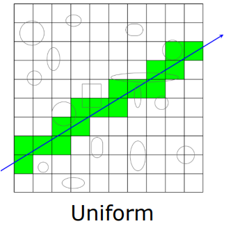

- 非均匀 (non-uniform) 划分：

    - 层次划分场景（如八叉树）以减少体素数量。

        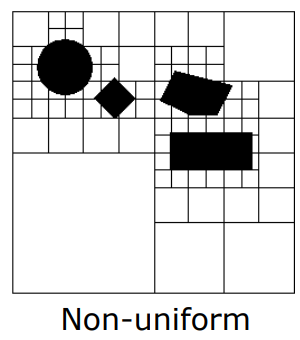

## 4 辐射度 Radiosity

### 4.1 定义

- 辐射度是单位面积上离开（发射和反射）表面的辐射通量。

    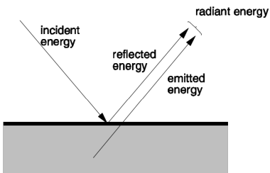

- 辐射度方法用于模拟表面间的漫反射 (**Diffuse Reflection**)（直接和间接）。

    - 漫反射中，光线以相同强度向各方向反射，但表面接收的光能量取决于其相对于光源的朝向。

    - 示意图：A以相同强度反射光照给B和C，因B的入射角较小，故其接收的光能更多。

        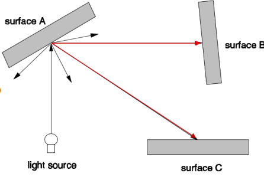

### 4.2 计算

* 贴片(patch) $i$ 的辐射度 $B_i$ 计算公式为：
    $$
    B_i = E_i + \rho_i \sum_{j \in \text{all patches}} L_{i \leftarrow j}
    $$
     其中，$L_{i \leftarrow j}$ 是从贴片 $j$ 到贴片 $i$ 的光线量 (amount of light)，$E_i$ 是贴片 $i$ 自身发射的光 (light emitted)，$\rho_i$ 是贴片 $i$ 的反射率 (reflectivity)。

* $L_{i \leftarrow j}$ 还可以进一步定义为：
    $$
    L_{i \leftarrow j} = F_{i \leftarrow j} B_j
    $$
     其中，$F_{i \leftarrow j}$ 是描述贴片 $j$ 到贴片 $i$ 的形状因子 (form factor)，$B_j$ 是贴片 $j$ 的辐射度。

* $F_{i \leftarrow j}$ 的计算公式为
    $$
    F_{i \leftarrow j} = \frac{1}{A_i} \int_{A_i} \int_{A_j} V_{ij} \frac{\cos \theta_i \cos \theta_j}{\pi r^2} dA_j dA_i
    $$
     其中，$A_i$ 和 $A_j$ 分别是贴片 $i$ 和 $j$ 的面积，$V_{ij}$ 表示贴片 $i$ 和 $j$ 之间的可见性，即如果两者之间没有遮挡，则 $V_{ij} = 1$，否则 $V_{ij} = 0$。

### 4.3 例子

考虑一个封闭区域，内有四个多边形，反射率 $\rho \ (0\leq\rho\leq1)$ 相同（漫反射表面通常较小）。 $S_1$ 是光源，时间 $t$ 时光源关闭，区域内无光能。

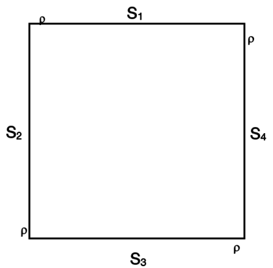

时间 $t+1$ ，光源 $S_1$ 开启，能量为 $e$。 多边形接收的总能量：

- $S_1: L_1 = 0$
- $ S_2: L_2 = eF_{2 \leftarrow 1}$
- $ S_3: L_3 = eF_{3 \leftarrow 1}$
- $ S_4: L_4 = eF_{4 \leftarrow 1}$

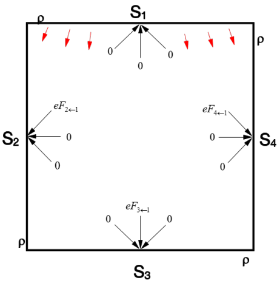

在时间 $ t+2$，每个多边形的总能量是基于其它多边形反射能量和反射率、形状因子之和，形成迭代方程。

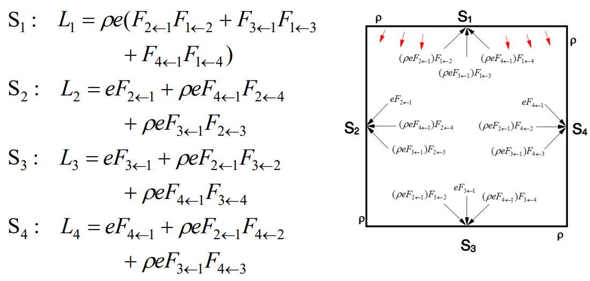

- 随时间 $ t$ 增大，项数增多。
- 因为 $ \rho < 1$，多次反射后后续项逐渐变小。
- 每个表面发射的能量最终收敛到一个稳定值。

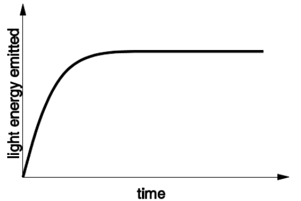

### 4.4 大辐射表面的辐射度

- 因入射角变化，辐射度在大表面上可能变化显著。
- 为提高准确度，将表面划分为小贴片，每个贴片假定均匀发射和反射光。
- 假设场景中有 $n$ 个贴片，构建 $n$ 个联立方程，未知量为 $B_i$，可用矩阵方法求解：
     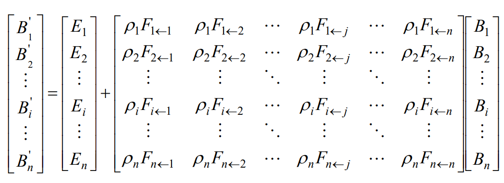
- 计算所有贴片辐射度后，更新原始图元颜色，使用扫描转换渲染。
- 计算的辐射度是视点无关的，无法处理视点相关的镜面反射 **(specular reflection)**。
- 可结合辐射度和光线追踪方法，但计算量更大。

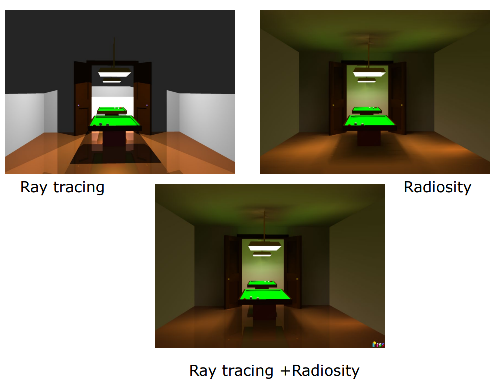