> 讲了实时渲染涉及到的一些技术，如渐进式渲染（离散LoDs、渐进网格），阴影的渲染，还要可见物体的判定方法等。机翻章节。

# CG-08 Real-Time Rendering

## 1 时间关键渲染 Time-Critical Rendering 

- 在实时3D应用中，比如虚拟环境和电脑游戏，**交互性**是非常重要的因素。
    * 当我们执行一个动作时，我们期望系统能立即响应，类似于现实生活中的互动。
- 为了实现实时反馈，我们需要在一个给定的时间内完成渲染过程，这个时间被称为**帧时间** (frame time)（两帧图像之间的时间间隔）。
    * 如果我们以每秒10帧生成图像，则帧时间为0.1秒。（电影每秒24帧）

-  在时间关键渲染中，我们以图像精度换取速度。换句话说，在一个帧时间内，我们希望渲染出尽可能准确的图像。
- 为此，我们需要以下内容：
    - 一种渐进式渲染技术 A progressive rendering technique
    - 一种估计物体视觉质量的方法 A way to estimate the visual quality of objects
    - 一种估计物体渲染成本的方法 A way to estimate the rendering costs of objects

### 1.1 渐进式渲染 Progressive Rendering

- 通常，渲染时间大致与需要渲染的图元数 (primitives)（通常是三角形 triangle）成正比 (proportional)。为了减少渲染时间，我们可以减少表示物体的三角形数量。
- 一般来说，如果物体离观看者较远，其细节可能不那么清晰可见。
- 一种技术是制作多个**细节层级**（LoDs）
    - 离散细节层级 Discrete LoD
    - 渐进网格 Progressive mesh

#### 离散细节层级 Discrete LoDs

- 预计算物体的几种不同分辨率模型，即不同的 LoDs。

- 优点

    - 高效，直接选择最合适的模型渲染即可。

- 缺点

    - 需要多少个细节层级？
    - 切换模型时可能产生视觉伪影 (Visual artifacts)。

    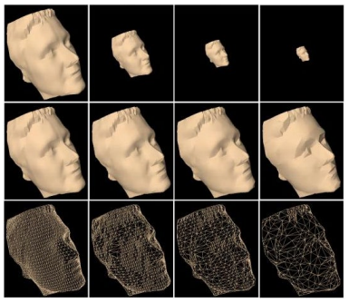

#### 渐进网格 Progressive meshes

- 物体模型的分辨率可以通过称为**边收缩 (edge collapse)** 的操作减少。

    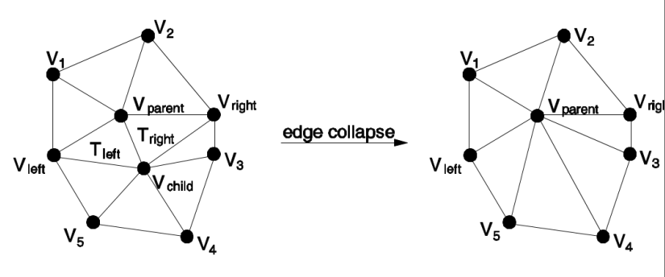

- 每次边收缩操作会移除模型中的两个三角形，即略微降低模型分辨率。

- 如果对模型持续进行边收缩，模型的分辨率会逐渐降低，直到达到最低分辨率，这个最低分辨率模型称为**基网格 (base mesh)**。

- 模型分辨率可以通过逆向操作**顶点分裂 (vertex split)** 逐步增加，该操作向模型中引入两个三角形。

    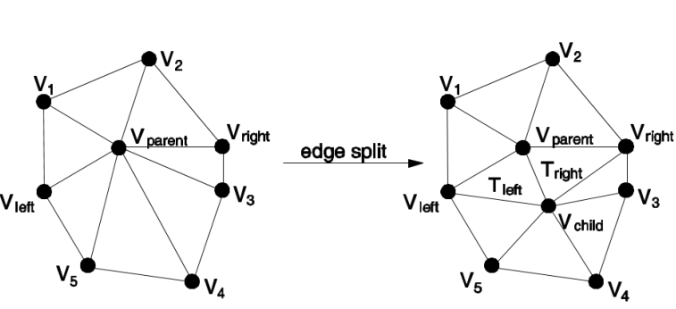

- 从基网格开始，持续应用顶点分裂，最终恢复到最高分辨率，也就是原始模型。

- 两个操作可表示为：
    $$
    M_{n}^{\text{ecol}} \xrightarrow[\text{edge collapse}]{} M_{n-1}^{\text{ecol}} \xrightarrow[\text{edge collapse}]{} \cdots \xrightarrow[\text{edge collapse}]{} M_{0}^{\text{ori}} = M^{\text{base}}
    $$

    $$
    M_{0}^{\text{ori}} \xrightarrow[\text{vertex split}]{} M_{1}^{\text{vsplit}} \xrightarrow[\text{vertex split}]{} \cdots \xrightarrow[\text{vertex split}]{} M_{n}^{\text{vsplit}} = M^{\text{orig}}
    $$

- 渐进网格结构既可以用于**高效存储 (efficient storage)**，也可以用于**渐进传输 (progressive transmission)**。

    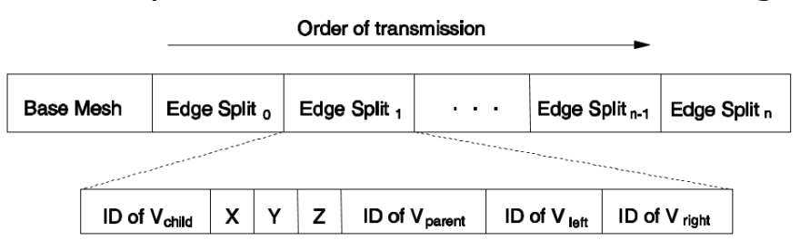

#### 选择性细化 Selective refinement

- 
    对于大型模型，例如景观模型，大部分时间我们只关注其中一小部分细节。
- 但渐进网格是独立于视角构造的，即高（低）分辨率时，整个模型都是高（低）分辨率。

- 如果能选择性地细化我们感兴趣的局部区域的模型分辨率，并保持其他部分为低分辨率，将优化三角形数量，从而提高渲染性能。
- 选择性细化的难点在于边收缩和顶点分裂操作时，三角形相邻区域之间存在强依赖。

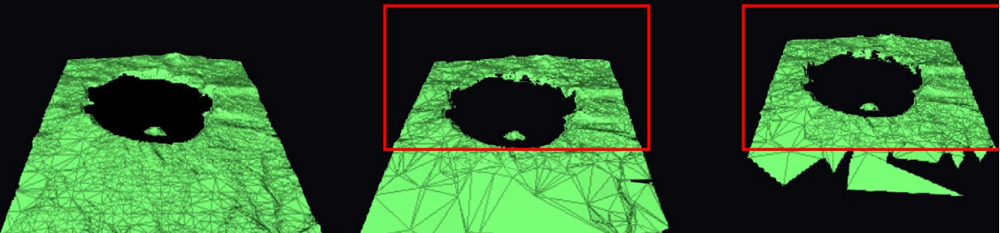

### 1.2 视觉质量估计 Visual Quality Estimation

- 视觉质量通常基于以下因素测量：
    - 用于渲染的模型 LoDs（或图元数量）。
    - 物体离观察者的距离。
    - 物体在屏幕上的投影大小。
- 其他可能影响物体质量感知的因素：
    - 物体移动速度。
    - 物体相对于观察者视线的角距离 (angular distance)。

### 1.3 渲染成本估计 Rendering Cost Estimation

- 渲染时，需要高效选择每个物体的合适细节层级和渲染方法，以在不超过允许渲染时间的前提下，实现输出图像的最大视觉质量。
- 因此，需要一种方法估计每个物体的渲染成本（以渲染时间计）：
    - 任意 LoDs
    - 使用任意渲染方法，例如平面着色或Gouraud着色
- 这种渲染成本估计应高效完成。

## 2 阴影 Shadows

- 阴影很重要，因为它们提供了物体与光源几何关系的信息。
- 硬阴影 Hard shadows
    - 只包含全影区域 (umbra regions)。
    - 点光源造成阴影边界清晰，即硬阴影。
- 软阴影 Soft shadows
    - 包含全影区域 (umbra regions) 和半影区域 (penumbra regions)。
    - 面光源使阴影边界变得柔和，这些柔和边界即为半影区域。

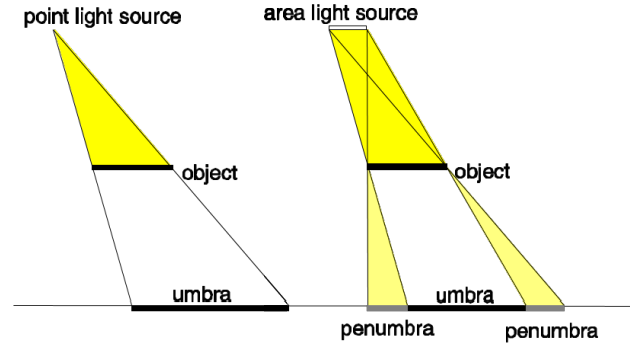

### 2.1 硬阴影生成 Generation of hard shadows

#### 阴影体积法 Shadow volume methods

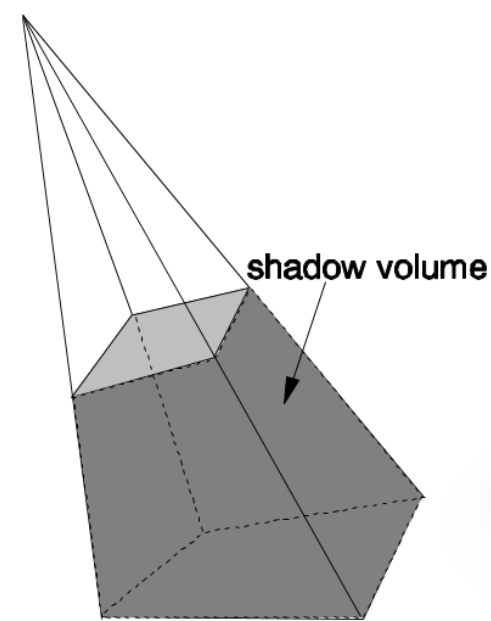

* 确定处于阴影中的体积，并用多边形包围。

- 判断点是否在阴影中，通过检查该点是否在阴影体积内。
- 该方法通常更复杂，因为需要处理额外的几何结构。

- 确定阴影状态

    - 从视点向每个感兴趣点连线。
    - 计数器初始为0。
    - 线穿过阴影体积的前向多边形，计数器加1。
    - 线穿过阴影体积的后向多边形，计数器减1。
    - 计数器最终为正数，点处于阴影中。

    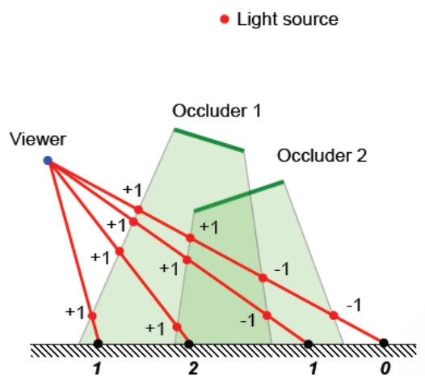

#### 阴影贴图法 Shadow map methods

- 首先从光源视角使用 z 缓冲法渲染深度图，称为阴影贴图 (shadow map)。
- 表示深度图每个像素处对光源可见的物体。

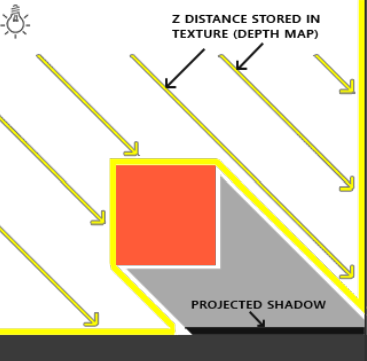

- 然后从观察者视角生成输出图像。
- 对每个像素，转换其观察者空间的深度值到光源空间。

- 将转换后的深度值与阴影贴图中对应深度值比较。
- 如果转换后的深度值大于阴影贴图深度值，该点处于阴影中。

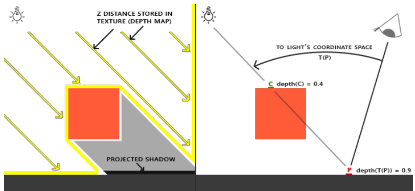

- 标准阴影贴图法主要限制是存在锯齿效应 (aliasing)（混叠）。
- 为了解决这个问题，**透视阴影贴图法**通过先从观察者视角进行透视变换，再生成阴影贴图
- 因此，近处物体在阴影贴图中看起来更大，远处物体看起来更小。

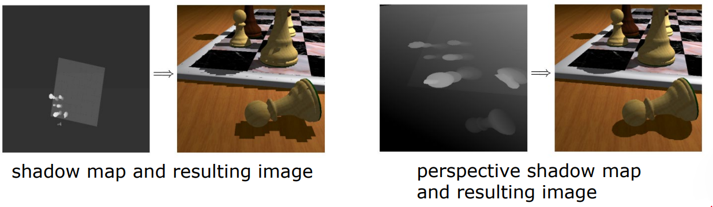

### 2.2 软阴影生成 Generation of soft shadows

#### 点光源合成 Combining point light sources

- 在不同位置多次采样光源，为每个样本点生成阴影贴图。
- 将这些阴影贴图合成为 衰减贴图 (attenuation map)。
- 最终渲染时，用衰减贴图调制每个阴影点的光照。

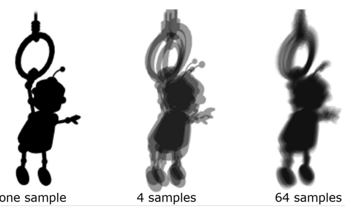

#### 单次采样软阴影 Single sample soft shadow

- 先从光源生成标准阴影贴图。
- 根据遮挡物深度，在阴影边界外生成半影区域。
- 同样地，在阴影边界外生成另一个半影区域。
- 衰减因子从内半影边缘（值为1）变化到外半影边缘（值为0）。

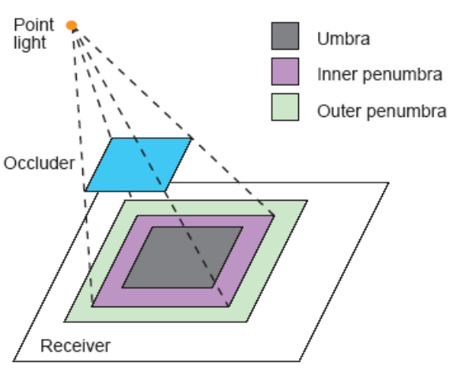

## 3 可见物体判定 Visible Object Determination

在大型场景中包含大量物体，处理所有物体渲染单帧图像效率过低，因此需要快速识别潜在可见物体的方法。

- 一种方法是将场景划分成小单元格。
- 确定所有与视野区域重叠的单元格，仅渲染与这些单元格相交的物体。

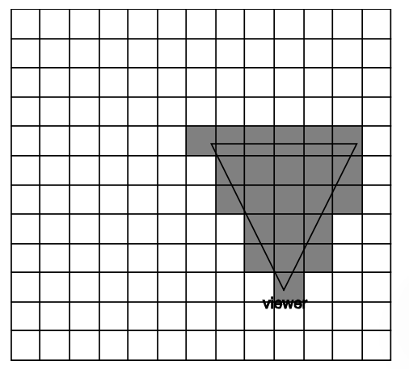

- 另一种方法叫兴趣区域 Area of Interest (AOI)。
- 只有位于观察者AOI内的物体被认为是可见的。
- 通过比较观察者与物体中心的欧氏距离与AOI半径判断是否可见。

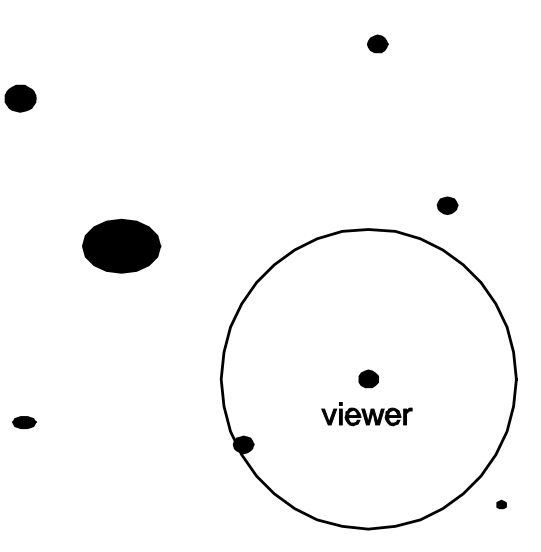

- AOI 方法也可以普适用于物体之间：
- 只有AOI与观察者AOI相交的物体才被认为对观察者可见。
- 通过比较观察者与物体中心的欧氏距离与两AOI半径之和判断可见性。

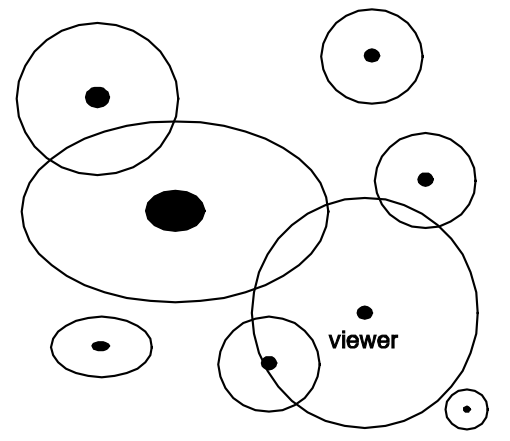

- 我们可以通过将场景细分为小单元格来进一步扩展AOI（兴趣区域）概念。
- 每个单元格维护一个列表，指示所有其AOI与该单元格重叠的物体。
- 现在，通过检查被观察者AOI覆盖的每个单元格中的列表，可以非常高效地确定可见物体。

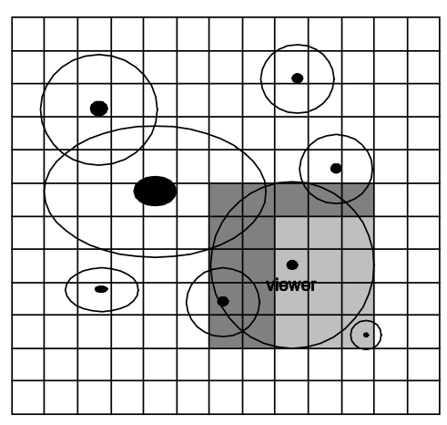