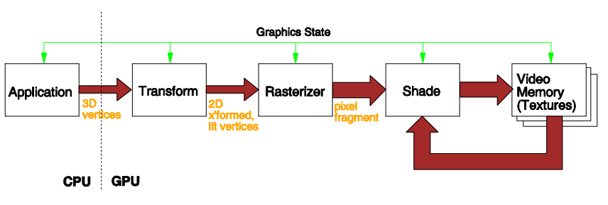
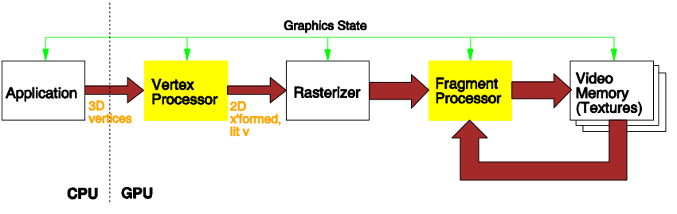
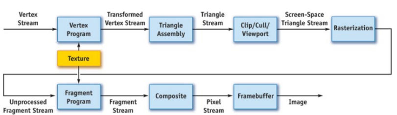
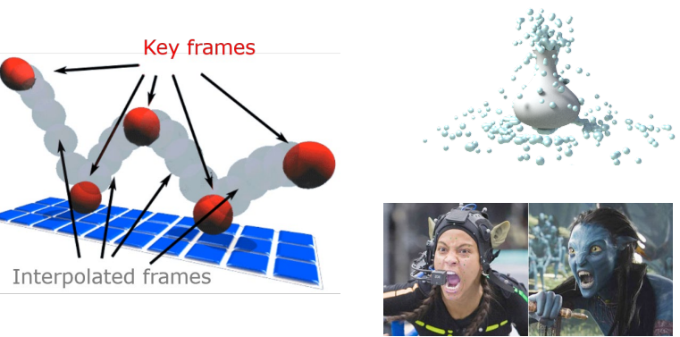
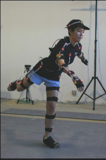
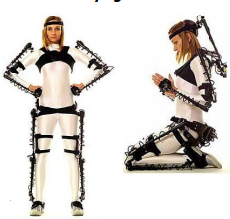
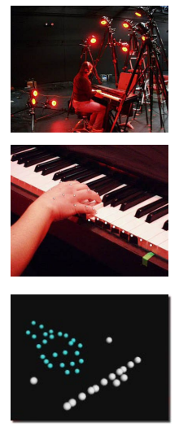
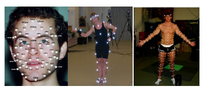
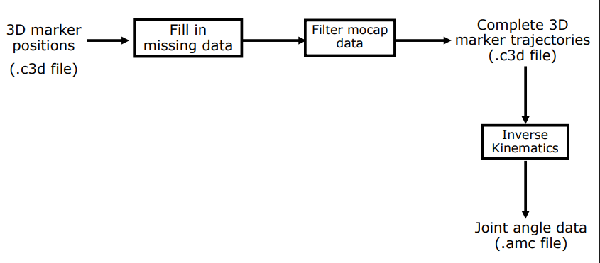

> 介绍了GPU特点和架构，动画三种类型及详细讲了不同类型的MoCap。动画MoCap用到的东西和VR的输入设备有异曲同工之处。机翻章节。

# CG-09 GPU and Computer Animation

## 1 GPU (Graphics Processing Unit)

GPU代表图形处理单元。简而言之，GPU是位于显卡上的处理器，负责快速数学计算。

#### **CPU vs. GPU**

CPU的特点：

- 擅长**控制密集型任务 (control-heavy)**，但不适合数据密集型任务 (data-heavy)
- 只有少量算术单元 (arithmetic units) ——空间有限
- 优化了低延迟性能
- 不适合高带宽需求

GPU的特点：

- 有大量计算单元和并行处理能力
- 控制简单，分多阶段处理
- 容忍较高延迟

#### **现代 GPU**

- 具有高度可编程性
    - 可编程顶点、像素和视频引擎
    - 支持高级编程语言
- 支持高精度计算
    - 全流程32位浮点数，满足多数应用需求
- GPU的计算性能与灵活性使其成为通用计算的理想平台

#### **GPU 架构**

* 传统硬件图形流水线示意图

* 高级硬件图形流水线
    * 可编程顶点处理器 (Vertex processors)
        * 变换
        * 背面剔除
        * 每顶点光照计算
    * 可编程像素（片元）处理器 (Fragment processors)
        * 深度比较
        * 为每像素计算颜色
        * 可选读取纹理（图像）颜色
    * 光栅化器 (Rasterizer)
        - 裁剪
        - 将几何表示（顶点）转换为图像表示（片元：像素数据，包括颜色、深度等）
        - 插值顶点数据至像素

* 流编程模型 Stream Programming Model

    * 图形流水线适合流编程模型，因为它传统上被结构化为由数据流连接的操作。

        顶点->变换->三角形->屏幕空间->流、

    

#### **高效计算**

- 数据级并行（Data-level parallelism）
    - 同样操作独立作用于数据子集
    - 例如，渲染时每个三角形可独立处理
- 任务级并行（Task-level parallelism）
    - 不同操作处理相同或不同数据
    - 典型为流水线技术，将数据通过多个独立执行的阶段
    - 如渲染分多阶段，每阶段向下一阶段传递数据，无需反复迭代

GPU并行性能受限于CPU-GPU通信复杂度 (the complexities of CPU-GPU communication)。提升通信效率的三种方法：

- 偏好传输整个数据流，而非单个元素，降低传输单元成本
- 将应用结构化为内核流水线，有助于释放中间结果的芯片外存储
- 偏好深度流水线，即增加流水线阶段数，隐藏数据访问时间

## 2 动画

- 艺术家导向（如关键帧动画）Artist-directed (e.g., keyframing)
- 程序化动画（如仿真）Procedural (e.g., simulation)
- 数据驱动动画（如动作捕捉）Data-driven (e.g., motion capture)

#### 关键帧 Keyframing

- 只指定重要事件，由计算机通过插值/近似填充其余动画帧
- “事件”不必是位置，也可以是颜色、光强度、相机缩放等

#### 程序化动画 Procedural animation

- 动画师定义完成动画的程序或操作集合
- 每个操作可生成或修改通过它的数据，并可有条件/无条件执行
- 采用程序化动画方法时（如粒子系统、刚体动力学、柔性动力学），用户定义规则、初始条件和参数，运行仿真

#### 动作捕捉 Motion Capture (MoCap)

* MoCap指通过采样和记录人、动物、无生命物体的三维运动数据实现动画。
* MoCap是记录演员动作并应用于三维角色的技术。

##### (1) 电磁式 Electromagnetic MoCap

- 通过发射器和接收器上的三正交线圈相对磁通计算每关节3D位置和方向
- 优点
    - 测量3D位置与方向
    - 无遮挡问题
    - 不需要特殊照明
    - 可同时捕捉多主体
- 缺点
    - 磁场干扰（金属）
    - 无法捕捉变形（面部表情）
    - 难以捕捉细小骨骼动作（手指）
    - 精度不如光学系统

##### (2) 机电式 Electromechanical MoCap

- 被试穿戴外骨骼直接跟踪关节角度
- 优点
    - 测量3D方向
    - 无遮挡
    - 便携，适合户外捕捉（如滑雪）
- 缺点
    - 难以获得3D位置信息
    - 无法捕捉变形（面部表情）
    - 难以捕捉细微骨骼动作（手指）

##### (3) 光学 Optical MoCap

- 多台校准相机采集不同视角的动作
- 被试穿戴反光标记
- 精确测量标记的3D位置

* 优点：

    - 测量3D位置及方向

    - 最精确捕捉方式

    - 高帧率

    - 可捕捉细节动作（身体、手指、脸部变形）

* 缺点：

    - 遮挡问题

    - 多演员交互捕捉困难

    - 昂贵

##### (4) 无标记 Markerless MoCap

* 视频基础 Video-based MoCap
    - 从单摄像头视频流捕获三维动作
* 深度传感器基础 Depth sensor-based（如Kinect）
    - 使用单个深度相机捕获3D动作

#### 光学 MoCap 管线

##### (1) Planning 设置

- 角色/道具设置
    - 角色骨骼拓扑（骨骼/关节数量，每骨骼自由度）
    - 道具位置和大小
- 标记设置
    - 标记数量
    - 标记放置位置
- 角色设置依赖于标记配置，因为骨骼旋转由标记位置决定

##### (2) Calibration 校准

- 相机校准
    - 确定每台相机的位置和方向
    - 确定相机参数（如焦距）
- 被试校准
    - 确定演员骨骼尺寸（.asf文件）
    - 确定骨骼相对标记位置
    - 道具尺寸和位置

##### (3) Processing Markers 过程标记

- 每个相机记录捕捉会话
- 提取: 标记需在图片中识别
    - 确定2D位置
    - 问题: 遮挡，标记不可见，多用相机
- 标记需标号
    - 识别每个标记身份
    - 问题: 标签交叉，需人工干预
- 计算3D位置
    - 至少两个相机看到标记，即可计算3D空间位置

##### (4) Data Processing 数据处理

