> 期末复习考点知识汇总。不要太依赖本人的复习笔记，因为复习的内容有限，很多都不考。尽量去找历年真题，如果有的话。我的内容比较适合临时抱佛脚，求个安心哈哈。

# Final Review

## 1 Introduction

### 1. 什么是虚拟现实 (Virtual Reality, VR)?  

#### 1.1 定义 

VR 是一种人机交互界面，包含以下特点：

- **实时模拟 (Real-time simulation)**
- 通过**交互 (Interactions)**
- 使用**多种感官通道 (Multiple sensorial channels)**

这些感官通道可能包括视觉 (visual)、听觉 (auditory)、触觉 (tactile)、嗅觉 (smell) 和味觉 (taste)。  

#### 1.2 VR四个层级

1. **被动型 (Passive)**:  
    - 用户几乎没有控制权，例如观看电影或阅读书籍。
    - 无法修改内容。

2. **探索型 (Exploratory)**:  
    - 用户可以通过移动探索虚拟世界。  
    - 无法修改内容。  

3. **交互型 (Interactive)**:  
    - 用户可以在虚拟世界中探索并互动，例如：
        - 伸手抓取虚拟书籍。
        - 移动虚拟房间中的家具。 

4. **协作型 (Collaborative) (Most difficult to achieve)** :  
    - 多个用户可以彼此互动，共同完成虚拟世界中的某些目标。  

> 注意：VR主要关注第2、3和4层次。  

#### 1.3 VR主要特点

- VR 允许用户在**实时模拟环境 (real-time simulated environment)** 中进行交互（如同真实生活中的互动）。
- 交互通过多种感官进行。

#### 1.4 VR设备

为了支持多感官交互，需要使用不同类型的接口设备：  

- **输入设备 (Input devices)**: 人到电脑  
- **输出设备 (Output devices)**: 电脑到人  
- 有些设备可能同时包含输入和输出功能的设备

### 2. 人机交互界面 (Human Computer Interfaces, HCI) 

#### 2.1 概述  

HCI 的重点在于：  

- 捕获用户的交互指令 **(输入 input)**。  
- 让计算机分析这些指令并生成反馈给用户的反应 **(输出 output)**。  

人类通常通过多种感官彼此互动。目标是在人机交互中支持类似的互动方式。  

#### 2.2 视觉 Visual  

视觉在人类互动中起着至关重要的作用：  

- **增强现实感 (Enhanced Realism)**： 
    研究提高了计算机图像合成的现实感和渲染速度，使计算机能够向用户呈现更加真实和互动的虚拟世界。

- **理解用户行为 (Understanding User Behavior)**： 
    研究还增强了计算机视觉技术，用于解读用户的世界。然而，由于视觉理解的复杂性，这仍然是一个挑战。  

#### 2.3 声音 Auditory 

- 音频为人类提供了一种直接交换想法的方法。  
- 它帮助个体感知周围环境，例如检测接近的汽车及其大致距离。  
- 对于计算机来说，生成声音比识别声音更容易。  
- **深度学习**的最新进展显著提高了音频识别的性能。  

#### 2.4 手势  Gesture

- 手势传递了大量信息。  
- 可以通过3D图像轻松呈现手势。  
- 各种电子手套可用于捕获人类手部动作。

#### 2.5 其他感官  

- **嗅觉 (Smell)**：  
    - 产生气味相对简单，但一旦产生后清除气味则很困难。  
    - 有些气味容易检测，而另一些则较难。  
    - 嗅觉集成在当前的虚拟现实应用中很少被考虑。  
- **触觉感知 (Tactile Sensing)**：  
    - 触觉感知涉及检测和施加力。  
    - **压力传感器 (Pressure sensors)** 可检测用户施加的力并作为计算机的输入。  
    - **机械或液压设备 (Mechanical or hydraulic devices)** 可为用户生成物理力输出。  
    - 然而，这种设备通常是侵入式的，因为即使在未使用时用户也能感受到它的存在。  

### 3. VR系统的类型

为了满足不同应用需求，已开发出多种虚拟现实系统。这里讨论了四种最流行的类别：  

- **沉浸式虚拟现实 (Immersive VR)** 
- **非沉浸式虚拟现实 (Non-immersive VR)**
- **增强虚拟现实 (Augmented VR, AR)**  
- **远程呈现 (Telepresence)**

> 沉浸式和非沉浸式VR 通常被统称为虚拟现实（VR）。 
> 远程呈现技术与机器人学相关联。  

| 类型                                    | 特点                                      | 设备                                          |
| --------------------------------------- | ----------------------------------------- | --------------------------------------------- |
| **沉浸式虚拟现实** (Immersive VR)       | 360°全沉浸式                              | 头戴显示器 (HMD), 触觉手套, 运动追踪器        |
| **非沉浸式虚拟现实** (Non-immersive VR) | 非360° 半沉浸式                           | 屏幕、立体眼镜(sterioscopic glasses)          |
| **增强现实** (Augmented Reality, AR)    | +现实环境                                 | 手机/平板电脑, 智能眼镜 (transparent glasses) |
| **远程呈现** (Telepresence)             | 和robot联动，双工( two-way communication) | 远程控制机器人, 视频会议系统                  |

---

## 2 Input Devices

### 1. 3D Tracking Basic

* **跟踪器（Tracker）**：一种用于实时测量（或跟踪）物体位置和/或方向的设备。   
* 在 VR 中，常见的跟踪目标包括用户的头部、手部和四肢。
* 被跟踪的位置和方向通常是相对于参考（或世界）坐标系指定的。

#### 1.1 自由度 (Degrees of Freedom, DOFs)

自由度表示需要跟踪的独立运动（或测量）数量。   

不同 DOFs 设备的示例：  

* 2 DOFs（例如，二维鼠标）
* 3 DOFs（例如，用于跟踪位置的加速度计或用于跟踪方向的陀螺仪）
    * 只跟踪旋转（绕X、Y、Z轴的转动），能测量头部或设备的朝向，但不能测量位置变化
    * row, pitch, yaw

* 6 DOFs（例如，大多数手机同时使用加速度计和陀螺仪）
    * 同时跟踪位置和平移（X、Y、Z轴的移动）和旋转（绕X、Y、Z轴的转动），能全面反映设备或人体部位在空间中的位置和姿态变化。
    * row, pitch, yaw, x, y, z

#### 1.2 坐标矩阵 (Coordinate Matrix)

给定一个 3D 点，我们可以通过以下公式确定其在图像空间中的位置
$$
\textbf{v}_{2D}=\textbf{M}_{proj}*\textbf{M}_{view}*\textbf{M}_{world}*\textbf{v}_{3D}
$$
其中$\textbf{v}_{3D}$是输入的 3D 点， $\textbf{M}_{world}$ 是 3D 点的模型矩阵，$\textbf{M}_{view}$ 是视图矩阵，$\textbf{M}_{proj}$ 是投影矩阵。

* $\textbf{M}_{world}$：模型矩阵，用于将模型局部坐标系中的 3D 点转换到世界坐标系（或参考坐标系）。
* $\textbf{M}_{view}$：视图矩阵，用于将世界坐标系中的 3D 点转换到视图坐标系（即用户的视角）。
* $\textbf{M}_{proj}$：投影矩阵，用于将视图坐标系中的 3D 点投影到 2D 图像上的点。

#### 1.3 跟踪器位置和方向

假设我们希望跟踪用户的视点位置，我们可以将跟踪器附加到用户的头部。

我们可以确定视图矩阵（即跟踪器相对于世界/参考坐标系的位置和方向），其公式如下：
$$
\textbf{M}_{view} = R(-θ_{roll}, -θ_{pitch}, -θ_{yaw}) * T(-eye)
$$

为了确定跟踪器的位置，我们使用平移矩阵表示传感器相对于参考坐标系的距离。

该平移矩阵可以表示为 **T(-eye)**，其中 **eye** 指的是眼点的 3D 位置。

为了确定跟踪器的方向，我们使用旋转矩阵相对于参考坐标系表示其方向。
该旋转矩阵为：
$$
R(-θ_{roll}, -θ_{pitch}, -θ_{yaw}) = R_{roll}(-θ_{roll}) * R_{pitch}(-θ_{pitch}) * R_{yaw}(-θ_{yaw})
$$

#### 1.4 跟踪器精度

跟踪器性能通常使用 **精度 (Accuracy)**、**抖动 (Jitter)**、**漂移 (Drift)**、**延迟 (Latency)** 来衡量。

1. 精度

    

    指对象的实际位置与跟踪器测量结果的相似程度。

    精度通常不是固定值，并且随着到参考坐标系原点距离的增加而降低。

    可接受精度的距离定义了跟踪器的 **工作范围 (operating range)**。   

2. 抖动

    

    是指即使跟踪对象保持静止，跟踪器输出也会发生的变化。

    这些变化通常是随机的，并围绕真实值波动。

    抖动的程度可能在跟踪器工作范围内有所不同，并受到环境条件的影响。

3. 漂移

    

    是指随着时间推移，由于误差积累等因素导致的不准确性增加。

    可能需要通过辅助跟踪器定期重置误差。

4. 延迟

    

    是指从动作发生到接收到信号之间的时间延误。

    对于 3D 跟踪器，延迟指对象位置或方向发生变化与跟踪器输出之间的时间间隔。

    动作和视觉反馈之间的长时间延迟会导致 **模拟病 (simulation sickness)**，如头痛、恶心和眩晕。   

    * 减少延迟的可能方法
        * 使用更快的通信路线
        * 减少每一步的处理延迟
        * 同步跟踪器的测量、通信、渲染和显示循环，这有助于降低整个系统的更新频率。
    * 

#### 1.5 跟踪器更新率

* 跟踪器每秒报告的测量次数，通常超过 30 次。   
* 更新率越高，模拟的动态响应越好。
* 如果单个跟踪系统需要支持更多跟踪器（即传感器）来跟踪多个物体或身体部位，则采样率可能需要相应减少。  

### 2. 不同类型的3D 跟踪器

3D 跟踪器主要有 机械跟踪器 (Mechanical Trackers)、磁性跟踪器 (Magnetic Trackers) 、超声波跟踪器 (Ultrasonic Trackers)、光学跟踪器 (Optical Trackers)、惯性跟踪器 (Inertial Trackers) 和 3D 导航/操控设备 (3D Navigation/Manipulation Devices) 这几种。

#### 2.5 惯性传感器

有3种惯性传感器：

- **陀螺仪 (Gyroscope):** 测量角速度 (angular velocity)，单位为每秒度数。
- **加速度计 (Accelerometer):** 测量线性加速度 (linear acceleration)，单位为米每平方秒 (m/s²)。
- **磁力计 (Magnetometer):** 测量磁场强度 (magnetic field)，单位为微特斯拉 (μT)。

| 类型                                                     | 特点                                             | 优点                                                         | 缺点                                                         |
| -------------------------------------------------------- | ------------------------------------------------ | ------------------------------------------------------------ | ------------------------------------------------------------ |
| **机械跟踪器 (Mechanical Trackers)**                     | 使用物理连接和传感器来测量对象的位置和方向。     | - 高度准确;    - 不受电磁干扰影响。                     | - 限制活动范围;    - 设备较重，需保持连接。             |
| **磁性跟踪器 (Magnetic Trackers)**                       | 通过发出磁场和接收器测量目标对象的位置和方向。   | - 精度高;    - 传感器轻便;    - 无视线限制。       | - 易受金属物体干扰;    - 需在受控环境中使用。           |
| **超声波跟踪器 (Ultrasonic Trackers)**                   | 通过超声波信号测量距离和方向。                   | - 成本相对低廉;    - 小巧轻便。                         | - 需要直接视线;    - 更新率较低;    - 精度受环境影响。 |
| **光学跟踪器 (Optical Trackers)**                        | 通过相机捕捉标记的反射光来测量对象的位置和方向。 | - 高精度;    - 高更新率;    - 小延迟。             | - 受遮挡和光照条件影响;    - 需要视线无阻。             |
| **惯性跟踪器 (Inertial Trackers)**                       | 结合陀螺仪和加速度计测量对象的运动和方向。       | - 无限追踪范围;    - 无视线限制;    - 低抖动。     | - 误差累积（漂移）;    - 受温度影响;    - 误差随时间加大。 |
| **3D导航/操控设备 (3D Navigation/Manipulation Devices)** | 允许用户在虚拟环境中进行物体操控和视角切换。     | - 提高交互体验;    - 多种手势和操作方式;    - 较为友好的人机交互。 | - 有时候不够直观;    - 传感器的耦合效应可能影响操作。   |

---

## 3 Output Devices

### 1. 人类视觉系统 (The Human Visual System)

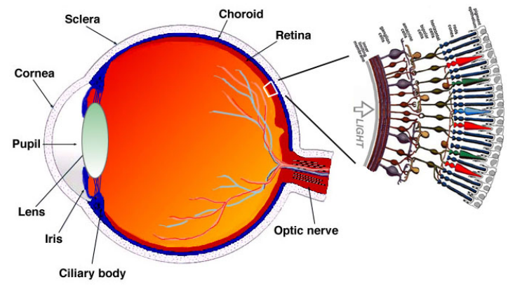

#### 1.1 视网膜 (Retina)

- 视网膜包含126百万个光感受器
    - 分布不均
- 中央凹 (Fovea)
    - 视网膜的中央区域
    - 高分辨率、颜色感知区域
    - 表示聚焦区域
- 低分辨率、运动感知光感受器
    - 覆盖其余视野

#### 1.4 深度感知 (Depth Perception)

- **近距离物体的深度线索**
    - **会聚 (Convergence)**：双眼旋转聚焦于物体
    - **调节 (Accommodation)**：睫状肌调整以聚焦 (Adjustment of ciliary muscles to focus)。
    - **视差 (Disparity)**：物体在两眼中的位置差异
    - **视差效应 (Parallax)**：头部水平移动时，近物体移动更多
- **远距离物体的深度线索**
    - **遮挡 (Occlusion)**：近物体遮挡远物体
    - **透视 (Perspective)**：远物体看起来更小 (Distant objects appear smaller)。
    - **雾化 (Haze)**：远物体显得更灰
    - **表面纹理 (Surface texture)**：类似透视效果

### 2. 头戴式显示器图像生成 (HMD Image Formation)

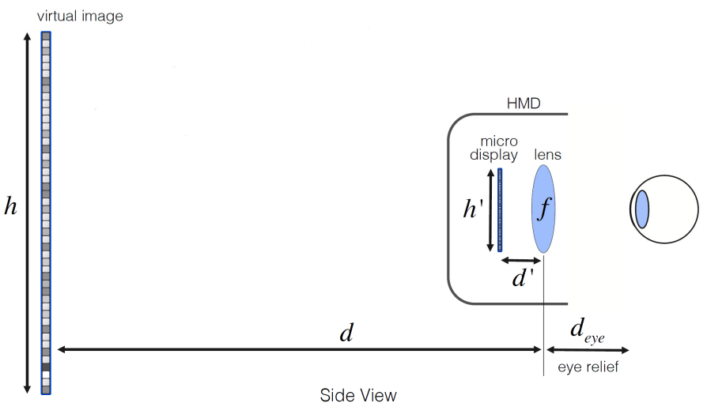

- **放大因子 (Magnification factor):**
    $$M = \frac{h}{h'}$$
    - $h$：虚拟图像高度
    - $h′$：实际图像高度
    - 由于 $d = \frac{f d'}{(d' - f)}$，因此 $M = \frac{f}{(d' - f)}$
- **会聚与调节冲突 (Convergence and accommodation conflict)**
    - 在HMD中，眼睛会聚于虚拟物体，但调节保持在虚拟图像平面

### 6. 声音属性 (Sound Properties)

- **声音是通过介质传播的压力波**

- 声音速度 (Speed of Sound):

    $c=\sqrt{\frac{K}{ρ}}$

    其中：

    - $K$ 是介质的刚性系数 (stiffness coefficient of the medium)。
    - $ρ$ 是介质的密度 (density of the medium)。

- 空气中的声音速度约为 $343 \text{m/s}$ (或 $767 \text{miles/hour}$)

- 声音具有普通波的特性:

    - **反射 (Reflection):** 声音遇到障碍物时反弹
    - **折射 (Refraction):** 声音进入不同密度介质时改变传播角度
    - **衍射 (Diffraction):** 声音绕过障碍物传播

#### 6.1 人类听觉系统 (Human Auditory System)

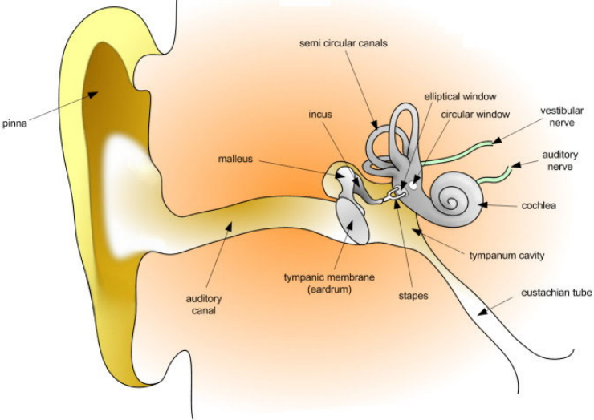

- 耳廓 (Pinna):
    - 反射声音并放大某些频率，同时衰减其他频率
    - 提供方向信息
- 耳道 (Ear Canal):
    - 放大 3-12$\text{kHz}$ 范围内的声音
- 中耳 (Middle Ear):
    - 由精细的骨骼组成，放大鼓膜的声音压力
- 内耳 (Inner Ear):
    - 将声音压力转换为脑信号
- 人类听觉范围 (Hearing Range):
    - $20 \text{Hz}$ 到 $20 \text{kHz}$
    - 对 3-4 $\text{kHz}$ 的声音最敏感

### 7. 三维声音 (3D Sound)

3D 声音与立体声的区别在于，3D 声音会根据用户头部的位置和方向动态变化

#### 7.1 声音定位 (Sound Localization)

人类通过以下线索确定声音来源的三维位置

##### 水平角度线索 (Azimuth Cues)

- 双耳时间差 (Interaural Time Difference, ITD):
    - 声音到达两耳的时间差
    - 公式
        $Δt=t_{left}−t_{right}$
- 双耳强度差 (Interaural Intensity Difference, IID):
    - 由于头部的遮挡效应，靠近声源的一侧耳朵接收到的声音强度更高

##### 垂直角度线索 (Elevation Cues)

- 耳廓反射 (Pinna Reflection):
    - 声音在耳廓上的反射和干涉会放大某些频率并衰减其他频率
    - 这些变化帮助确定声音的垂直角度

##### 距离线索 (Distance Cues)

- 声音的感知响度 (Perceived Loudness):
    - 大脑结合已知声音源的特性和感知响度来估计距离 (The brain estimates distance by combining prior knowledge of the sound source and its perceived loudness)。
- 运动视差 (Motion Parallax):
    - 用户头部移动时，声音源的方向变化

#### 7.2 头相关传递函数 (Head-Related Transfer Function, HRTF)

- **定义 (Definition):**
    头相关传递函数 (HRTF) 是声音从声源传播到耳朵的传递函数的傅里叶变换

- **个性化 (Individuality):**
    每个人的 HRTF 都是独一无二的，因为耳廓和躯干的几何形状不同 (Each person has a unique HRTF due to differences in outer ear and torso geometry)。

- 公式 (Formula):

    $Y_i=H_i⊗S$

    其中：

    - $H_i$ 是用户 $i$ 的 HRTF
    - $S$ 是输入声音源
    - $⊗$ 是卷积操作符

- 卷积 (Convolution):

    - 将 HRTF 应用于输入声音并通过耳机播放，用户会感知声音来自原始声源位置

【生物结构只考关键部位】

* **眼睛结构** 
    * **Retina (视网膜)**：是眼睛内部感光的关键组织，主要功能是：
        - **接收光信号**：视网膜位于眼球后部，负责接收进入眼睛的光线。
        - **感光细胞转换**：视网膜内有两种主要感光细胞——杆细胞和锥细胞。杆细胞对光的强弱敏感，负责夜间及弱光视觉；锥细胞负责颜色和细节识别。
        - **图像处理**：感光细胞把光信号转变成电信号，并初步进行信号处理，提取边缘、对比度等视觉信息。
        - **传递信息**：这些电信号通过视神经传到大脑视觉皮层，产生视觉感知。

* **耳朵结构 (期中考了)**
    * **Cochlea（耳蜗）**：是内耳中的一个关键结构，主要作用是将声音的机械振动转换成神经信号，从而实现声音的感知。它的功能和过程如下：
        - **作用原理**：声音波通过外耳道传入中耳，引起鼓膜振动，经过听骨链传递至耳蜗内的液体介质，产生波动。
        - **信号转化**：耳蜗内有成千上万的毛细胞，这些细胞对不同频率的声波产生相应的机械反应，毛细胞的运动被转化为电信号。
        - **频率分析**：耳蜗结构呈现梯度刚度，不同部位的毛细胞对不同频率的声音具有最大响应，完成频率的分解和分析。
        - **传输信号**：电信号通过听神经传递到大脑听觉皮层，实现对声音的识别和解码。

* **皮肤触觉传感器 (not so important):**
    - 表层感受器 (Surface Receptors):
        - **迈斯纳小体 (Meissner Corpuscles):** 快速适应，检测高频刺激
        - **梅克尔盘 (Merkel Disks):** 慢速适应，检测低频刺激
    - 深层感受器 (Deep Receptors):
        - **帕齐尼小体 (Pacinian Corpuscles):** 快速适应，检测接触力的变化
        - **鲁菲尼小体 (Ruffini Corpuscles):** 慢速适应，检测静态力
    - Slow-Adapting Sensors - Merkel and Ruffini
    - Fast-Adapting Sensors - Mesissner and Pacininan

### 8. 触觉反馈 (Haptic Feedback)

触觉接口通过传递感官信息帮助用户感知虚拟物体

- **触觉反馈 (Tactile Feedback):**
    提供实时接触表面几何形状、粗糙度和温度的信息
- **力反馈 (Force Feedback):**
    提供虚拟物体表面属性、重量和惯性的实时信息

#### 8.2 触觉反馈接口 (Tactile Feedback Interfaces)

- **触觉鼠标 (Tactile Mouse):**
    - 通过振动提供触觉反馈
    - 示例：Logitech 的 iFeel Mouse
        - Has an additional electrical actuator that can vibrate the outer shell of the mouse
- **触觉手套 (Tactile Gloves):**
    - CyberTouch 手套:
        - 配备 6 个振动触觉执行器
    - 温度反馈手套 (Temperature Feedback Gloves):
        - 通过热电泵模拟物体的热特性 

---

## 4 Computer Architectures

### 1. VR系统架构 (VR System Architecture)

#### 1.1 任务

1. 读取输入设备（传感器）数据  
2. 更新虚拟世界的状态
3. 渲染输出（图形、触觉等）
4. 将输出传递到输出设备

#### 1.2 VR引擎架构要求

- **低延迟 (Low latency)**  
- **快速图形渲染 (Fast graphics rendering)**  
- **触觉渲染 (Haptics rendering)**  

### 2. 图形渲染管线 (Graphics Rendering Pipeline)

> 期末：major task understand ,cpu (game) gpu (graphic)

图形渲染是将虚拟世界中的三维几何模型转换为二维图像的过程 

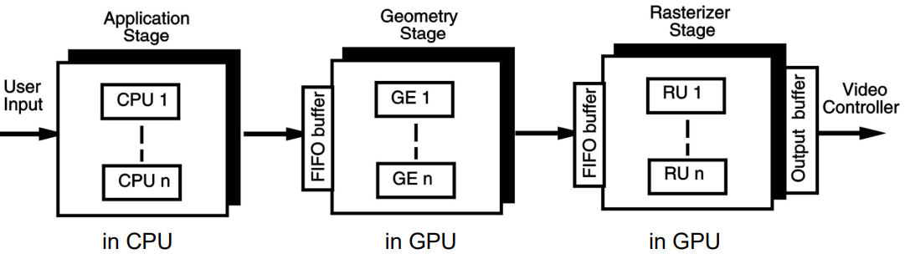

#### 2.1 应用阶段 (Application Stage)

- **由CPU执行 (Executed by the CPU)**  
- 任务  
    1. 获取用户输入（如鼠标、追踪器、感应手套）
    2. 更新虚拟世界的视图、数据库和状态
    3. 选择相关的几何对象并发送到后续阶段进行渲染  

#### 2.2 几何阶段 (Geometry Stage)

- **由GPU硬件实现**  
- 任务  
    1. **模型变换 (Model transformations)**  
    2. **着色计算 (Shading computations)**  
    3. **场景投影 (Scene projection)**  
    4. **裁剪 (Clipping)**  

#### 2.3 光栅化阶段 (Rasterizer Stage)

- **任务**

    1. 将几何图元（如三角形）分解为像素片段

    2. **抗锯齿 (Anti-aliasing):**  

        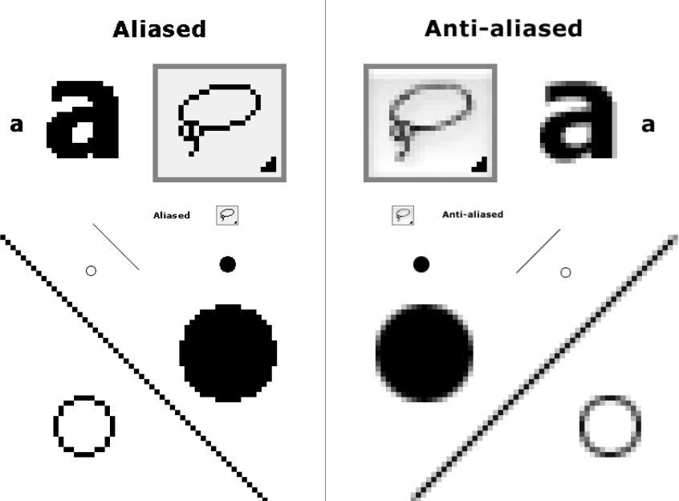

        - 每个像素分为$n$个子像素  
        - 计算每个子像素的颜色，最终颜色为子像素颜色的平均值

    3. **纹理映射 (Texture Mapping):** 将纹理图像映射到几何表面

        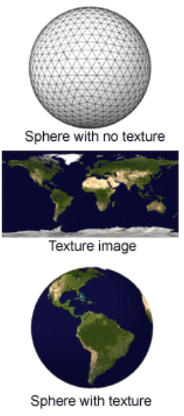

### 3. 触觉渲染管线 (Haptics Rendering Pipeline)

> 期末：(not standard, not for all device) ask basic.

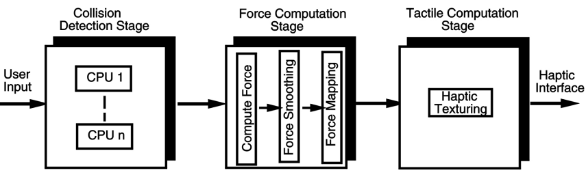

#### 3.1 碰撞检测阶段 (Collision Detection Stage)

- 加载物体的物理特性  
- 检测用户与物体之间的碰撞  

#### 3.2 力计算阶段 (Force Computation Stage)

- **计算碰撞力 (Compute collision forces):**  
    - 基于物理模拟模型  
- **力平滑 (Force smoothing):** 调整力向量方向以避免突然变化
- **力映射 (Force mapping):** 将计算得出的力映射到特定触觉设备的特征

#### 3.3 触觉计算阶段 (Tactile Computation Stage)

- **触觉纹理渲染 (Haptic Texturing):**  
    - 计算触觉效果（如振动或表面温度）并发送到触觉显示设备  

> 期末要求掌握：what the 2 pipeline do.

### 5. 分布式VR架构 (Distributed VR Architecture)

#### 5.1 单用户系统 (Single-User Systems)

- 使用多个并排显示器
    - 用于桌面虚拟现实工作站或大型体积显示器（如 CAVE 或“墙”）。
    - 一种解决方案是为每个投影仪使用一台配备图形加速器的独立计算机。
    - 另一种解决方案是只使用一台计算机，配备多个图形加速器卡（每个监视器一张）。
- 使用多个局域网连接的计算机

#### 5.2 多用户系统 (Multi-User Systems)

- **架构类型 :**  
    - 客户端-服务器系统 (Client-server systems)
    - 点对点系统 (Peer-to-peer systems)
    - 混合系统

---

## 复习笔记（一）

> 至此是期中考前内容，期末考试的考点范围，此处贴上期中复习时的笔记图片。

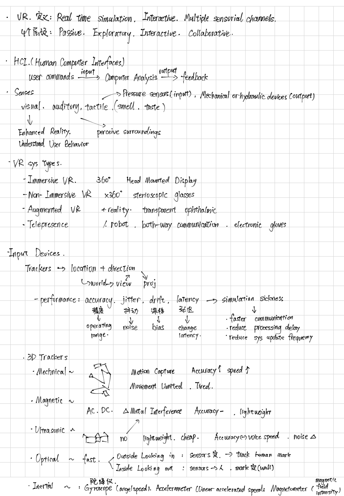

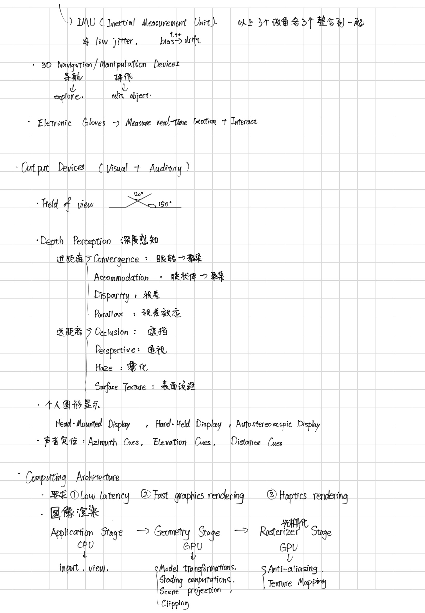

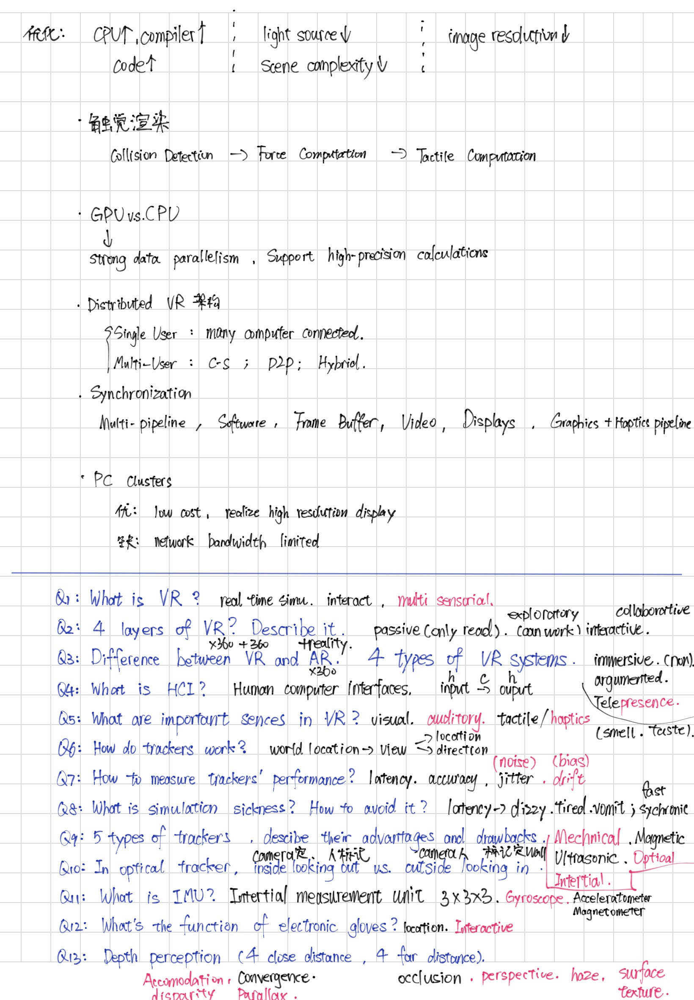

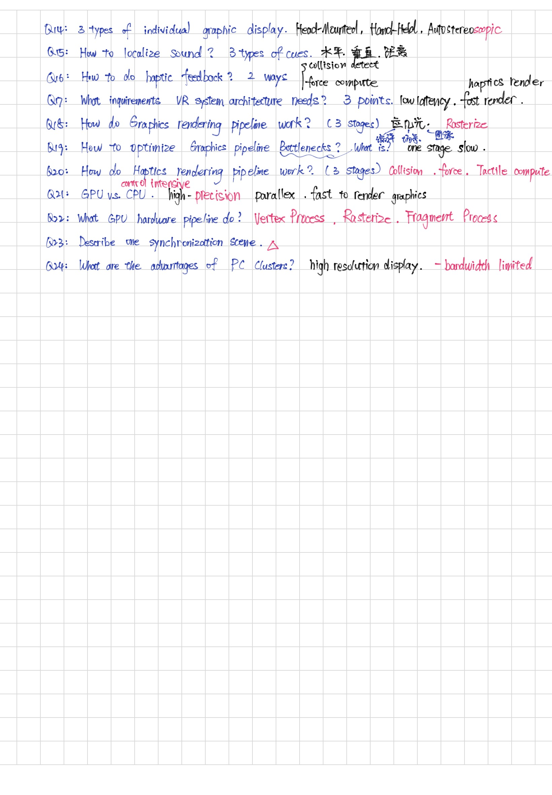

> 期中考后的考点范围不是很多，着重理解即可。

---

## 5 VR Modeling

**VR对象建模问题 (VR Object Modeling Issues)：**

1. **几何建模 (Geometric modeling)**
    负责创建对象的形状和结构，定义对象的空间形态和几何细节。
    Responsible for creating the shape and structure of objects, defining their spatial form and geometric details.
2. **运动学建模 (Kinematical modeling)**
    处理对象的运动及其运动关系，比如关节的旋转、位置变化、速度等。
    Deals with the motion of objects and their relationships, such as joint rotations, position changes, and velocities.
3. **物理建模 (Physical modeling)**
    模拟对象的物理特性和力学行为，比如质量、碰撞、弹性等。
    Simulates the physical properties and mechanical behaviors of objects, such as mass, collisions, elasticity, etc.
4. **对象行为建模（智能代理）(Object behavior modeling (intelligent agents))**
    赋予对象智能，使其能够自主决策和响应环境变化。
    Gives objects intelligence so they can make autonomous decisions and respond to environmental changes.
5. **模型管理 (Model management)**
    负责管理和维护上述各种模型的组织、存储与协调，确保整体系统的有序运行。
    Manages and maintains the organization, storage, and coordination of the various models above to ensure orderly operation of the full system.

---

## 6 Sense of Presence

- 存在感是指用户在虚拟环境中感受到自己真实存在的感觉。
- 实现存在感需要说服多种感官（视觉、听觉、触觉、运动感、嗅觉）共同参与。
- 当前VR技术面临人物动作不够真实、感官信息缺失及设备限制等挑战。
- 存在感的衡量可分为主观问卷测评、心理物理测量和客观生理及表现测量。
- Sheridan提出的存在感衡量指标包括感官信息程度、感官控制能力和环境修改能力三方面。
- 提升存在感的因素包括高视觉质量、大视场角、低延迟、多感官信息和良好交互体验。
- 存在感减弱因素有感官错位、高延迟、劣质音频、连线缠绕以及用户看不到自己的身体部位。

**开放性问题 (Open Questions)**

- 什么因素决定了存在感（sense of presence）？

    - **感觉信息的范围 (Extent of sensory information)：**
        有多少感官通道被激活（视觉、听觉、触觉、运动、嗅觉等）。
    - **感官控制 (Control of sensors)：**
        用户能在多大程度上控制或改变感官输入，比如头部追踪和互动。
    - **环境修改能力 (Ability to modify environment)：**
        用户能够多大程度上影响虚拟环境，增强临场感。

    增加存在感：高质量视觉效果（清晰画面）、大视场角（FOV）、低延迟（减少感官错位）、多感官融合（声音、触觉反馈）、良好的交互性、看到自己的身体部位

    降低存在感：感官错位、高延迟、劣质音频、连线缠绕、看不到身体部位

    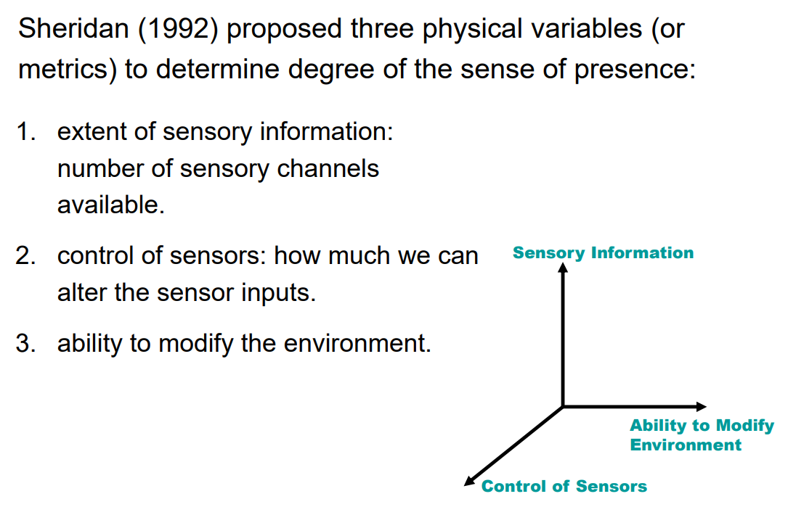

- 是否有主观和客观的测量方法可以量化存在感？

    - **主观测量 (Subjective measures)**
        通过问卷调查让用户评价体验的真实程度，如Witmer和Singer问卷、Steed等人的Likert量表。用户根据自己感受打分，测量存在感后验评价。
    - **心理物理测量 (Psychophysical measures)**
        将物理刺激的强度（如屏幕分辨率、视场角）与主观感受进行关联分析，建立量化关系模型。
    - **客观测量 (Objective measures)**
        - **生理指标 (Physiological measures)**：如心率变化、呼吸频率、血压等生理参数的变化，反映真实感。
        - **任务表现 (Performance measures)**：测量用户在虚拟环境中的任务执行时间、准确率，和现实中的表现作对比。

---

## 8 Distributed Environment

### 1. 定义

- **分布式虚拟环境 (Distributed Virtual Environments, DVEs)** 是一个共享的虚拟环境，允许远程用户通过网络与虚拟对象交互或协作完成任务。
- 支持多用户协同完成任务的 DVE 称为协作虚拟环境 (**Collaborative Virtual Environment, CVE**)。

- 主要应用包括：虚拟博物馆、网络游戏、Second Life、元宇宙等。

### 2. 多服务器分布式虚拟环境 (Multi-Server DVEs)

- DVEs 强调交互性。

- 在典型的客户端-服务器系统中，单一服务器需要处理所有用户请求，更新虚拟世界对象状态并分发同步信息。

    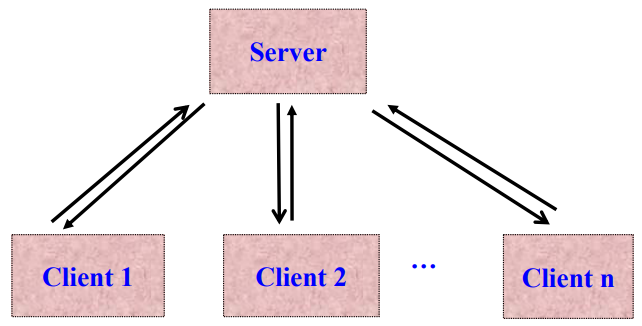

- 当用户数量增加时，单一服务器会超载，无法及时响应用户请求。

- 解决方法

    - 增加服务器以分担负载。
    - 分区方法有：用户分区、区域分区、动态分区。

### 3. 运动同步 (Motion Synchronization)

#### 3.1 网络延迟的影响 (Impact of Network Latency)

- DVEs 强调实时交互，网络延迟 (Latency) 对其影响很大。
- 示例延迟时间：
    - 本地局域网 (LAN)：0.64 ms
    - 区域互联网 (本地连接)：10 ms
    - 海外互联网 (美国-香港)：160 ms
    - 海外互联网 (英国-香港)：203 ms

#### 3.2 分布式系统事件类型

- **离散事件 (discrete events)**：事件发生间隔时间远大于网络延迟，几乎不受网络延迟影响。（如 ATM 操作）
- **连续事件 (continuous)**：事件发生间隔小于网络延迟，网络延迟会显著影响体验。（如 3D 游戏交互）

#### 3.3 场景示例：同步问题 

1. 用户 **A** 在时间 $t$ 看到对象位于位置 $p$。
2. 用户 **A** 将对象移动到位置 $p_A$，并立即发送一条更新消息通知用户 **B**。
3. 假设网络延迟为 0.2 秒，用户 **B** 在 $t+0.2$ 才知道对象被移动到 $p_A$ 。
4. 假设用户 **B** 在时间 $t+0.1$ 希望将对象从位置 $p$ 移动到位置 $p_B$。
5. 由于 **B** 的机器并不知道对象本应该位于 $p_A$ ，因此 **B** 成功地将对象从 $p$ 移动到 $p_B$ 。
6. **B** 马上发送更新信息给 **A** 表明这个改变。 

##### **问题 1**

在时间 $t+0.2$，当 **B** 收到来自 **A** 的更新消息，知道 **A** 在时间 $t$ 已将对象移动到 $p_A$，**B** 应该怎么办？

##### **问题 2**

在时间 $t+0.3$，当 **A** 收到来自 **B** 的更新消息，知道 **B** 在时间 $t+0.1$ 将对象移动到了 $p_B$，**A** 应该怎么办？

##### 典型解决方案——回滚 (roll-back)

- 通常的解决方法是将 **A** 视为“胜者”（Winner）。
- 当 **B** 的机器收到 **A** 的更新消息后，需要纠正情况。

- 游戏应用程序会强制将对象从非法位置 $p_B$ 移动到正确位置 $p_A$ 。
- 这种方法显然可能会导致玩家之间出现争议。

#### 3.5 死算 (Dead Reckoning)

- 死算是连续事件同步的一种流行方法。
- 操作方式：
    - 发送节点和接收节点使用相同的运动预测模型 (motion predictor)。它根据最后一次更新消息中的数据推测运动对象的位置。该更新消息存储了对象的最后位置以及速度/加速度的信息。
    - 当误差超过允许阈值 (threshold) 时，发送更新消息；否则省略更新消息以节省带宽 (save bandwidth)。

### 4. 运动预测 (Motion Prediction)

在死算方案中，给出对象的最后位置以及速度/加速度，我们需要预测它现在的位置。这就是运动预测，通过以前的信息来更新对象现在的位置。

#### 4.1 多项式预测器 (Polynomial Predictors)

- **一阶多项式 (FOP)**

    $$ P_{\text{new}} = p + v \cdot t $$ 

- **二阶多项式 (SOP)**

    $$ P_{\text{new}} = p + v \cdot t + \frac{1}{2}a \cdot t^2 $$ 

    其中：

    - $p$：最后一次更新的位置。
    - $p_{new}$：预测的位置。
    - $v$：运动速度。
    - $t$：预测时间（延迟）。
    - $a$：运动加速度。

- 多项式预测器通常与**死算 (Dead Reckoning)** 方法结合使用，用于运动预测。

- **优点**：非常简单，计算开销很小。

- **局限性**：它们并不是非常精确的预测工具。它们假定速度 $v$ 和加速度 $a$ 是已知的，并且在预测期间它们保持不变。

- **估算速度 $v$ **：需要收集对象的**两个**之前的位置。

    $$v=\frac{p(t)−p(t−1)}{Δt}$$

- **估算加速度 $a$ **：需要收集对象的**三个**之前的位置。

    $$a=\frac{p(t)−2p(t−1)+p(t−2)}{Δt^2}$$

- 基于这些对象的历史位置，可以求得 $v$ 和 $a$ 。然后将这些信息代入预测器，计算预测的位置。

- 然而，还需要知道网络延迟（即 $t$ 的值）。**网络延迟值**并非恒定，它会随着网络流量的变化而动态变化。

---

## 复习笔记（二）

> 以下附上期末复习整理笔记图片

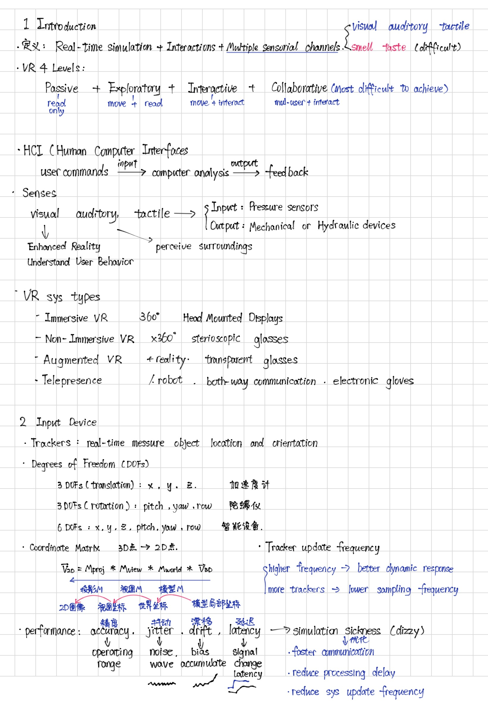

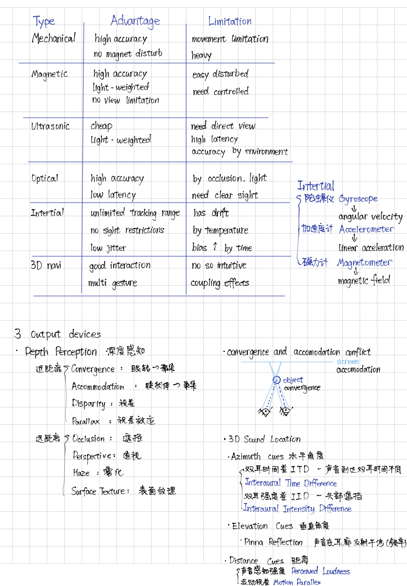

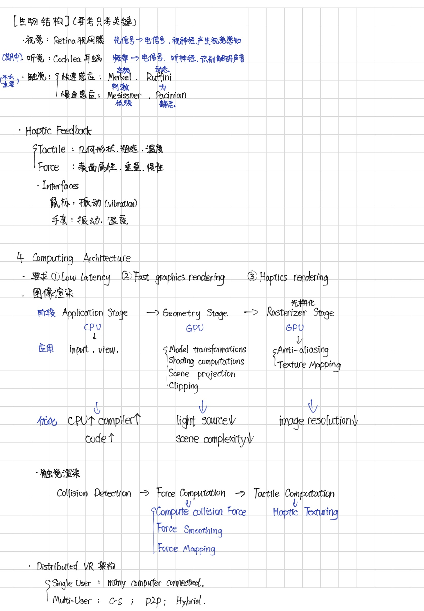

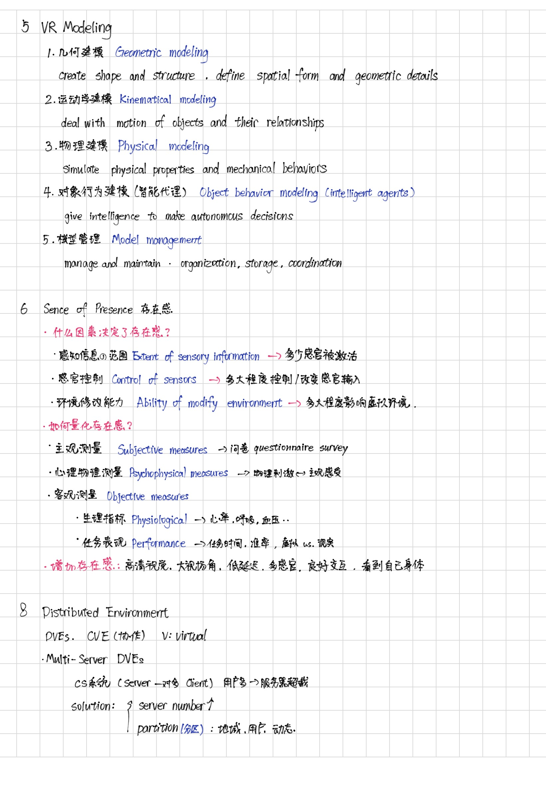

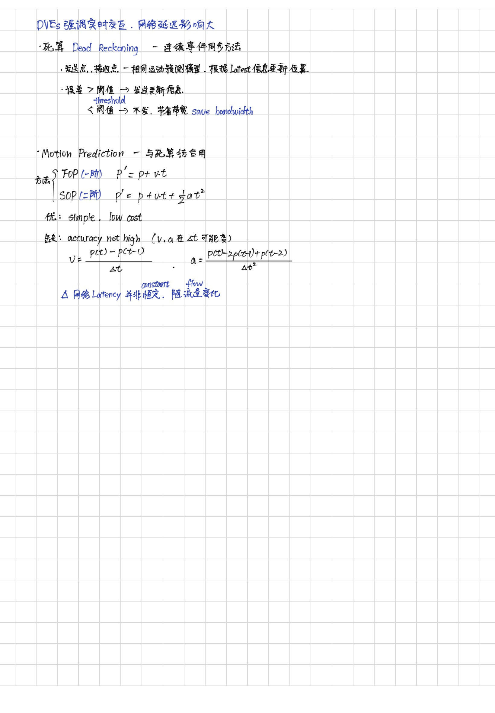

---

## 回顾 ⭐

> 和期中一样，期末也是考到挺多没复习到的。有种在考CG的疯感。

考了些啥呢，凭记忆回忆一点。

1. Gouraud Shading 和 Phong Shading 原理异同优缺点。

    CG期中考过，但是还没复习期末，不太记得哪个是先插值哪个是后插值。

2. 触觉渲染管线，基本管线流程，如何设计电子手套（手指弯曲角度如何获取），如何获取触觉反馈，模拟力。可以回去看 [VR-02: 输入设备] 这一节。

    瞎编乱造，定三点知三边，余弦定理算夹角。事实上应该是个片元不是点，那就插值呗 (bushi)。

3. LoD (Level of Details) 是什么，怎么应用到场景中。

    以前用unity做小游戏涉及到，大概知道是什么东西。但是复习完全没复习到。

4. 分布式。CS模式，多人在线游戏，设置类似MOBA游戏，分析三种场景的利弊：图形资源①全存在服务器，②玩家有一份完整副本，③玩家有一份只和玩家相关部分资源的副本。
    这个我也是根据打游戏经验去理解的。

5. 双重缓冲是什么，有什么优缺点。
    麻了，看到double buffer，脑子里只有一个隐藏面消除算法里的Z-buffer算法，两个缓冲区怎么不算double buffer了(bushi)。好吧，它考的应该是GPU的双重缓冲，是什么垂直同步那块的知识，只能说没进脑子也没复习到，活该不会。

6. 存在感的决定因素是什么，每个是干啥的。
    这个复习到了，背就完了。

7. 变换用的齐次化矩阵

    类判断题，问涉及哪些变换，平移、旋转、缩放、投影(CG课的时候，如果只是变换矩阵是平移旋转缩放，不包含投影的)，投影有自己的矩阵。问是3D变换的齐次化矩阵是几维的，这个理解变换矩阵不难。

8. 视线和 Input Device

    这个要知道输入设备有哪几种，它们的优缺点都需要掌握，无视线限制的，我记得的就磁性和惯性两种。超声波和光学的一个利用光一个利用声音的，肯定还是要直线”视线“比较好。

9. 问光学追踪器(?)为什么利用红外光，不用可见光，优缺点。

10. AR的瓶颈是什么，有什么解决方案。

11. convergence 和 accommodation 冲突是什么，怎么导致的。

12. 视差效应。

    动态时近处的移动感觉更快。例子：坐火车近处的树和远处的山。

不止以上列的这些，只能说考得很刁钻，复习讲的东西，可能只占到考的50%。考得挺痛苦就是了。
