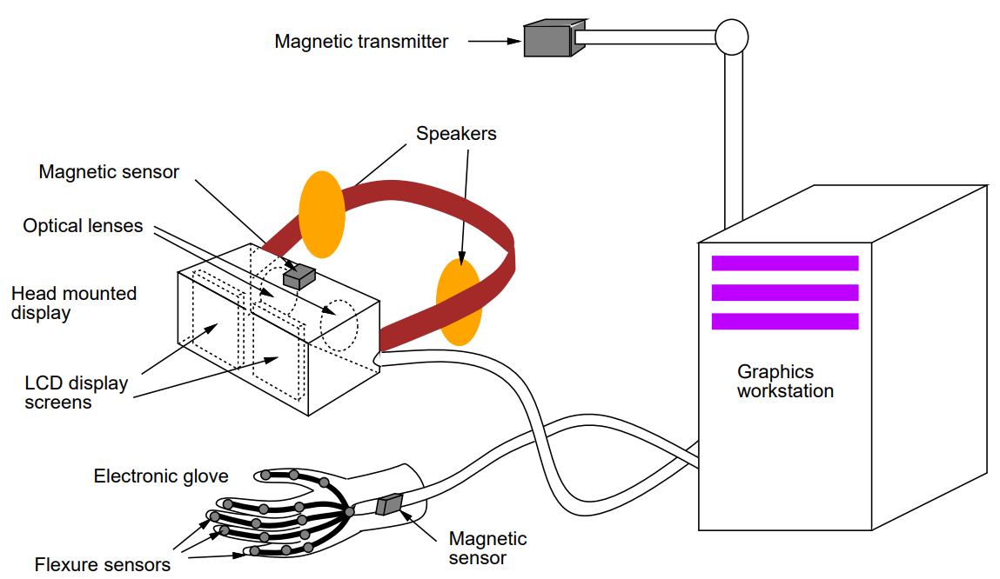
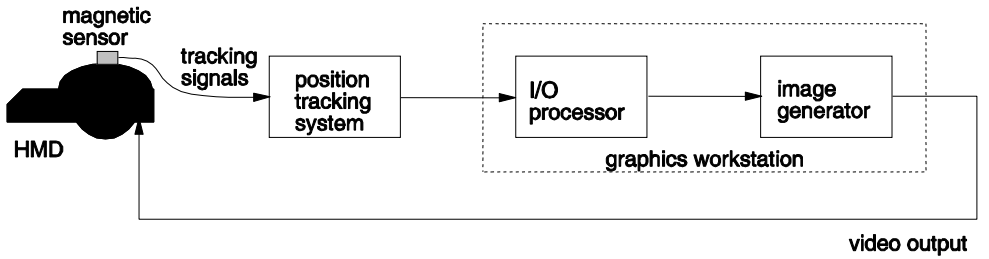
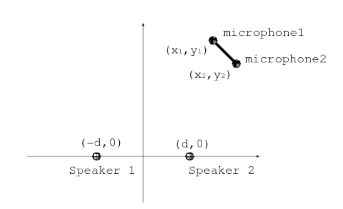
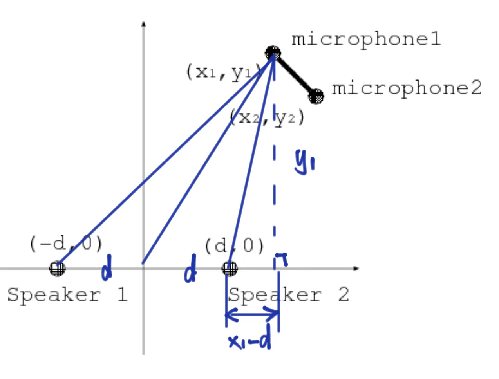

> 第一节课简单介绍了VR的定义与类型，VR系统，提到了一些物理设备。

# VR-01 Introduction

## 0. 总结 ☁️

* 虚拟现实（VR）是一种多感官交互技术，包括视觉、听觉、触觉等感官模拟。
* VR 共有四个层级：被动型、探索型、交互型、协作型。
* 支持VR系统的设备包括头戴式显示器（HMD）、电子手套和位置传感设备。
* VR 系统流行的四个类别：沉浸式VR (360°)、非沉浸式VR (视野受限)、增强VR (虚实结合)、远程呈现 (远程机器人交互)
* 常用的位置追踪技术包括磁性追踪和超声波追踪，支持用户在虚拟空间中精确操作。

## 1. 什么是虚拟现实 (Virtual Reality, VR)?  

### 1.1 定义 

VR 是一种人机交互界面，包含以下特点：

- **实时模拟 (Real-time simulation)**
- 通过**交互 (Interactions)**
- 使用**多种感官通道 (Multiple sensorial channels)**

这些感官通道可能包括视觉 (visual)、听觉 (auditory)、触觉 (tactile)、嗅觉 (smell) 和味觉 (taste)。  

### 1.2 VR四个层级

1. **被动型 (Passive)**:  
    - 用户几乎没有控制权，例如观看电影或阅读书籍。
    - 无法修改内容。

2. **探索型 (Exploratory)**:  
    - 用户可以通过移动探索虚拟世界。  
    - 无法修改内容。  

3. **交互型 (Interactive)**:  
    - 用户可以在虚拟世界中探索并互动，例如：
        - 伸手抓取虚拟书籍。
        - 移动虚拟房间中的家具。 

4. **协作型 (Collaborative)**:  
    - 多个用户可以彼此互动，共同完成虚拟世界中的某些目标。  

> 注意：VR主要关注第2、3和4层次。  

### 1.3 VR主要特点

- VR 允许用户在**实时模拟环境 (real-time simulated environment)** 中进行交互（如同真实生活中的互动）。
- 交互通过多种感官进行。

### 1.4 VR设备

为了支持多感官交互，需要使用不同类型的接口设备：  

- **输入设备 (Input devices)**: 人到电脑  
- **输出设备 (Output devices)**: 电脑到人  
- 有些设备可能同时包含输入和输出功能的设备

## 2. 人机交互界面 (Human Computer Interfaces, HCI) 

### 2.1 概述  

HCI 的重点在于：  

- 捕获用户的交互指令 **(输入 input)**。  
- 让计算机分析这些指令并生成反馈给用户的反应 **(输出 output)**。  

人类通常通过多种感官彼此互动。目标是在人机交互中支持类似的互动方式。  

### 2.2 视觉  

视觉在人类互动中起着至关重要的作用：  

- **增强现实感 (Enhanced Realism)**： 
    研究提高了计算机图像合成的现实感和渲染速度，使计算机能够向用户呈现更加真实和互动的虚拟世界。

- **理解用户行为 (Understanding User Behavior)**： 
    研究还增强了计算机视觉技术，用于解读用户的世界。然而，由于视觉理解的复杂性，这仍然是一个挑战。  

### 2.3 声音  

- 音频为人类提供了一种直接交换想法的方法。  
- 它帮助个体感知周围环境，例如检测接近的汽车及其大致距离。  
- 对于计算机来说，生成声音比识别声音更容易。  
- **深度学习**的最新进展显著提高了音频识别的性能。  

### 2.4 手势  

- 手势传递了大量信息。  
- 可以通过3D图像轻松呈现手势。  
- 各种电子手套可用于捕获人类手部动作。

### 2.5 其他感官  

- **嗅觉 (Smell)**：  
    - 产生气味相对简单，但一旦产生后清除气味则很困难。  
    - 有些气味容易检测，而另一些则较难。  
    - 嗅觉集成在当前的虚拟现实应用中很少被考虑。  
- **触觉感知 (Tactile Sensing)**：  
    - 触觉感知涉及检测和施加力。  
    - **压力传感器 (Pressure sensors)** 可检测用户施加的力并作为计算机的输入。  
    - **机械或液压设备 (Mechanical or hydraulic devices)** 可为用户生成物理力输出。  
    - 然而，这种设备通常是侵入式的，因为即使在未使用时用户也能感受到它的存在。  

### 2.6 计算机视觉的挑战  

- 传统的计算机视觉技术专注于**像素 (pixels)**，而像素是低级数据。这限制了从像素中恢复高级语义信息的能力。  
- **深度学习的进步**引入了从图像/视频中提取高级语义的技术。  

## 3. VR系统的类型

为了满足不同应用需求，已开发出多种虚拟现实系统。这里讨论了四种最流行的类别：  

- **沉浸式虚拟现实 (Immersive VR)** 
- **非沉浸式虚拟现实 (Non-immersive VR)**
- **增强虚拟现实 (Augmented VR, AR)**  
- **远程呈现 (Telepresence)**

> 沉浸式和非沉浸式VR 通常被统称为虚拟现实（VR）。 
> 远程呈现技术与机器人学相关联。  

### 3.1 沉浸式VR

- 它将用户完全沉浸在模拟环境中。  

- 由于视觉交流在人类互动中起着重要作用，沉浸式VR系统强调视觉沉浸感。  

- 通常使用配备头部跟踪功能的**头戴式显示器 (Head Mounted Display, HMD)** 来提供虚拟的360°视野——头部跟踪器检测用户头部的位置/方向，以便图形系统渲染适当的图像并显示在HMD上。  

- 某些系统可能使用多块大型投影屏幕从视觉上环绕用户，例如CAVE系统。  

- 其他系统可能提供类似真实环境的体验，例如在类似驾驶舱的房间中进行飞行模拟，或在类似汽车的场景中进行汽车模拟。  

### 3.2 非沉浸式VR 

- 与沉浸式VR不同，非沉浸式VR系统不提供360°全景视图。用户通常只能通过计算机屏幕进行显示。因此，非沉浸式VR也被称为“有限现实”。  

- 成本低——使用传统显示器进行视觉输出。  

- 某些系统可能使用额外的设备，例如立体眼镜，来提供立体视觉。例如，CrystalEyes眼镜配有两个可控镜片，可以编程为与显示图像同步交替允许/阻止光线通过，从而提供立体视觉。大多数3D电视也采用了类似的技术。  

### 3.3 增强VR (AR)  

- 增强VR是使用透明眼镜，将数据、图表、动画或视频投影到眼镜上，使用户能够在看到真实世界的同时获得计算机提供的附加信息。  

- 常见的两种显示形式包括：  

    - 一种是单片或双片镜片，上面安装了一个小型投影仪，能够将视频图像投射到镜片上。  

    - 另一种是飞行头盔，通常用于战斗机飞行员。头盔上装有小型投影仪，可以将来自计算机的关于环境的额外信息投射到透明屏幕上，即护目镜上。  

- 高级立体显示器能够直接从屏幕中提供立体图像，而无需用户佩戴任何眼镜。这种显示器已经上市，但通常不太流行。  

- 在非沉浸式VR中，用户只有在注视屏幕时才处于虚拟世界中。  

### 3.4 远程呈现  

- 远程呈现技术允许用户观察远程场所，并通过控制远程机器或机器人完成某些任务。通常，用户与远程机器人之间存在双向通信。（遥控是单向的）

- 摄像头、麦克风和其他传感器通常安装在远程机器人上。这些传感器发送的信号会被传输到控制室内的人类操作员。操作员可能配备头戴式显示器（HMD）及其他设备以渲染这些远程信号。  

- 人类操作员也会佩戴一些传感器，例如位置跟踪器和电子手套，用于感应操作员的动作。这些信号会被发送至远程机器人以控制其动作。

## 4. 位置传感器 (Position Sensors)  

为了在虚拟世界中进行探索或交互，计算机需要捕捉用户的物理坐标。以下是一些跟踪方法：  

- **2D鼠标 (2D Mouse)**: 
    虽然2D鼠标非常便宜且始终可用，但在3D世界中使用较为困难。此外，它仅返回相对（非绝对）的鼠标移动信息。  

- **机器追踪器 (Mechanical Tracker)**: 
    机械手臂连接到一个控制手柄，手柄的移动带动机械手臂的移动，从而生成位置信号。这种设备反应快速且精确，但运动范围受限（受机械臂长度的限制）。  

## 5. 典型的沉浸式VR系统

典型的沉浸式VR系统配置可能包括：  

- 头戴式显示器（HMD）  
- 电子手套或某种类型的运动传感器  
- 一组位置跟踪设备  
- 3D图形工作站  

### 5.1 HMD 和电子手套相关组件  

- **头戴式显示器 HMD**: 
    HMD包含一对LCD屏幕和一对光学镜片，可为用户提供立体视觉。此外，HMD还配备了一对扬声器，用于立体声输出。  

- **电子手套 (Electronic Glove)**: 
    电子手套内部包含大量传感器，用于检测手指弯曲动作，因此能够识别手势。  

- **磁性追踪系统 (Magnetic Tracking System)**: 
    磁性追踪系统用来跟踪身体部位的位置。  

- **传感器附件 (Sensor Attachments)**: 
    通常，一个磁性传感器固定在HMD上，同时两个传感器固定在电子手套上，以跟踪用户头部和手部的位置及方向。  

### 5.2 图形工作站功能  

- 图形工作站可以实时生成立体图像，并将其发送到HMD内部的两个显示屏上。  
- 通过在虚拟世界中设置两台虚拟摄像机，对应用户两只眼睛的位置，生成两组图像序列，分别提供给左右眼。  
- 当用户移动头部时，显示屏上的图像会随头部的特定位置实时更新。  
- 当用户移动双手时，计算机也能感知手部在3D空间中的位置及手势，从而实现对虚拟世界中物体的控制。  

### 5.3 磁性追踪器

- 磁性追踪是广泛使用的方法之一。一个磁性发射器固定在某个位置，磁性传感器安装在需要被追踪的物体上。  
- 这种方法通常更精确，但容易受到磁场和大型金属物体的干扰。  

### 5.4 超声波追踪器 (Ultrasonic Tracker)  

- 超声波发射器安装在被追踪的物体上，并在不同的位置放置多个传感器。  
- 通过比较传感器接收到超声波信号所耗费的时间，可以确定物体的位置。  
- 超声波系统价格低廉，但分辨率较低，且容易受到噪声干扰。

## 6. 延迟

所有虚拟现实系统都存在延迟问题。请考虑以下虚拟现实系统：

### 延迟问题的描述

- 当数据库更新后，图像生成器会根据更新后的数据库渲染更新的图像。这其中也会存在延迟。
- 因此，从头部移动到屏幕上的图像更新以反映头部移动的时间被称为**系统总延迟 (total system lag)**。
- 这种时间延迟可能会让用户感到不适，这是由于视觉感知与大脑预期之间的差异造成的。

### 延迟问题的组成部分

1. **磁传感器延迟**
    - 当我们移动头部时，磁传感器会感知到变化并生成信号。
    - 从我们移动头部到信号生成之间会存在延迟。
2. **追踪系统处理延迟**
    - 当追踪系统接收到传感器的信号时，它会处理信号以计算传感器的新位置和方向。
    - 这个过程中也会存在延迟。
3. **数据库更新与渲染延迟**
    - 当追踪系统发送信息时，计算机会接收该信息，处理它，然后更新数据库。
    - 这一过程中也会存在延迟。

---

# Tutorial 1 超声波追踪器计算位置和朝向 :maple_leaf:

### 题目

我们有一个二维超声波追踪器，由两个扬声器和两个麦克风组成。设两个扬声器在世界坐标系中的位置分别为 **(d, 0)** 和 **(-d, 0)**。麦克风1分别在 **t₁₁** 秒和 **t₁₂** 秒后检测到扬声器1和扬声器2发出的超声波信号，而麦克风2分别在 **t₂₁** 秒和 **t₂₂** 秒后检测到扬声器1和扬声器2发出的信号。请回答以下问题：

(a) 麦克风1的位置是什么？

(b) 追踪器的方向是什么？计算世界坐标系的x轴与追踪器上两个麦克风连线之间的夹角。

### 解答

使用勾股定理求解。

(a) 设超声波的速度为$v$
$$
(x_1+d)^2+y_1^2=(t_{11} \cdot v)^2
$$

$$
(x_1-d)^2+y_1^2=(t_{12} \cdot v)^2 
$$

联立方程求解，两方程相减可得$x_1$，再代入求得$y_1$，注意取正值。

解得：
$$
x_1 = \frac{(t_{11}^2-t_{12}^2)v^2}{4d}
$$

$$
y_1 = ±\sqrt{\frac{-16d^2+8d^2\cdot (t_{11}^2+t_{12}^2)\cdot v^2-(t_{11}^2-t_{12}^2) \cdot v^4}{16d^2}}
$$

(b) 同理，可以得到$x_2,y_2$，追踪器的方向由麦克风1和麦克风2连线的斜率确定，斜率公式为：
$$
\tan \theta = \frac{y_1-y_2}{x_1-x_2}
$$
夹角 $θ$ 可通过反正切函数计算: $\theta = \arctan \frac{y_1-y_2}{x_1-x_2}$