> 第二节课简单介绍了输入设备。

# VR-02 Input Device

## 0. 总结 🌹

该节介绍了各种物理输入设备，结合原理和现成的设备例子来讲。对于本物理苦手，知道有什么东西，优缺点是什么就行了。理解原理还是留给专业的uu们吧。第一章的基础概念比较重要。后面的基本都是机翻，不太能看进去一点😢

## 1. 3D Tracking Basic

* **跟踪器（Tracker）**：一种用于实时测量（或跟踪）物体位置和/或方向的设备。   
* 在 VR 中，常见的跟踪目标包括用户的头部、手部和四肢。
* 被跟踪的位置和方向通常是相对于参考（或世界）坐标系指定的。

### 1.1 自由度 (Degrees of Freedom, DOFs)

自由度表示需要跟踪的独立运动（或测量）数量。   

不同 DOFs 设备的示例：  

* 2 DOFs（例如，二维鼠标）

* 3 DOFs（例如，用于跟踪位置的加速度计或用于跟踪方向的陀螺仪）

* 6 DOFs（例如，大多数手机同时使用加速度计和陀螺仪）

### 1.2 坐标矩阵 (Coordinate Matrix)

给定一个 3D 点，我们可以通过以下公式确定其在图像空间中的位置
$$
\textbf{v}_{2D}=\textbf{M}_{proj}*\textbf{M}_{view}*\textbf{M}_{world}*\textbf{v}_{3D}
$$
其中$\textbf{v}_{3D}$是输入的 3D 点， $\textbf{M}_{world}$ 是 3D 点的模型矩阵，$\textbf{M}_{view}$ 是视图矩阵，$\textbf{M}_{proj}$ 是投影矩阵。

* $\textbf{M}_{world}$：模型矩阵，用于将模型局部坐标系中的 3D 点转换到世界坐标系（或参考坐标系）。
* $\textbf{M}_{view}$：视图矩阵，用于将世界坐标系中的 3D 点转换到视图坐标系（即用户的视角）。
* $\textbf{M}_{proj}$：投影矩阵，用于将视图坐标系中的 3D 点投影到 2D 图像上的点。

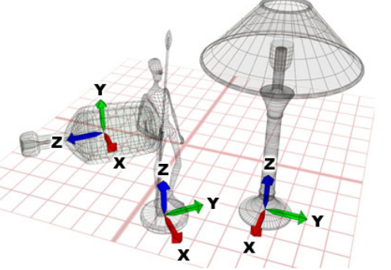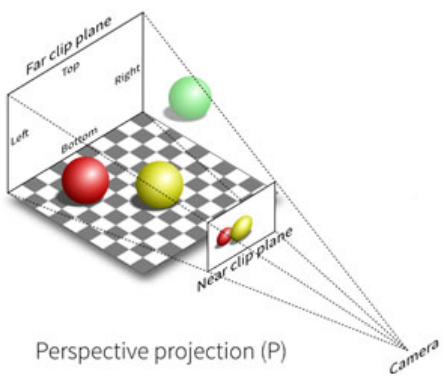

### 1.3 跟踪器位置和方向

假设我们希望跟踪用户的视点位置，我们可以将跟踪器附加到用户的头部。

我们可以确定视图矩阵（即跟踪器相对于世界/参考坐标系的位置和方向），其公式如下：
$$
\textbf{M}_{view} = R(-θ_{roll}, -θ_{pitch}, -θ_{yaw}) * T(-eye)
$$
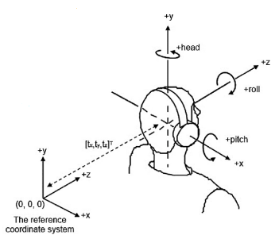

为了确定跟踪器的位置，我们使用平移矩阵表示传感器相对于参考坐标系的距离。

该平移矩阵可以表示为 **T(-eye)**，其中 **eye** 指的是眼点的 3D 位置。

为了确定跟踪器的方向，我们使用旋转矩阵相对于参考坐标系表示其方向。
该旋转矩阵为：
$$
R(-θ_{roll}, -θ_{pitch}, -θ_{yaw}) = R_{roll}(-θ_{roll}) * R_{pitch}(-θ_{pitch}) * R_{yaw}(-θ_{yaw})
$$

### 1.4 跟踪器精度

跟踪器性能通常使用 **精度 (Accuracy)**、**抖动 (Jitter)**、**漂移 (Drift)**、**延迟 (Latency)** 来衡量。

1. 精度

    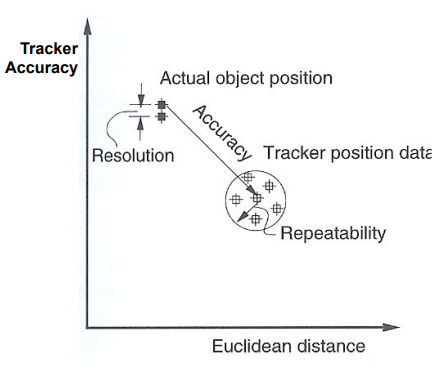

    指对象的实际位置与跟踪器测量结果的相似程度。

    精度通常不是固定值，并且随着到参考坐标系原点距离的增加而降低。

    可接受精度的距离定义了跟踪器的 **工作范围 (operating range)**。   

2. 抖动

    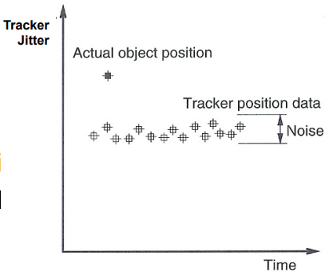

    是指即使跟踪对象保持静止，跟踪器输出也会发生的变化。

    这些变化通常是随机的，并围绕真实值波动。

    抖动的程度可能在跟踪器工作范围内有所不同，并受到环境条件的影响。

3. 漂移

    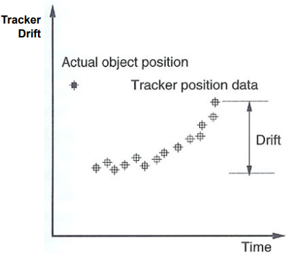

    是指随着时间推移，由于误差积累等因素导致的不准确性增加。

    可能需要通过辅助跟踪器定期重置误差。

4. 延迟

    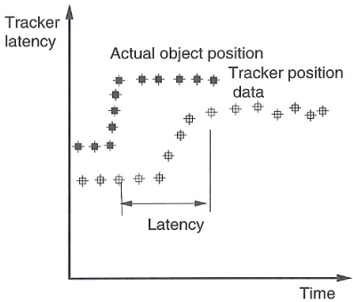

    是指从动作发生到接收到信号之间的时间延误。

    对于 3D 跟踪器，延迟指对象位置或方向发生变化与跟踪器输出之间的时间间隔。

    动作和视觉反馈之间的长时间延迟会导致 **模拟病 (simulation sickness)**，如头痛、恶心和眩晕。   

    * 减少延迟的可能方法
        * 使用更快的通信路线
        * 减少每一步的处理延迟
        * 同步跟踪器的测量、通信、渲染和显示循环，这有助于降低整个系统的更新频率。
    * 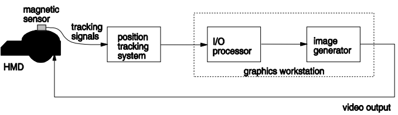

### 1.5 跟踪器更新率

* 跟踪器每秒报告的测量次数，通常超过 30 次。   
* 更新率越高，模拟的动态响应越好。
* 如果单个跟踪系统需要支持更多跟踪器（即传感器）来跟踪多个物体或身体部位，则采样率可能需要相应减少。  

## 2. 不同类型的3D 跟踪器

3D 跟踪器主要有 机械跟踪器 (Mechanical Trackers)、磁性跟踪器 (Magnetic Trackers) 、超声波跟踪器 (Ultrasonic Trackers)、光学跟踪器 (Optical Trackers)、惯性跟踪器 (Inertial Trackers) 和 3D 导航/操控设备 (3D Navigation/Manipulation Devices) 这几种。

### 2.1 机器跟踪器

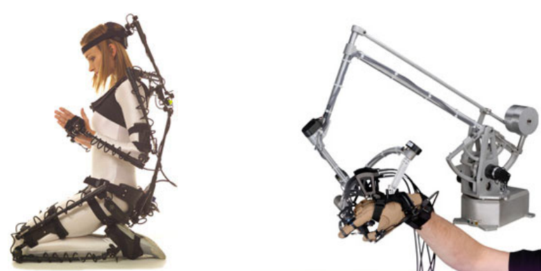

* 一种由连杆组成的串联或并联运动结构，通过传感器化的接头相互连接。  
* 系统预先知道运动链的结构。
* 机械跟踪器中一个部件相对于另一个部件的位置和方向通过跟踪器的关节传感器获得。
* 将跟踪器的一端连接到桌子或地面，计算机可以推导出另一端对象的位置。  

**Gypsy 动作捕捉 (Motion Capture)** 

* 由穿戴在服装上的传感器化外骨骼组成。
* 用户的 15 个关节位置通过 42 个单圈导电塑料精密电位器测量，精度达 0.08°。
* 来自每个传感器的电线通过肩部和臀部的空心铝制外壳传输。
* 跟踪的工作空间是无限的。  
* 机械跟踪器由这些部分构成：铝制板、旋转夹、橡胶服装
* 它的重量为 5 公斤到 7 公斤。   
* 为了捕捉诸如行走、跑步以及相对于外部系统的其他身体位置变化，它使用足部微型开关
    * 系统可以检测哪个脚落地。
* 它计算一只脚相对于另一只脚的相对位置
* Gypsy 2.5 跟踪服中包括一个陀螺仪，用于跟踪臀部的旋转。   

**优点**

一般优点：高精度，低延迟

针对机械动作捕捉的特点：无需视线限制；可以进行长时间记录，且漂移较小；工作空间无限制（捕捉的运动仅限于相对于结构基座的范围）。  

**缺点**

* 由于机械结构的限制，运动范围有限（运动相对于结构基座）。
* 随着连杆质量增加，由于惯性导致的机械振荡也随之增加。
* 系统的重量较重，可能导致用户疲劳并减少沉浸感。 
* 跟踪器本身可能干扰用户的运动，并降低用户的运动自由度。   

**Note:** 机械跟踪器对运动具有干扰性，而非接触式运动跟踪器（如磁性跟踪器、超声波跟踪器、光学跟踪器以及加速度计/陀螺仪）则没有这个问题。   

### 2.2 磁性跟踪器 

- 它们利用固定发射器产生的磁场来确定运动接收器（追踪器）的实时位置。

- 发射器由三个天线组成，这些天线由三个互相正交的线圈在铁磁性立方体上绕制而成。

    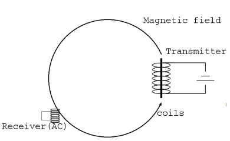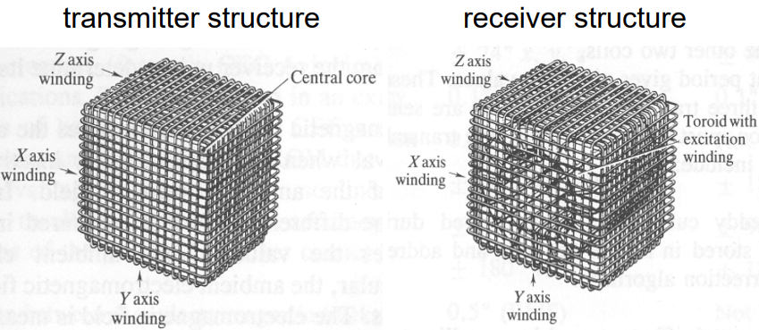

- 这些线圈被逐次激发以产生三个正交的磁场，这些磁场是7-14kHz的交变场（用于交流跟踪器）或脉冲场（用于直流跟踪器）。

- 到达接收器的磁场会生成包含九个电压的信号。

- 当使用交流磁场时，接收器由三个小的正交线圈组成。当使用直流磁场时，接收器由磁力计组成。

- 跟踪系统采样接收器的电压，以确定接收器相对于发射器的位置 (x,y,z)(*x*,*y*,*z*) 和方向 (x~,y~,z~)(*x*~,*y*~,*z*~)。

- 使用时间复用技术以连接多个传感器，用于运动跟踪。

**交流磁跟踪器 (AC Magnetic Trackers) **

- **Polhemus Isotrak** 是第一个交流磁跟踪器（1991年）。
    - 延迟较大（约30毫秒）。
    - 存在较大的抖动噪声（约1度旋转）。
    - 这导致虚拟手抖动，并使某些早期系统中的图像模糊。
- **Polhemus Fastrak** 使用了DSP架构。
    - 在仅使用一个接收器时，它每秒可测量多达120次。
    - 当使用两个接收器时，采样率会减半。
    - 工作范围是发射器与接收器之间75厘米。可选的远程版本可将范围扩大到三倍。
- **产生的问题**
    - 当磁场强度变化时，周围的金属会感应出涡流。
    - 感应电压 ($V_r$) 可被计算为：$V_r=N\frac{\Delta\Phi_B}{\Delta t}$
        - $\Delta \Phi_B$：磁通量幅度关于时间的变化率。
    - 当导体暴露于变化的磁场时，会产生涡流。
    - 电流被感应出来以对抗生成它们的磁通量变化。
    - 这些电流产生新的磁场，抵消原磁场的变化。
    - 跟踪器接收器接收一个失真的磁场，精度降低。

**直流磁跟踪器 (DC Magnetic Trackers)**

- 为缓解涡流问题，直流磁场被用来替代交流磁场。

- 在发射机激励之间的短暂时延可以使涡流消散。

- 嵌入式处理器控制发射器直流磁脉冲的幅度。

- 多路复用器允许处理器循环电流源，一个接一个地产生三个正交磁源。

    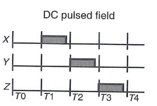

- 循环包含四个时间段，分别为 T0-T1、T1-T2、T2-T3 和 T3-T4。

    - T0 – T1：所有电流源关闭。
    - T1 – T2：开启 X 方向磁场。
    - T2 – T3：开启 Y 方向磁场。
    - T3 – T4：开启 Z 方向磁场。

- 发送器的磁场在接收器的三个正交天线中感应出电压。

- 在 T0-T1 时段，获取由地球直流磁场引起的电压。

- 将地球磁场引起的电压从其他时段的测量数据中扣除。

- 处理器使用校准算法确定传感器的位置/方向。

- **Ascension Flock of Birds** 于1998年推出。

    - 它采用分布式计算架构，减少计算时间并保持高更新率。
    - 每个接收器有独立的处理器，确保并行处理数据时不降低更新速率。
    - 即使多达30个接收器工作，也可提供每秒144次测量更新率。

- **Ascension MotionStar** 是一个无线系统，于2001年首次推出。

    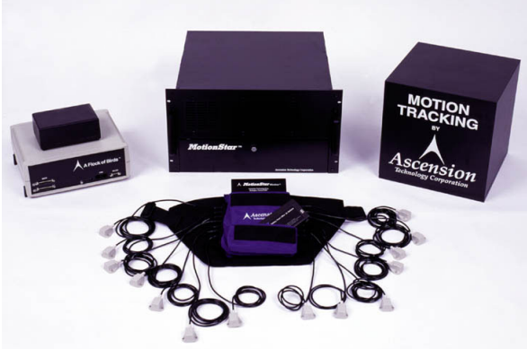 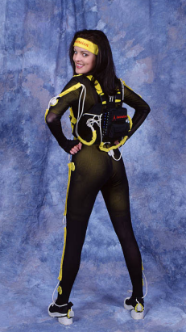

    - 扩展距离控制器以时间顺序驱动两个发射器（ERT1 和 ERT2）。
    - 首先由 ERT1 发送一组直流磁脉冲，随后是 ERT2，然后返回到 ERT1。
    - 两个发射器可以并排放置或相对放置。
    - 用户身体上装有10到20个直流磁接收器。
    - 所有传感器通过电缆连接到一个重1.7公斤的背包。
    - 背包内装有电池、处理电子设备以及用于数据通信的无线调制解调器。
    - 基站通过磁数据计算接收器的位置/方向。
    - 基站能识别来自 ERT1 和 ERT2 场的数据读取。
    - 更靠近的发射器数据会被赋予更大的权重来提高精度。
    - 最多可用五个背包-基站对，每位用户每秒可以处理100组数据。

- **产生的问题**

    - 磁场强度随着距离发射器的距离的立方递减。

    - 由于环境噪声导致的位置测量误差可以表示为：${Error} = K\cdot d^4$，其中，$ K $ 是常数，$ d $ 是发射器与接收器之间的距离。

    - 金属干涉 (Metal Interference)

        - 涡流可能由时变磁场产生。
        - 直流跟踪器不受黄铜、铝和不锈钢等非铁磁金属的影响。
        - 交流和直流跟踪器都会受到低碳钢和铁氧体等铁磁金属的影响，这些金属会变成磁体，进而影响磁场。
        - 铁磁材料的高磁导率使得感应磁场能够在交流/直流跟踪器中存在。
        - 交流和直流跟踪器都容易受到铜的影响：由于其高导电性，涡流持续时间比直流电流使用的延迟更长。

        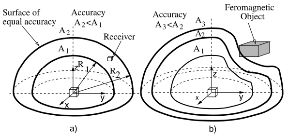

**优点**

- 精确，但不如机械跟踪器精确。
- 传感器重量轻。
- 不需要视线限制。

**缺点**

- 受金属物体/表面影响。

### 2.3 超声波跟踪器

- 超声波跟踪器是一种非接触式位置/方向跟踪设备，通过固定发射器产生的超声波信号来确定移动接收器（或跟踪器）的实时位置。

    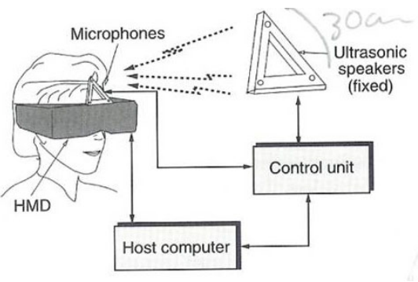

- 发射器由三个超声扬声器组成，安装在刚性三角形框架上，间隔约30厘米。

- 接收器有三个超声麦克风，安装在较小的刚性三角形框架上。

- 由于其简单性，超声波跟踪器是磁跟踪器的廉价替代方案。

- 在已知温度下，可通过已知的声速根据飞行时间来测量距离。

- 每个扬声器依次被激活，并计算从扬声器到接收器中三个麦克风的距离。

- 共测量9组距离，以确定包含这三个麦克风的平面的位置和方向。

- 超声波跟踪器的更新率约为每秒50组数据（不到磁跟踪器的一半）。

- 更新率较低是因为需要等待5-100毫秒，以使先前测量的回声消散。

- 工作范围取决于空气吸收导致的超声波衰减，通常发射器距离为1.52米。

- 发射器和接收器之间需要直接视线。

- 必须消除背景噪声。

- 通过将多个发射器与单个接收器进行空间复用，可增加运动范围。

- 跟踪区域必须重叠以实现无缝跟踪。

- 为避免相互干扰，每次只能激活一个发射器。

**优点**

- 在金属下无干扰。
- 小巧轻便。
- 相对便宜。

**缺点**

- 需要直接视线。
- 精确性取决于声速，而声速又受温度、压力和湿度等因素影响。
- 易受噪声干扰，例如墙壁特性。

### 2.4 光学跟踪器

- 光学跟踪器：
    - 是一种非接触式位置测量设备，
    - 基于光学传感，
    - 可计算物体的实时位置和方向。
- 需要直接视线。
- 提供高更新率和低延迟。

#### **2.4.1 Outside Looking In**

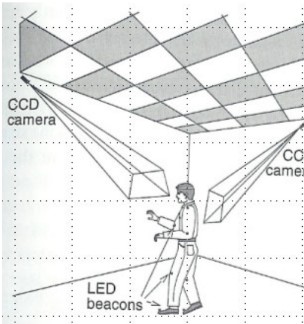

- 在这种技术中，传感器（如摄像机）固定在特定位置。
- 在需要跟踪其动作的用户身上放置标记物或光信标。

**例子**：动作捕捉系统

- 一种流行的动作捕捉系统是 MotionAnalysis ([www.motionanalysis.com](http://www.motionanalysis.com/))。

- 在工作区域周围放置红外灯。

- 在被跟踪的物体或用户的各个部位安装标记物（红外反射器）。

- 使用若干台红外摄像机（例如，8台）捕捉从标记物上反射的光。

- 该设置会生成8张图像（来自8台红外摄像机）。

- 恢复 2D 标记的 3D 位置

    - 基于8张捕获的图像，我们首先在这些图像中找到同一标记物。
    - 根据标记物在不同图像中的2D位置，可以计算出标记物的3D位置。
    - 注意，由于遮挡或模糊，通常无法在所有8张图像中找到同一标记物。但幸运的是，我们只需在3到4张图像中找到该标记物即可。

- 恢复 3D 身体姿势

    - 给定一个标记物，如果知道它在每张捕获图像中的2D位置，则可以计算出其3D位置。
    - 在每段身体上放置三个标记物，就可以计算出该身体段的位置和方向。
    - 对所有身体段执行此操作后，就可以计算出整个身体的姿态。

    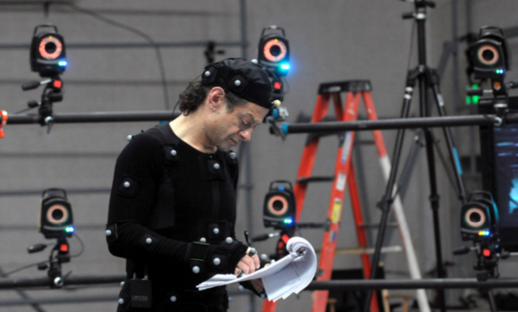

- 使用捕获的3D运动数据，可以编程使虚拟对象跟随真实对象的运动。

- 例如，要模拟一个虚拟人打棒球的场景：

    - 在真实棒球运动员的不同身体部位安装标记物以捕捉其运动。
    - 捕获的运动信息随后可以用来引导虚拟棒球运动员的动作。

- 通过夸大捕捉到的信息，还可能产生更有趣的效果。

- 跟踪灵敏度下降的情况：

    - **标记物间距减少** – 导致计算精度降低。
    - **用户与摄像机之间的距离增加** – 导致计算误差增加。
    - **相邻摄像机之间的距离增加** – 由于遮挡，摄像机视野之间的不一致性增加。（减少相邻摄像机间距则需要更多摄像机和更高的处理成本。）

**光动捕系统流程**

动作捕捉过程有五个步骤：

1. **校准（Calibration）** – 需要通过捕捉一些已知位置的特殊标记物的位置，确定每台摄像机在参考坐标系统中的位置。可以使用棋盘格或校准框完成此过程。
2. **动作捕捉（Motion Capture）** – 这是实际的动作捕捉步骤，演员（或对象）执行需要捕捉的动作。
3. **3D 位置重建（3D Position Reconstruction）** – 动作捕捉中可能会发生遮挡现象。为了在参考坐标系统中重建每个标记物的3D位置，至少需要被两台摄像机看到。
4. **骨骼匹配（Fitting the Skeleton）** – 这是为了将标记物关联到一个预定义的骨骼（如果可用）。这有助于提高精度。
5. **后期处理（Post Processing）** – 动作捕捉完成后，可能需要对动作进行校正、改进或优化，例如去除噪声、改变某部分动作的速度以及动作编辑。

**优点**

- **高精度:** 这是动作捕捉的标准方法。使用许多技术（例如摄像机校准和跟踪算法）来提高准确性。

**缺点**

- 遮挡问题: 身体部位可能相互遮挡，隐藏部分可能无法被捕获。
    - 如果提供被跟踪对象的3D模型，则可以显著减少误差。

#### 2.4.2 Inside Looking Out

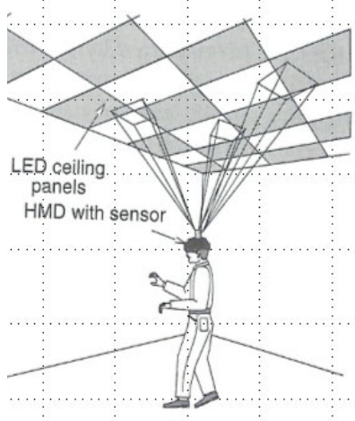

- 在这种技术中，将传感器（例如摄像机）附加到被跟踪的物体或用户上。
- 在墙壁上放置标记物。
- 对方向变化的灵敏度最大化。
- 理论上，工作空间可以无限扩展。

**例子**：HiBall 跟踪器

- 它由两个 HiBall 单元、LED 信标阵列、天花板-HiBall 接口和主机组成。
- HiBall 传感单元集成了红外过滤镜头、横向效应光电二极管 (LEPD) 以及微型化电子电路。
- 有六个窄视角（6度）的透镜，排列在半球体的六个区域中。
- LEPD 确定光点的 x-y 坐标，该光点是信标阵列中脉冲 LED 的图像。
- 信标阵列由48个LED组成，这些LED以六个平行条带排列在一个8平方英尺的表面上。
- 通过增加信标阵列，可以将HiBall的跟踪范围从8×8英尺扩大到40×40英尺。
- 更新率为每秒2000组数据。
- **优点:** 高精度和大范围跟踪空间。

### 2.5 惯性传感器

有3种惯性传感器：

- **陀螺仪 (Gyroscope):** 测量角速度，单位为每秒度数。
- **加速度计 (Accelerometer):** 测量线性加速度，单位为米每平方秒 (m/s²)。
- **磁力计 (Magnetometer):** 测量磁场强度，单位为微特斯拉 (μT)。

#### 2.5.1 陀螺仪

- 传感器方向变化率（或角速度）可以通过科里奥利型陀螺仪测量。

**例子**：**Fujitsu Gyro** 传感器

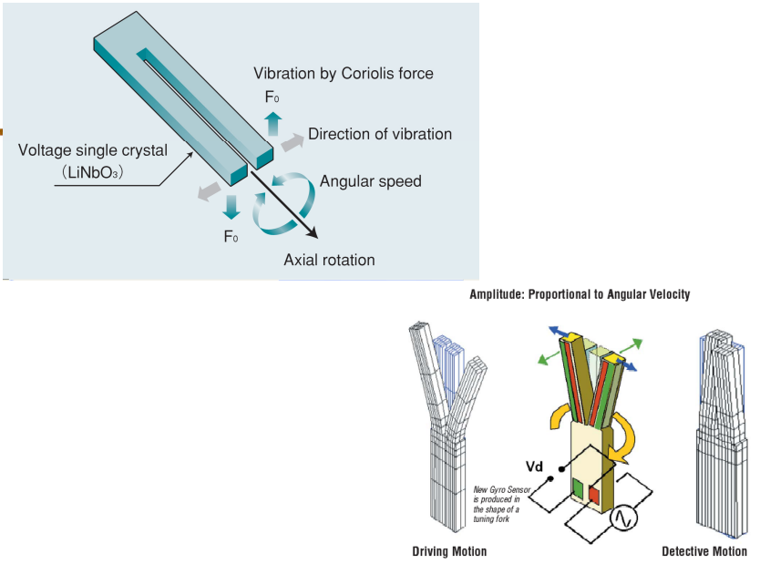

- 传感器的形状像音叉，并不断振动。
- 当传感器旋转时，科里奥利力使两个元件在与连续振动垂直的方向上振动。
- 由科里奥利力引起的振动可以转换成与旋转角速度成正比的电压，用于测量。
- 三组此类陀螺仪组合并安装在互相正交的轴上。
- 传感器的3D方向可以通过对三个陀螺仪的角速度积分计算得出。
- 陀螺仪的测量受温度影响，且随着时间会产生漂移。
- 短期内精度较高，但长期会因漂移而受影响。

#### 2.5.2 加速度计

- 加速度计用于测量平移速度或加速度。
- 三个加速度计与三个陀螺仪共轴安装。
- 传感器的3D位置可以通过对加速度进行二次积分计算得出，并扣除重力和旋转的影响。
- 加速度计在长期内是精确的且不会受到漂移影响。
- 然而，由于噪声，它们在短期内不够可靠。
- 因此，其测量结果可以与陀螺仪的测量结果互为补充。

#### 2.5.3 磁力计

- 测量地球磁场强度，单位为微特斯拉 (μT)。
- 同样，包含三个正交轴。
- 磁力计指向的实际方向可能因纬度和经度的不同而变化。
- 准确性受附近金属物体的影响。
- 应用范围较窄，主要用于特定跟踪器中。

#### 2.5.4 惯性测量单元 (Inertial Measurement Unit, IMU)

- InvenSense MPU-9250 是一款 9自由度的惯性测量单元 (IMU)。
- 集成了三轴陀螺仪、三轴加速度计和三轴磁力计于一块芯片上。
- 包含9个16位ADC用于对9自由度数据进行数字化。

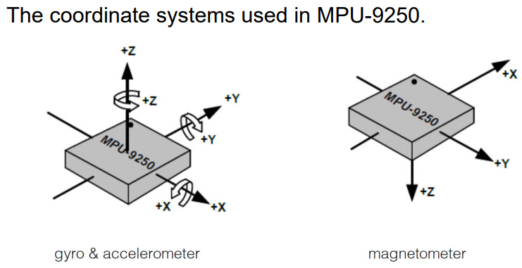

#### 2.5.5 小结

**优点**

- 无限的跟踪范围。
- 无需视线约束。
- 低抖动。

**缺点**

- 错误或漂移迅速累积。
- 陀螺仪偏差会导致**方向误差**，误差随着时间按比例增加（因积分而产生）。
- 加速度计偏差会导致误差**随着时间平方增加**。
- 商用设备：2秒误差40mm。
- 高端设备：200秒误差40mm。
- **解决方案**：使用其他类型跟踪器定期重置误差。

### 2.6 3D 导航/操作设备

- **导航（Navigation）**: 在虚拟环境中交互式地改变视角以进行探索。
- **操作（Manipulation）**: 选择一个对象进行某种形式的修改。

**Logitech Magellan**

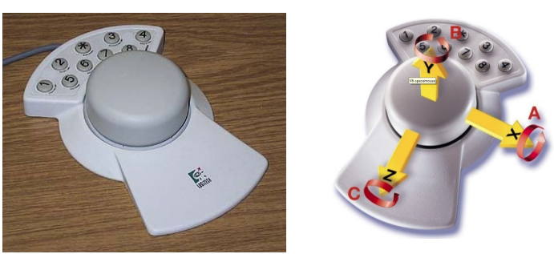

- 探测圆柱体，可以测量用户手对圆柱体施加的三种力和三种扭矩。
- 六个LED放置在圆柱体内部的中心位置。
- 六个光传感器安装在圆柱体内部的外壳上。
- 当用户对移动的外壳施加力或扭矩时，圆柱体的形状会发生变形，从而影响光传感器的输出。
- 因此，光传感器的输出被用来测量用户施加的力和扭矩。
- 缺点
    - 轨迹球存在传感器耦合问题：尽管用户可能希望平移物体，但它经常会同时发生旋转。
    - 用户体验不够友好。

**MicroScribe 3D: A 3D Probe**

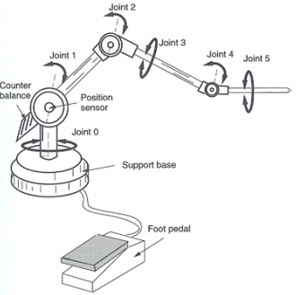

- 包含6个旋转关节；因此探针具有6个自由度，允许末端同时定位和定向。
- 附近的配重装置靠近基座以最小化用户的疲劳。
- 可以用于数字化物体。
- 使用直接运动学计算末端位置，基于传感器的数值以及连接件的长度。
- 脚踏板上的二元开关用于选择或取消选择虚拟对象、导航或在真实物体表面标记某点。
- 可以超过每秒1,000次采样。
- 运动学手臂的误差从基座逐渐累积至末端。
- 需要**校准**以最小化误差。

## 3. 手势设备

- 测量用户手指的实时位置。
- 允许基于手势与虚拟环境进行交互。

**Pinch Gloves**

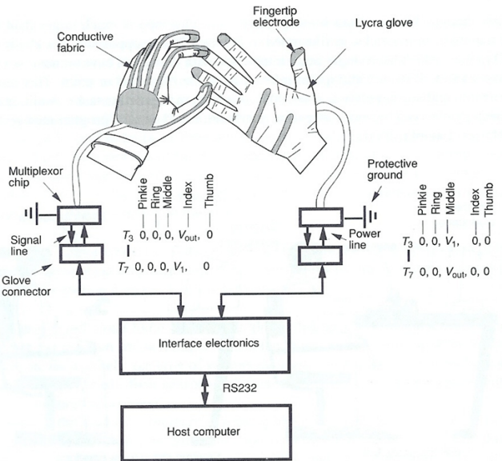

- 集成了以导电纤维贴片形式的电极：
    - 指尖，
    - 手指背部，
    - 手掌部。
- 手势通过检测手指与手掌之间的电接触建立或断开来判断。
- 仅能检测是否建立接触。

**The 5DT Data Gloves**

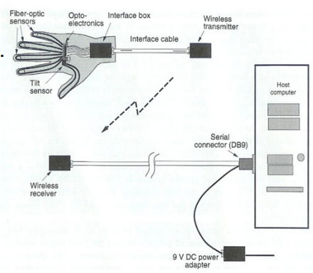

- 能够测量手指关节角度。
- 每个手指配备一个弯曲传感器。
- 配备一个倾斜传感器，用于测量手腕方向。

- 每个手指配备一个通过附件连接的光纤传感器环。

- 光纤的一端装有LED，另一端装有光电晶体管，用于捕获LED发出的光。

- 光纤壁经过处理以改变其折射率，使光线在手指弯曲时逸出。

- 手指弯曲可以根据返回光的强度间接测量。

- 手套使用8位A/D转换器。

- 其分辨率为扁平手掌和握拳手掌之间的256个中间位置。

- 传感器数据需要先进行归一化，以考虑不同手尺寸的影响。

- 归一化公式如下：
    $$
    out = \frac{raw_{val} - raw_{min}}{raw_{max} - raw_{min}} \times 256
    $$
    其中，$raw_{max} - raw_{min}$ 是给定弯曲传感器和用户的动态范围。

- 校准通过用户多次弯曲手部完成，系统会更新手套动态范围的值。

- 生成一个查找表，将传感器输出映射到手部姿势。

- 因此，可以实现手指关节角度的实时检测。

**Didjiglove**

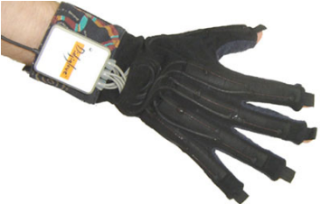

- 使用了十个电容式弯曲传感器来测量用户手指的位置。
- 每个电容传感器由两层导电聚合物构成，中间通过介电材料分隔。
- 每个导电层以梳齿状排列，一个电极的重叠表面面积与弯曲量成正比。
- 由于电容与电极的重叠表面面积成正比，因此弯曲角度可以通过电信号测量。

**CyberGloves**

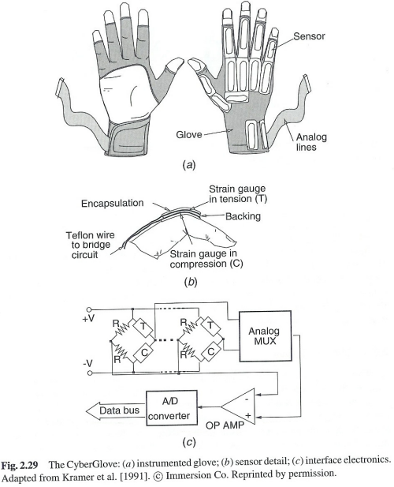

- 集成了薄电阻应变片，放置在弹性尼龙材质的手套上。
- 手套传感器分别是矩形的（用于弯曲角测量）或U形的（用于内收-外展角测量）。
- 每副手套中有18个或22个传感器，用于测量指关节弯曲、内收、外展以及手腕偏航和俯仰。
- 关节角度通过一对受力传感器的电阻变化间接测量。
- 在手指运动过程中，一个传感器受到压缩，另一个受到拉伸。
- 它们的电阻变化会产生两者之间的电压变化。
- 这些差分电压随后会被放大，并通过A/D转换器数字化。
- CyberGlove 在高性能手部测量中非常流行。
- 这是因为它具有大量的传感器、良好的编程支持，以及可以扩展到更复杂的触觉手套。

---

# Tutorial 2 直流磁场追踪系统 🤩

### 题目

假设有一个直流磁场追踪系统 (DC magnetic tracking system)，由两根无限长的直导线组成。导线垂直于地面，通过导线的电流交替开启和关闭，产生磁场。磁场的大小由公式计算：
$$
B = \frac{\mu _0I}{2\pi r}
$$
其中，$B$ 是磁场强度，$\mu _0=4\pi \cdot 10^{-7}N/A^2$ 是真空磁导率，$I$ 是电流，$r$ 是测量点到导线的距离。

现在，在某个位置，使用基于霍尔效应的磁力计 (magnetometer) 测量磁场强度。当 $10A$ 电流通过导线 Wire 1 时，磁力计测得磁场强度为 $1.0×10^{−6}T$，当相同电流通过导线 Wire 2 时，磁力计测得磁场强度为 $\frac{1}{\sqrt{2}}×10^{-6}T$。

回答以下问题：

(a) 测量计的位置是什么？

(b) 通过导线1的电流产生的磁场的方向是什么？

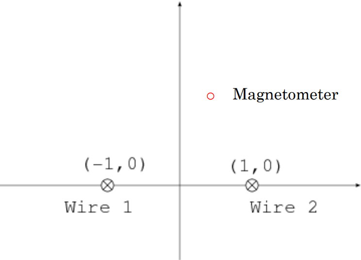

### 解答

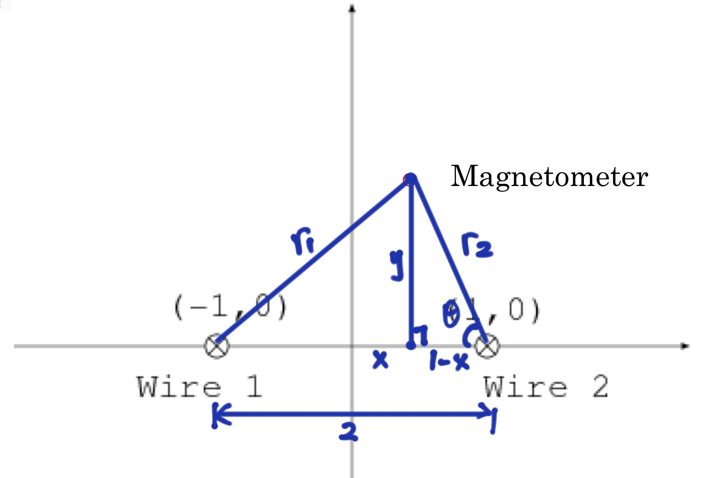

(a) 设测量点位置为 $(x,y)$ 

由磁场强度计算公式可以得到测量点到两个导线的距离 $r_1$ , $r_2$ 。已知三边，由海伦公式可以计算出三角形面积：
$$
S =\sqrt{p(p-a)(p-b)(p-c)}
$$
令这里的 $a=r_1$, $b=r_2$, $c=2$, 则半周长 $p=\frac{r_1+r_2+2}{2}$ 

由于底边为2，则高 (即测量点的垂直位置 $y$)，可以由 $\frac{2\cdot y}{2}=y=S$ 得到。

再根据余弦定理，可以计算出测量点的水平位置 $x$，即：
$$
\cos \theta = \frac{1-x}{r_2}=\frac{2^2+r_2^2-r_1^2}{2\cdot 2\cdot r_2}
$$
则
$$
x=\frac{r_1^2-r_2^2}{4}
$$
代入数值计算即可。

算得 $r_1=2$, $r_2=\sqrt{2}$, $p=2+\frac{\sqrt{2}}{2}$, $y=\frac{\sqrt{7}}{2}$, $x=\frac{1}{2}$

**法2** (跟 Tutorial 1类似)

联立方程：
$$
(x+1)^2+y^2=r_1^2
$$

$$
(1-x)^2+y^2=r_2^2
$$

求交点，取正值。

(b) 根据右手螺旋法则（安倍定则），我们可以得到导线1电流产生的磁场方向。如图所示。

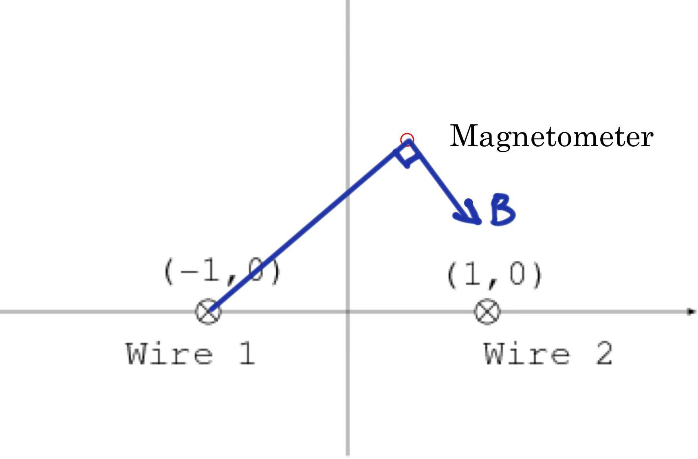