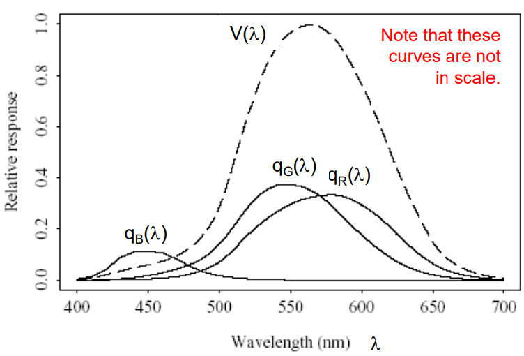
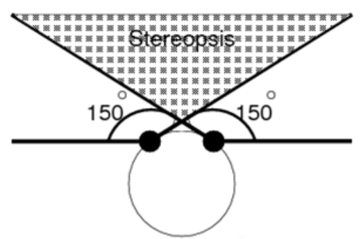
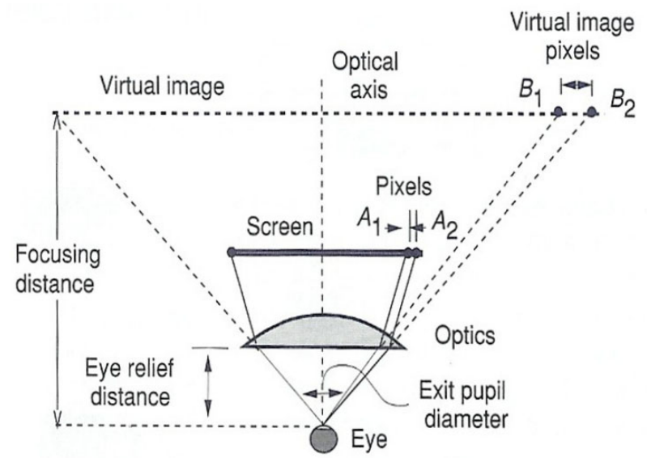
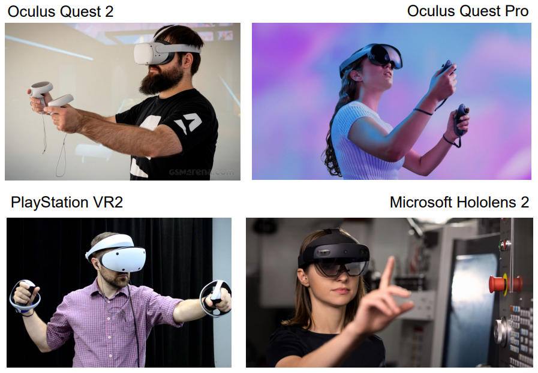

> 第三节课简单介绍了输出设备。期中竟然考了耳蜗的功能是什么，英语文盲退场。

# VR-03 Output Device

## 0. 总结 🦆

从视觉和听觉的生物结构入手，详尽地讲解了输出设备的一些原理。生物苦手😴1-8是听觉。

## 1. 人类视觉系统 (The Human Visual System)

### 1.1 视网膜 (Retina)

- 视网膜包含126百万个光感受器
    - 分布不均
- 中央凹 (Fovea)
    - 视网膜的中央区域
    - 高分辨率、颜色感知区域
    - 表示聚焦区域
- 低分辨率、运动感知光感受器
    - 覆盖其余视野

### 1.2 颜色感知 (Color Perception)

- **视网膜由杆状体和三种锥状体组成**
    - 杆状体 (Rods)
        - 用于夜视
    - 锥状体 (Cones)
        - 用于颜色视觉 
        - **L-锥状体 (L-cone)**：对红光最敏感
        - **M-锥状体 (M-cone)**：对绿光最敏感
        - **S-锥状体 (S-cone)**：对蓝光最敏感
- **人眼对绿色光最敏感**
    - 
    - 颜色通道响应
        - 红色感受器灵敏度：$q_R(λ)$
        - 绿色感受器灵敏度：$q_G(λ)$
        - 蓝色感受器灵敏度：$q_B(λ)$
    - 亮度效率函数
        - 表示整体灵敏度
            $V(λ)=q_R(λ)+q_G(λ)+q_B(λ)$

### 1.3 视野 (Field of View, FOV)

- 单眼视野 (Each eye)
    - 水平约 $150^\circ$ ，垂直约 $135^\circ$
- 双眼视野 (Both eyes)
    - 水平约 $180^\circ$，垂直约 $135^\circ$
- 双眼重叠区域 (Binocular overlap)
    - 水平约 $120^\circ$
    - 大脑利用双眼视差估算深度
    - 

### 1.4 深度感知 (Depth Perception)

- **近距离物体的深度线索**
    - **会聚 (Convergence)**：双眼旋转聚焦于物体
    - **调节 (Accommodation)**：睫状肌调整以聚焦 (Adjustment of ciliary muscles to focus)。
    - **视差 (Disparity)**：物体在两眼中的位置差异
    - **视差效应 (Parallax)**：头部水平移动时，近物体移动更多
- **远距离物体的深度线索**
    - **遮挡 (Occlusion)**：近物体遮挡远物体
    - **透视 (Perspective)**：远物体看起来更小 (Distant objects appear smaller)。
    - **雾化 (Haze)**：远物体显得更灰
    - **表面纹理 (Surface texture)**：类似透视效果

------

### 1.5 视觉清晰度 (Visual Acuity)

- 人眼通常可分辨 1 弧分（$1 \text{ arc min} = \frac{1}{60^\circ}$）

------

### 1.6 视网膜显示 (Retina Display)

- 为匹配人眼视觉清晰度，每只眼睛需要的分辨率：
    $Resolution=(60×150∘)×(60×135∘)=9000×8100 pixels$
- 挑战
    - 渲染和存储成本高
    - 制造覆盖大视野的显示器困难

## 2. 头戴式显示器图像生成 (HMD Image Formation)

- **放大因子 (Magnification factor):**
     $$M = \frac{h}{h'}$$
     - $h$：虚拟图像高度
     - $h′$：实际图像高度
     - 由于 $$d = \frac{f d'}{(d' - f)}$$，因此 $$M = \frac{f}{(d' - f)}$$
- **会聚与调节冲突 (Convergence and accommodation conflict)**
    - 在HMD中，眼睛会聚于虚拟物体，但调节保持在虚拟图像平面

## 3. 个人图形显示

### 3.1 头戴式显示器 (Head-Mounted Displays, HMDs)

- **特点**
  
    - 图像投射到用户前方1-5米
    - 特殊光学设计：
        - 允许眼睛聚焦于短距离
        - 放大图像以尽可能填充视野
    - 分辨率越低或视野越大，每个像素的弧分越大。
    - 较旧的 HMD 分辨率低，使用扩散器模糊像素之间的边缘。
    
- **常见设备**
  
    
    
    - Oculus Quest 2
    - Meta Quest Pro
    - Microsoft Hololens 2
    - PlayStation VR2

### HMD 比较

| 设备            | 分辨率      | 每眼分辨率  | 水平 FOV | 垂直 FOV | 跟踪技术      | 价格           |
| --------------- | ----------- | ----------- | -------- | -------- | ------------- | -------------- |
| Oculus Quest 2  | 3664 x 1920 | 1832 x 1920 | 106°     | 96°      | 6DOF 内部跟踪 | 从 400 美元起  |
| Meta Quest Pro  | 3600 x 1920 | 1800 x 1920 | ~110°    | 96°      | 6DOF SLAM     | 从 1500 美元起 |
| Hololens 2      | 4096 x 1080 | 2048 x 1080 | ~110°    | 96°      | 眼动追踪      | 3500 美元      |
| PlayStation VR2 | 4000 x 2040 | 2000 x 2040 | ~110°    | 96°      | 6DOF 跟踪     | 600 美元       |

### 3.2 手持显示器 (Hand-Held Displays, HHDs)

- 特点 (Features)
    - 这些是用户用一只或双手持有的个人图形显示器，以便定期查看合成场景
    - 用户可随时进入或退出虚拟场景
    - 通过按钮与虚拟场景交互

------

### 3.3 裸眼立体显示器 (Autostereoscopic Displays)

- 用户无需佩戴任何观看设备即可感知立体图像。
- 特殊的列交错图像格式，交替分配给左眼视图和右眼视图的单独列。
- 在单个面板上同时呈现一对立体图像。
- **被动式 (Passive)**
    - 用户头部未被追踪
    - 限制用户眼睛在小范围内感知立体图像
- **主动式 (Active)**
    - 通过追踪用户头部运动解决视角限制问题

## 4. 大体积显示设备 (Large-Volume Displays)

- 允许多个用户在近距离同时查看虚拟世界的立体或单视图像的图形显示称为大型显示。
- 它们可以进一步分类为基于监视器（并排放置）或基于投影仪（工作台、CAVE、显示墙、穹顶）。
- 它们更大的工作空间提高了用户的运动自由度和自然交互能力，相比个人显示器。

### 4.1 基于显示器的显示 (Monitor-Based Displays)

- 主动快门眼镜
    - 通过红外同步信号控制眼镜
    - 每只眼睛交替接收图像，形成立体视觉

### 4.2 基于投影仪的显示 (Projector-Based Displays)

- 数字投影仪
    - LCD投影仪
        - 优点：高光效、更清晰 
        - 缺点：像素化现象明显
    - DLP投影仪
        - 优点：平滑图像、高对比度

### 4.3 极化（Polarization）
- 使用一对极化投影仪，并为每位观众提供一副便宜的极化眼镜。  
- 这些眼镜的镜片对右眼和左眼的极化方式不同。  
- 每只眼睛看到与其匹配极化的立体图像组件。  

## 5. 体积显示 (Volumetric Displays) 
- 特点
    - 提供360°全景视图
    - 使用旋转屏幕和高速投影
    - 分辨率：$768 \times 768\ (pixels) \times 198\ (slide)$。

## 6. 声音属性 (Sound Properties)

- **声音是通过介质传播的压力波**

- 声音速度 (Speed of Sound):

    $c=\sqrt{\frac{K}{ρ}}$

    其中：

    - $K$ 是介质的刚性系数 (stiffness coefficient of the medium)。
    - $ρ$ 是介质的密度 (density of the medium)。

- 空气中的声音速度约为 $343 \text{m/s}$ (或 $767 \text{miles/hour}$)

- 声音具有普通波的特性:

    - **反射 (Reflection):** 声音遇到障碍物时反弹
    - **折射 (Refraction):** 声音进入不同密度介质时改变传播角度
    - **衍射 (Diffraction):** 声音绕过障碍物传播

### 6.1 人类听觉系统 (Human Auditory System)

- 耳廓 (Pinna):
    - 反射声音并放大某些频率，同时衰减其他频率
    - 提供方向信息
- 耳道 (Ear Canal):
    - 放大 3-12$\text{kHz}$ 范围内的声音
- 中耳 (Middle Ear):
    - 由精细的骨骼组成，放大鼓膜的声音压力
- 内耳 (Inner Ear):
    - 将声音压力转换为脑信号
- 人类听觉范围 (Hearing Range):
    - $20 \text{Hz}$ 到 $20 \text{kHz}$
    - 对 3-4 $\text{kHz}$ 的声音最敏感

------

## 7. 三维声音 (3D Sound)

3D 声音与立体声的区别在于，3D 声音会根据用户头部的位置和方向动态变化

### 7.1 声音定位 (Sound Localization)

人类通过以下线索确定声音来源的三维位置

#### 水平角度线索 (Azimuth Cues)

- 双耳时间差 (Interaural Time Difference, ITD):
    - 声音到达两耳的时间差
    - 公式：
        $Δt=t_{left}−t_{right}$
- 双耳强度差 (Interaural Intensity Difference, IID):
    - 由于头部的遮挡效应，靠近声源的一侧耳朵接收到的声音强度更高

#### 垂直角度线索 (Elevation Cues)

- 耳廓反射 (Pinna Reflection):
    - 声音在耳廓上的反射和干涉会放大某些频率并衰减其他频率
    - 这些变化帮助确定声音的垂直角度

#### 距离线索 (Distance Cues)

- 声音的感知响度 (Perceived Loudness):
    - 大脑结合已知声音源的特性和感知响度来估计距离 (The brain estimates distance by combining prior knowledge of the sound source and its perceived loudness)。
- 运动视差 (Motion Parallax):
    - 用户头部移动时，声音源的方向变化

------

### 7.2 头相关传递函数 (Head-Related Transfer Function, HRTF)

- **定义 (Definition):**
    头相关传递函数 (HRTF) 是声音从声源传播到耳朵的传递函数的傅里叶变换

- **个性化 (Individuality):**
    每个人的 HRTF 都是独一无二的，因为耳廓和躯干的几何形状不同 (Each person has a unique HRTF due to differences in outer ear and torso geometry)。

- 公式 (Formula):

    $Y_i=H_i⊗S$

    其中：

    - $H_i$ 是用户 $i$ 的 HRTF
    - $S$ 是输入声音源
    - $⊗$ 是卷积操作符

- 卷积 (Convolution):

    - 将 HRTF 应用于输入声音并通过耳机播放，用户会感知声音来自原始声源位置

------

## 8. 触觉反馈 (Haptic Feedback)

触觉接口通过传递感官信息帮助用户感知虚拟物体

- **触觉反馈 (Tactile Feedback):**
    提供实时接触表面几何形状、粗糙度和温度的信息
- **力反馈 (Force Feedback):**
    提供虚拟物体表面属性、重量和惯性的实时信息

------

### 8.1 人类触觉感知 (Human Haptic Sensing)

- **皮肤触觉传感器 (Tactile Sensors in Skin):**
    - 表层感受器 (Surface Receptors):
        - **迈斯纳小体 (Meissner Corpuscles):** 快速适应，检测高频刺激
        - **梅克尔盘 (Merkel Disks):** 慢速适应，检测低频刺激
    - 深层感受器 (Deep Receptors):
        - **帕齐尼小体 (Pacinian Corpuscles):** 快速适应，检测接触力的变化
        - **鲁菲尼小体 (Ruffini Corpuscles):** 慢速适应，检测静态力
- **分辨率 (Resolution):**
    - 指尖可分辨 $2.5 \text{mm}$ 的接触点 
    - 手掌可分辨 $11 \text{mm}$ 的接触点

------

### 8.2 触觉反馈接口 (Tactile Feedback Interfaces)

- **触觉鼠标 (Tactile Mouse):**
    - 通过振动提供触觉反馈
    - 示例：Logitech 的 iFeel Mouse。
- **触觉手套 (Tactile Gloves):**
    - CyberTouch 手套:
        - 配备 6 个振动触觉执行器
    - 温度反馈手套 (Temperature Feedback Gloves):
        - 通过热电泵模拟物体的热特性 

------

### 8.3 力反馈接口 (Force Feedback Interfaces)

- **力反馈操纵杆 (Force Feedback Joysticks):**
    - 示例：Logitech 的 WingMan Force 3D。
- **PHANToM 臂:**
    - 提供 3-6 个自由度的触觉反馈
    - 最大输出力为 $6.4\text{N}$，连续力为 $1.7 \text{N}$
- **CyberGrasp 手套:**
    - 控制单个手指的模拟力
    - 最大生成力为 $16 \text{N}$
- **CyberForce:**
    - 结合机械臂和 CyberGrasp 手套，模拟物体重量和惯性