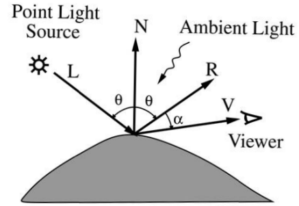
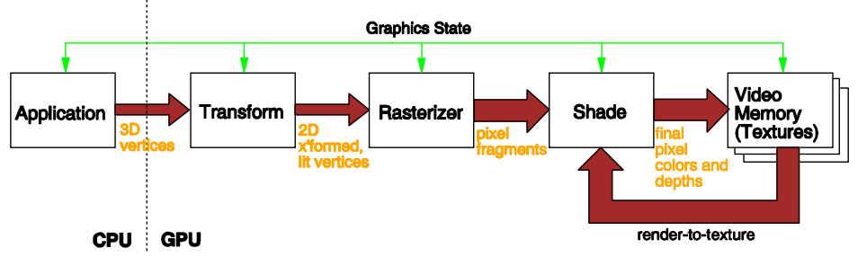
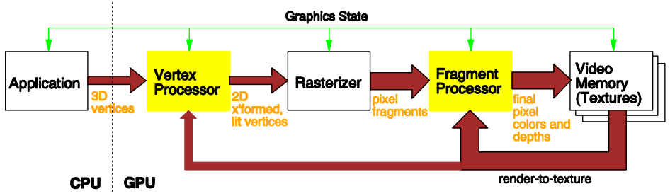
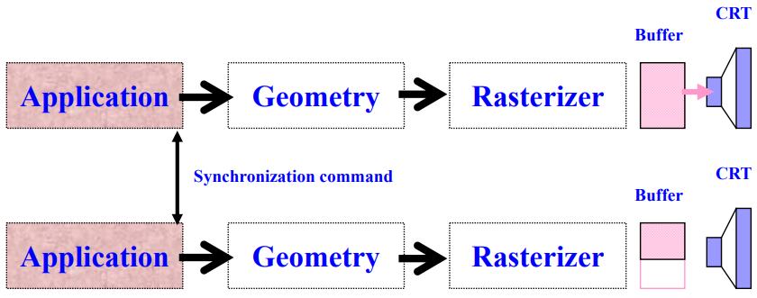
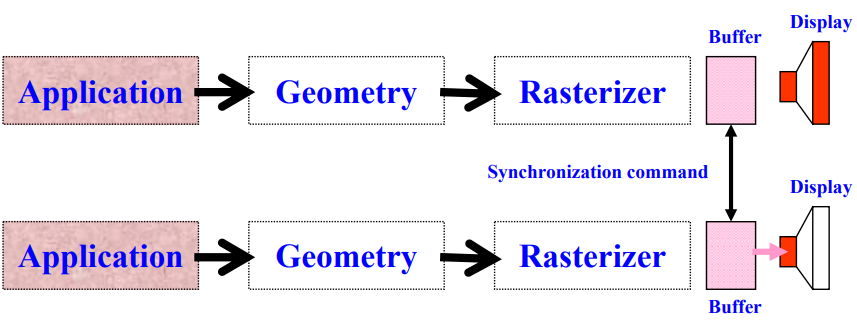
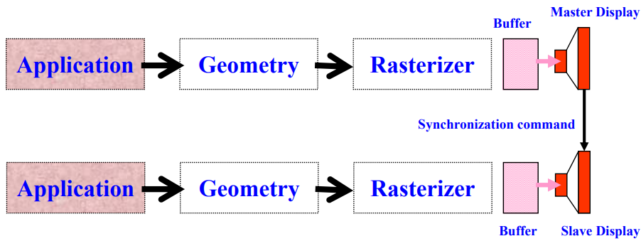
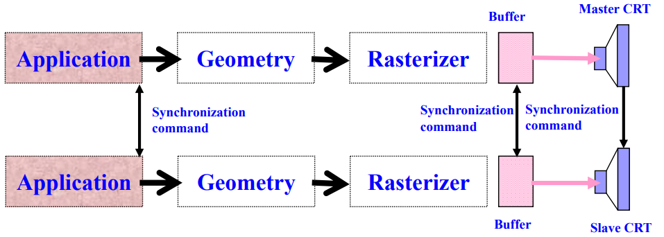
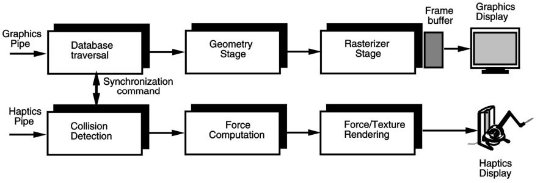

> 第四节课简单介绍了计算架构。期末考了分布式。这部分和 CG 有重合内容。

# VR-04 VR 计算架构

## 0. 总结🍜

讲了VR计算架构的内容，包括VR系统的输入输出流程、图形与触觉渲染管线的工作原理、GPU硬件和分布式VR架构的特点，以及PC集群在高性能VR系统中的应用。闷闷的☁️:

## 1. VR系统架构 (VR System Architecture)

### 1.1 任务
1. 读取输入设备（传感器）数据  
2. 更新虚拟世界的状态
3. 渲染输出（图形、触觉等）
4. 将输出传递到输出设备

### 1.2 VR引擎架构要求
- **低延迟 (Low latency)**  
- **快速图形渲染 (Fast graphics rendering)**  
- **触觉渲染 (Haptics rendering)**  

## 2. 图形渲染管线 (Graphics Rendering Pipeline)

图形渲染是将虚拟世界中的三维几何模型转换为二维图像的过程 

### 2.1 应用阶段 (Application Stage)
- **由CPU执行 (Executed by the CPU)**  
- 任务  
  1. 获取用户输入（如鼠标、追踪器、感应手套）
  2. 更新虚拟世界的视图、数据库和状态
  3. 选择相关的几何对象并发送到后续阶段进行渲染  

### 2.2 几何阶段 (Geometry Stage)
- **由GPU硬件实现**  
- 任务  
  1. **模型变换 (Model transformations)**  
  2. **着色计算 (Shading computations)**  
  3. **场景投影 (Scene projection)**  
  4. **裁剪 (Clipping)**  

#### 照明 (Illumination)

- 它根据以下内容计算表面颜色：
    - 模拟光源的类型和数量
    - 光照模型
    - 物体的反射/透射特性
    - 大气效应，如雾或烟
- 照明描述了由模拟对象表面上一个像素反射回来的光的强度，并被观察者看到。

**[Phong 照明模型][link1]**

[link1]:https://cauchyoooo.github.io/2025/02/28/2025/CS5182CG/CG-04/#2-%E5%85%89%E7%85%A7-Illumination

- **计算表面颜色 :**  

  $$I_\lambda = I_{a\lambda} K_a C_{d\lambda} + f_{att} I_{p\lambda} (K_d C_{d\lambda} \cos\theta + K_s C_{s\lambda} \cos^n \alpha)$$  

  其中：  

  - $I_\lambda$：波长$\lambda$的光强 (Intensity of light of wavelength $\lambda$)。  
  - $I_{a\lambda}$：环境光强 (Intensity of ambient light)。  
  - $K_a$：表面环境反射系数 (Surface ambient reflection coefficient)。  
  - $C_{d\lambda}$：物体漫反射颜色 (Object diffuse color)。  
  - $f_{att}$：大气衰减因子 (Atmospheric attenuation factor)。  
  - $I_{p\lambda}$：点光源光强 (Intensity of point light source)。  
  - $K_d$：漫反射系数 (Diffuse reflection coefficient)。  
  - $K_s$：镜面反射系数 (Specular reflection coefficient)。  
  - $C_{s\lambda}$：镜面反射颜色 (Specular color)。  

#### 多种着色模型 (Shading Models)
- **平面着色 (Flat Shading):** 为多边形的所有像素分配相同颜色
- **Gouraud着色:** 基于顶点颜色插值
- **Phong着色:** 插值顶点法线后计算每个像素的光强

### 2.3 光栅化阶段 (Rasterizer Stage)
- **任务**
  
  1. 将几何图元（如三角形）分解为像素片段
  
  2. **抗锯齿 (Anti-aliasing):**  
  
     
  
     - 每个像素分为$n$个子像素  
     - 计算每个子像素的颜色，最终颜色为子像素颜色的平均值
  
  3. **纹理映射 (Texture Mapping):** 将纹理图像映射到几何表面
  
      
  
- **并行架构**

  - 为了提高性能，在渲染管线中使用了并行架构。
  - 几何阶段包含多个几何引擎（GEs）。
  - GEs 将它们的结果写入光栅化阶段的 FIFO 缓冲区。
  - 光栅化阶段还包含多个光栅化单元（RUs）。
  - RUs 读取 FIFO，渲染分配的像素中的图元，并将结果写入帧缓冲区。

### 2.4 图形管线瓶颈与优化 (Graphics Pipeline Bottlenecks and Optimization)

- 理想情况下，管线的输出速率与下一个阶段的输入速率完美匹配。
- 在实际应用中，三个阶段中的一个（应用、几何和光栅化）将是最慢的。

#### 瓶颈检测 (Bottleneck Detection)
- **CPU限制 (CPU-limited):** CPU运行100%时 
- **几何限制 (Transform-limited):** 性能随光源或多边形数量减少而提升
- **填充限制 (Fill-limited):** 性能随图像分辨率或多边形数量减少而提升

#### 优化方法 (Optimization Methods)
1. **应用阶段 (Application Stage):**  
   - 使用更快的CPU 
   - 使用更高效的编译器
   - 优化代码
       - 使用低精度算术代替双精度
       - 最小化除法运算的次数
2. **几何阶段 (Geometry Stage):**  
   - 减少光源数量  
   - 简化场景复杂度  
3. **光栅化阶段 (Rasterizer Stage):**  
   - 降低图像分辨率  

## 3. 触觉渲染管线 (Haptics Rendering Pipeline)

### 3.1 碰撞检测阶段 (Collision Detection Stage)

- 加载物体的物理特性  
- 检测用户与物体之间的碰撞  

### 3.2 力计算阶段 (Force Computation Stage)
- **计算碰撞力 (Compute collision forces):**  
  - 基于物理模拟模型  
- **力平滑 (Force smoothing):** 调整力向量方向以避免突然变化
- **力映射 (Force mapping):** 将计算得出的力映射到特定触觉设备的特征

### 3.3 触觉计算阶段 (Tactile Computation Stage)
- **触觉纹理渲染 (Haptic Texturing):**  
  - 计算触觉效果（如振动或表面温度）并发送到触觉显示设备  

## 4. GPU架构 (GPU Architecture)

### GPU与CPU的对比 (GPU vs. CPU)
- **CPU特点 (CPU Features):**  
  - 标量编程模型，无数据并行性
  - 适合控制密集型任务
- **GPU特点 (GPU Features):**  
  - 数据并行性强 
  - 支持高精度计算 (e.g., 32-bit 浮点数)

### GPU硬件管线 (GPU Hardware Pipeline)

- **顶点处理器 (Vertex Processors):**  
  - 处理变换、光照计算、背面剔除等 
- **光栅化器 (Rasterizer):**  
  - 将几何表示转换为像素表示
- **片段处理器 (Fragment Processors):**  
  - 计算每个像素的颜色  

## 5. 分布式VR架构 (Distributed VR Architecture)

### 5.1 单用户系统 (Single-User Systems)
- 使用多个并排显示器
    - 用于桌面虚拟现实工作站或大型体积显示器（如 CAVE 或“墙”）。
    - 一种解决方案是为每个投影仪使用一台配备图形加速器的独立计算机。
    - 另一种解决方案是只使用一台计算机，配备多个图形加速器卡（每个监视器一张）。
- 使用多个局域网连接的计算机

### 5.2 多用户系统 (Multi-User Systems)
- **架构类型 :**  
  - 客户端-服务器系统 (Client-server systems)
  - 点对点系统 (Peer-to-peer systems)
  - 混合系统

### 5.3 同步 (Synchronization)

#### 5.3.1 多管道同步 (Multi-pipeline Synchronization)

- 无论多个图形管道是一个计算机的一部分还是多个协同工作的计算机的一部分，输出图像都需要同步。
- 同步也很重要，以减少整体系统延迟并创建一致的帧率。

#### 5.3.2 软件同步 (Software Synchronization)

- 同步并行管道的应用阶段，以同时开始处理新的一帧。
- 这并不充分，因为它没有考虑每个管道所处理的负载可能存在的不对称性。

#### 5.3.3 帧缓冲同步 (Frame Buffer Synchronization)

- 同步缓冲区的交换。
- 显示器的水平刷新和垂直刷新并未同步。
- 交换依赖于显示器的刷新——缓冲交换需等待来自显示器的刷新信号。

#### 5.3.4 视频同步 (Video Synchronization)

- 一个显示器成为主显示器，而其他显示器为从属显示器。
- 从属显示器的垂直和水平重绘跟随主显示器进行。
- 通过将从属显示器的内部视频逻辑电路与主显示器同步来实现。

#### 5.3.5 显示同步 (Synchronization of Displays)

- 最佳方法是对两个（或更多）渲染管道进行软件 + 缓冲 + 视频同步。

#### 5.3.6 图形和触觉管线同步 (Graphics and Haptics Pipeline Synchronization)

- 同步在应用程序阶段完成。
- 主要有两种实现方式：
    - 力的计算在主机计算机上进行。
    - 力的计算由嵌入在触觉接口控制器中的处理器进行。
- 分离图形和触觉管线是必要的，因为它们的输出速率有显著不同。
- PHANToM 控制器以 1kHz 的频率进行力渲染，而图形管线每秒仅渲染 30-60 帧。

## 6. PC集群 (PC Clusters)

- 大型拼接显示器，由数十台投影仪组成，如果希望得到高分辨率，则需要等量的图形管线来驱动它们。

- 这无法通过单台计算机完成：
  - PCI Express (PCIe) 插槽数量不足。
  - 由于总线拥塞，数据吞吐量将会不好。

### 特点

- **优点 (Advantages):**  
  - 成本低
  - 软件实现图像拼接  
- **缺点 (Drawbacks):**  
  - 受限于局域网带宽  

### 示例
1. **普林斯顿显示墙 (Princeton Display Wall):**  
   - 由24台PC驱动的6000x3000分辨率显示墙
2. **Chromium PC集群 (Stanford University):**  
   - 包含32个渲染服务器和4个控制服务器
