> 第五节课讲了建模，对象的表示方法。

# VR-05 VR 建模

## 1. 几何建模 (Geometric Modeling)

- **对象表面类型**:
    - 多边形网格 (Polygonal meshes)：最常用，计算高效
    - 样条曲面 (Splines)：高次函数，存储少，更光滑
    - 点云数据 (Point based data)
- **对象外观**:
    - 照明 (Lighting)
    - 纹理映射 (Texture mapping)

### 1.1 对象表面类型

#### 1.1.1 三角网格 (Triangular Meshes)

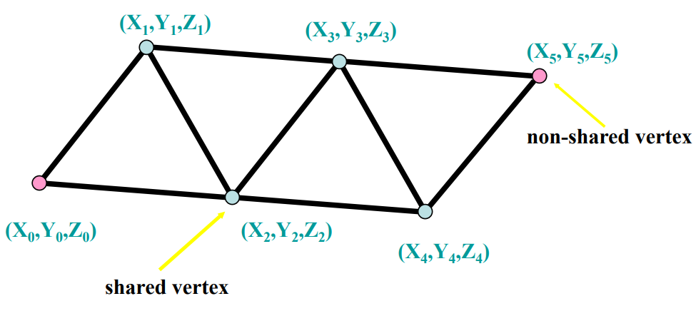

- 优点: 计算效率高。

#### 1.1.2 样条曲面 (Spline-based Surfaces)

- 使用高次函数表示虚拟对象，存储需求低，表面光滑度高。
- 参数样条用点 $x(t)$、$y(t)$、$z(t)$ 表示，参数 $t=[0…1]$，a, b, c 是常数系数。

​		$$x(t)=α_x\cdot t^3+β_x\cdot t^2+c_x\cdot t+d_x$$

​		$$y(t)=α_y\cdot t^3+β_y\cdot t^2+c_y\cdot t+d_y$$

​		$$z(t)=α_z\cdot t^3+β_z\cdot t^2+c_z\cdot t+d_z$$

- 参数曲面是参数样条的扩展，点坐标由 $x(s,t)$、$y(s,t)$、$z(s,t)$ 给出，参数为 s=[0...1] 和 t=[0...1]。

    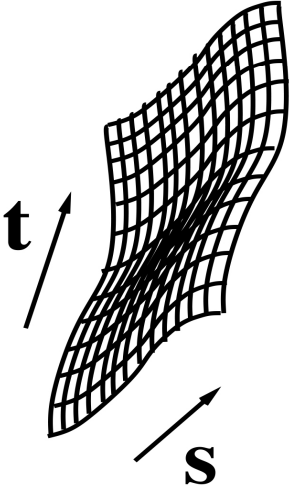

#### 1.1.3 多边形网格 (Polygonal Meshes)

- 使用OpenGL或建模编辑器（如Maya、AutoCAD）构建。
- 可通过3D数字化仪或3D扫描仪创建。

#### 1.1.4 CAD模型 (CAD-based Models)

- 使用Maya/AutoCAD创建，需转换为VR工具包或游戏引擎兼容格式。
- 优势：可利用现有模型

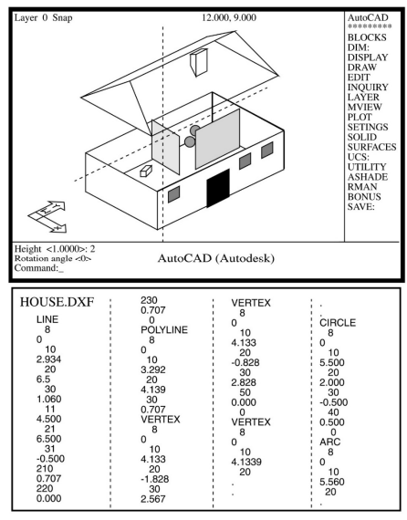

#### 1.1.5 3D扫描仪

* 各种种类扫描仪的介绍。
* 扫描数据转换：点云 → 多边形网格 / NURBS面片（使用Geomagic Wrap等）

### 1.2 对象视觉外观 (Object Visual Appearances)

#### 1.2.1 **场景照明 (Scene Illumination)**

- **局部照明 (Local Illumination)**: 逐个对象渲染。

    - 平坦着色、Gouraud 着色、Phong 着色 （CG内容）

    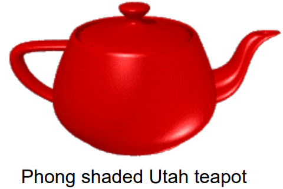

- **全局照明 (Global Illumination)**: 考虑场景中所有对象的相互影响，更逼真计算需求高。

    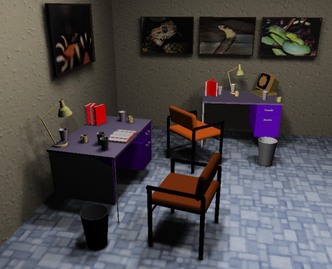

- **辐射度照明 (Radiosity Illumination)**：**迭代计算**漫反射光能传递

    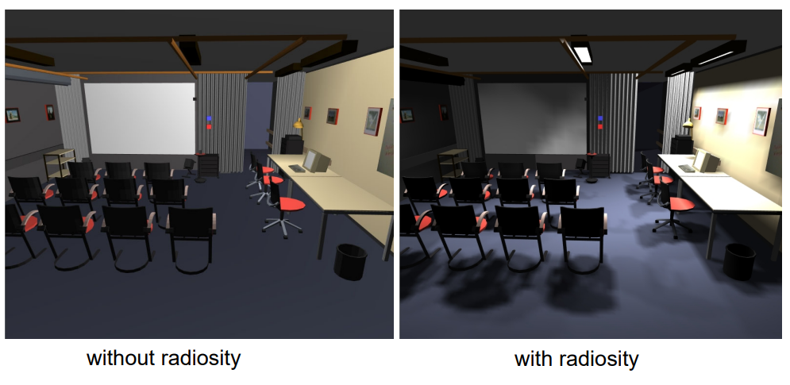

    

    例子：考虑一个封闭区域，包含四个多边形，在时刻 $t$。为简化，假设所有四个多边形具有相同的漫反射系数 $ρ$，$0≤ρ≤1$。漫反射系数指入射光通过漫反射被反射的百分比。$S_1$ 是一个光源，但处于关闭状态。因此此时封闭区域内没有光能。

    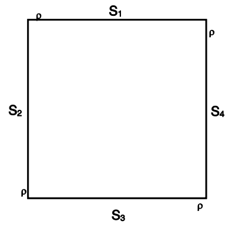

    * $S_1$ 打开是光线反射的总结：

        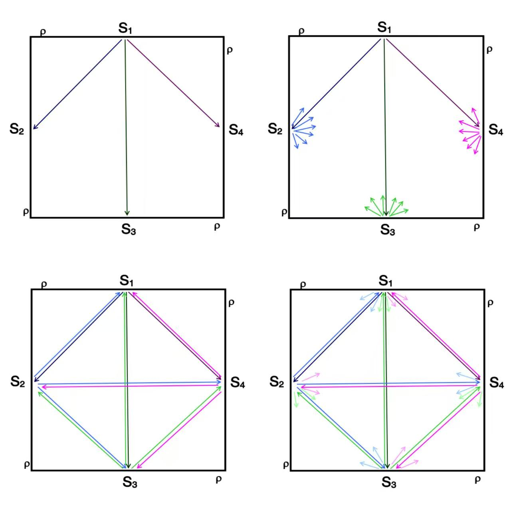

#### **1.2.2 纹理映射 (Texture Mapping)**

- 纹理如同模型的贴纸，增加场景真实感，减少多边形数量，提高帧率。

    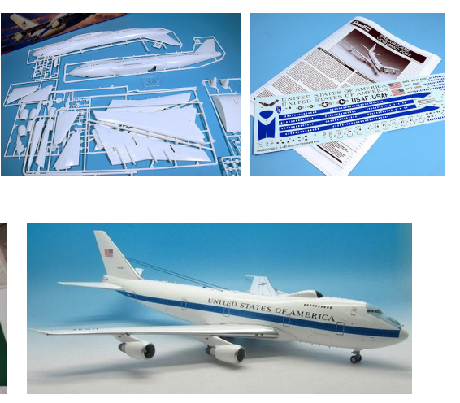

- 该过程在图形管线的光栅化阶段进行，允许修改对象模型的表面属性，包括颜色、镜面反射或像素法线。

- 它使用映射函数将对象的参数（或顶点）坐标映射到纹理空间坐标。

- 纹理坐标以 $(u, v)$ 索引的形式指定。

- **优点**

    - 纹理有助于增加场景的真实感。
    - 纹理提供更好的三维空间线索。
    - 纹理有助于减少场景中的多边形数量，即提高帧率。

- **制作纹理**

    - 它们可以在网上的纹理“库”中找到，这些库包含汽车、人物、建筑材料等。
    - 自定义纹理可以通过扫描照片或使用交互式绘画程序创建位图。

- **图像纹理**

    - 图像被映射到一个多边形上。
    - 纹理的大小受到图形加速器的限制，必须是 $2^m \times 2^n$ 或 $2^m \times 2^m$ 平方。OpenGL 的下限是 $64 \times 64$ 像素。
    - 一个纹理单元（texel）是纹理图像中的一个像素。
    - 如果多边形的大小大于纹理的大小，则硬件会进行放大（magnification）。
    - 如果像素少于纹理单元，则硬件会进行缩小（minification）。
    - 这两种技术都使用双线性插值来为像素分配颜色。

#### 1.2.3 **多重纹理 (Multi-textures)**

- 可以在一个像素上叠加多个纹理单元（texels）。
- 纹理**混合级联 (blending cascade)** 由一系列纹理阶段组成。

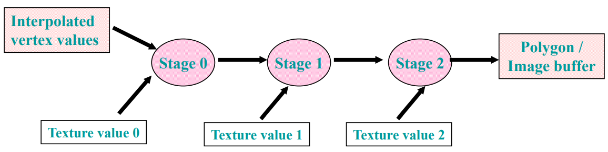

- 可以通过多种纹理产生复杂效果：法线 (Normal) 纹理、反射 (Reflectivity) 纹理、背景 (Background) 纹理、透明 (Transparency) 纹理、凹凸贴图 (Bump maps) ... 【UE5下载Texture的时候，经常有这种复杂纹理，需要自己连接材质】

    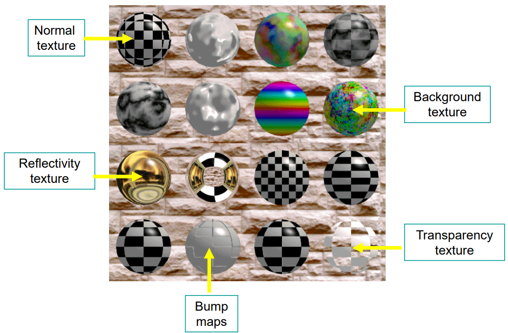

- **用于凹凸映射的多重纹理：**

    - 由于物体表面的不规则性而导致的光照效果通过“凹凸映射”进行模拟。
    - 它将表面不规则性编码为图像纹理。
    - 模型几何形状没有变化。
    - 在几何阶段没有增加计算。
    - 作为每个像素着色操作的一部分执行，属于NSR（NVIDIA着色器光栅化器）。

    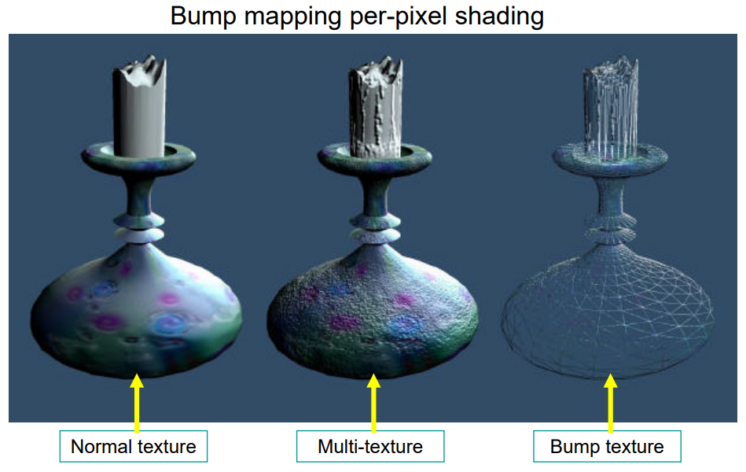

- **用于光照的多重纹理**

    - 顶点着色 (vertex shading)
        - 每个顶点提供位置、颜色、光照、纹理、法线等，以计算顶点颜色。
        - 多边形顶点的颜色通过插值得到多边形内每个像素的颜色。
        - 几何阶段的顶点着色。光栅化阶段对顶点颜色插值得到像素颜色。
        - 光照计算是实时的，但需要大量多边形（三角形）才能获得逼真外观。
        - 低多边形数量的表面，顶点光照无法产生高质量光照；高多边形数量表面的顶点光照可以产生逼真光照，但渲染成本高。

    - 光照贴图 (light maps)
        - 使用光照贴图，我们预先计算高质量光照效果，作为称为“光照贴图”的2D纹理。
        - 但是，当物体移动时，需要重新计算光照贴图。这是一个昂贵的、非实时的过程。

- 小结

    - 凹凸贴图：模拟表面不规则光照，不改几何，逐像素着色
    - 光照贴图：预计算高质量光照，但物体移动时需重算（非实时）
    - NVIDIA NSR逐像素光照：实时、高质量，需法线贴图

## 2. 运动学建模 (Kinematics Modeling)

### 2.1 齐次变换矩阵 Homogeneous Transformations

- 齐次坐标是具有正交单位向量三元组的右手笛卡尔坐标。

- 这样的 $(i,j,k)$ 三元组满足模长 $∣i∣=∣j∣=∣k∣=1$，点积$ i⋅j=i⋅k=j⋅k=0$ 。

- 4×4矩阵，包含旋转子矩阵 $R_{3×3}$ 和平移向量 $P_{3×1}$

- 齐次变换矩阵的一般形式

    - $$
        T_{A←B} = \ \begin{bmatrix} & R_{3×3} && P_{3×1} \\ 0 & 0 & 0 & 1 \end{bmatrix} \
        $$

        表示B坐标系原点相对于A坐标系原点的位置

- 优点：统一处理平移和旋转，可复合，易求逆 $$T_{A←B} = (T_{B←A})^{-1}$$

### 2.2 物体位置/方向

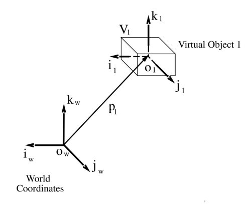

- 静态：将物体坐标映射到世界坐标

    - $$
        T_{W←1} = \ \begin{bmatrix} i_{w←1} & j_{w←1} & k_{w←1} & P_{1} \\ 0 & 0 & 0 & 1 \end{bmatrix} \ 
        $$

        其中 $i_{w←1}$,$j_{w←1}$,$k_{w←1}$是将物体单位向量投影到世界坐标系的 3×1 向量。

- 运动：变换矩阵成为时间的函数

    - $$
        T_{W←1}(t) =  \begin{bmatrix} i_{w←1}(t) & j_{w←1}(t) & k_{w←1}(t) & P_{1}(t) \\ 0 & 0 & 0 & 1 \end{bmatrix} \ 
        $$

    - 物体顶点 $Vi$ 在世界坐标系中的位置可由其在物体坐标系中的位置计算
        $$
        V_i^{(W)}(t)=T_{W←1}(t)V_i^{(object)}
        $$

    - 如果物体与世界坐标系的方位对齐，$R_{3×3}$ 为单位矩阵。因此，如果物体1平移：
        $$
        V_i^{(W)}(t)= \begin{bmatrix} 
        1 & 0 & 0 & P_{1x}(t) \\
        0 & 1 & 0 & P_{1y}(t) \\
        0 & 0 & 1 & P_{1z}(t) \\
        0 & 0 & 0 & 1 \end{bmatrix} \ 
        V_i^{(object)}
        $$
        其中 $p_{1x}(t),p_{1y}(t),p_{1z}(t)$ 分别是物体从 $t_1$ 到 $t_2$ 在x、y、z方向上的位移。

        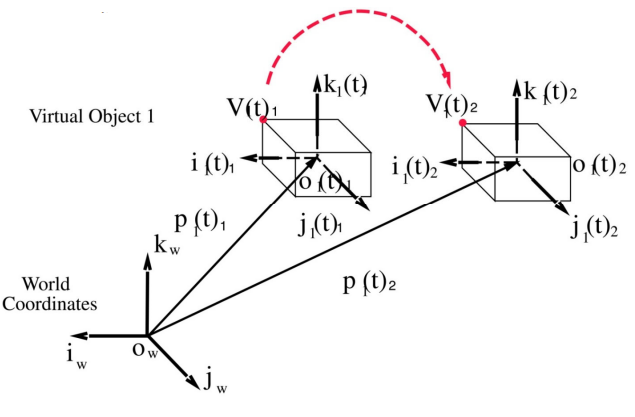

    - 缩放操作也类似，参照CG内容一节。

### 2.3 变换不变量 Transformation Invariants

- 用于追踪虚拟手：$T_{W←hand}(t)=T_{W←source}T_{source←receiver}(t)$
- 抓住物体时，$T_{receiver←object}$不变，因此被抓物体在世界坐标系的运动为：
    - $T_{W←object}(t)=T_{W←source}T_{source←receiver}(t)T_{receiver←object}$

### 2.4 物体层次结构 Object Hierarchies 

- 父级运动传递给子级，反之不成立
- 虚拟手层次：相机 → 世界 → 源 → 手掌 → 各指节 → 指尖
- 好多公式和图，省略了...

### 2.5 3D世界观察（渲染管线）

- **模型变换**：物体坐标 → 世界坐标（可生成多个实例）
- **观察变换**：世界坐标 → 相机坐标（眼空间），相机位于原点，看向 -z
- **投影变换**：透视投影（VR常用），将视景体映射到顶点为(-1,-1,-1)和(1,1,1)的单位立方体，称为**规范视景体** canonical view volume
- **裁剪**：移除立方体外的物体或部分
- **屏幕映射（视口变换）**：平移+缩放，影响x,y，不影响z

## 3. 物理建模 (Physical Modeling)

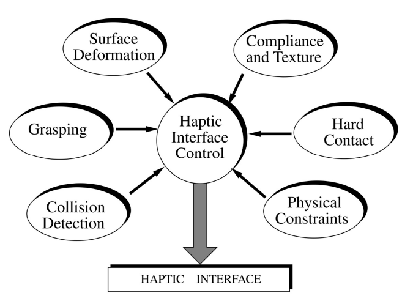

回顾触觉渲染管线

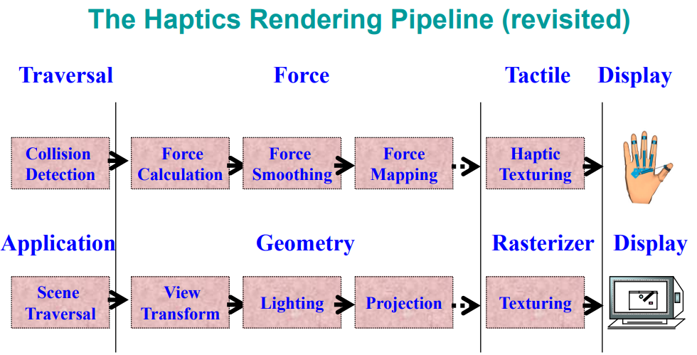

- **碰撞检测 (Collision Detection)**: 使用边界框快速响应，精确检测使用两阶段碰撞检测。

### 3.1 碰撞检测

- 直接多边形相交昂贵 → 使用**包围盒 (bounding box )**（固定尺寸或可变尺寸）

    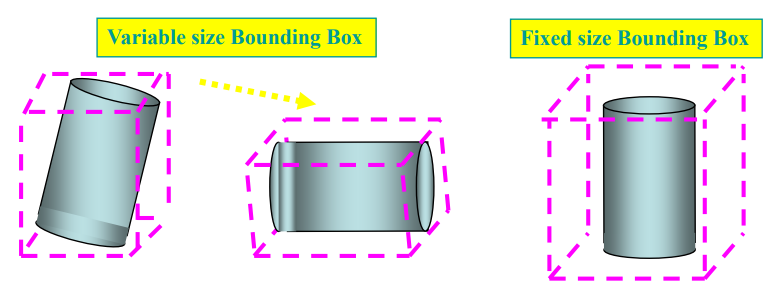

- 两阶段检测：近似（包围盒）→ 精确

    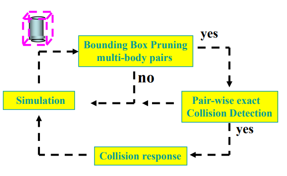

- 未检测碰撞问题：一帧内移动距离超过物体与遮挡物间距

### 3.2 碰撞响应

- **表面切割** Surface Cutting：接触力超过阈值，复制顶点并分离（弹簧/阻尼定律）
- **表面变形** Surface Deformation

### 3.3 力

#### 3.3.1 力计算

- 均匀弹性物体：$F=K⋅d$

- 具有更硬内部的弹性物体：分段线性
    $$
    F=\begin{cases}
    K_1⋅d & 0≤d≤d_{discoutinuity} \\
    K_1⋅d_{discoutinuity} + K_2⋅(d-d_{discoutinuity}) & d_{discoutinuity}＜d
    \end{cases}
    $$
    其中 $d_{discontinuity}$ 是物体刚度变化的点

#### 3.3.2 力平滑

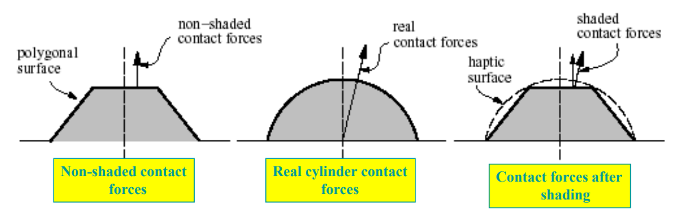

- $$
    F_{smoothed}=\begin{cases}
    K_{object}⋅d⋅\overline{N} & 0≤d≤d_{max} \\
    F_{max}⋅\overline{N} & d_{max}＜d
    \end{cases}
    $$

    其中 $\overline{N}$ 是基于顶点法线插值的接触力方向。

- 触觉网格：多个HIP (触觉交互点 haptic interaction point)，每个计算 $F_{haptic-mesh}=K_{object}⋅d_{mesh}⋅\overline{N}_{surface}$

#### 3.3.3 力映射

* 商用力反馈手套（如CyberGrasp）每根手指只有一个执行器。显示的力计算为：

- $$
    F_{displayed} = (\Sigma F_{haptic-mesh} ) / cos\theta
    $$

    其中 $\theta$ 是网格合力与触觉手套执行器（或图中的活塞）之间的夹角。

    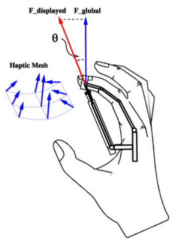

- 力反馈手套（如CyberGrasp）：单执行器/手指，合力投影

### 3.4 触觉纹理

- 触觉鼠标产生触觉图案

- PHANToM表面触觉纹理：$F=A\sin⁡(m\ x)·\sin⁡(n\ y)$

    其中 A, m, n 为常数：A 表示振动幅度，m 和 n 调节 x 和 y 方向的振动频率。

## 4. 行为建模 (Behavior Modeling)

- **自主性级别 (Levels of Autonomy)**: 组件的自主性影响虚拟环境的自主性。

### 4.1 自主级别（LoA）

- 引导式 guided （最低）、编程式 programmed、自主式 autonomous（最高）

    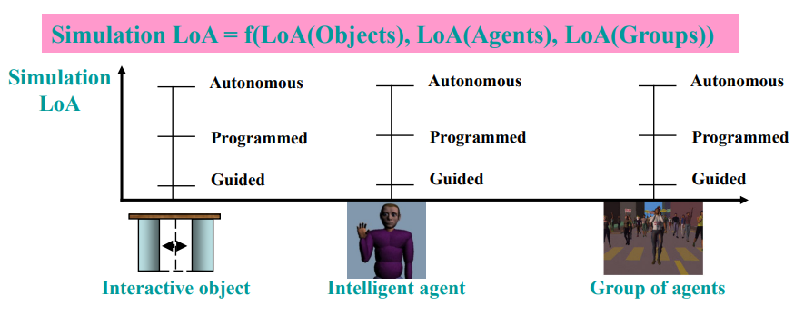

- 模拟自主度 = f(对象自主度, 智能体自主度, 群体自主度)

### 4.2 交互对象

- 独立于用户输入的行为（如时钟、自动门）

    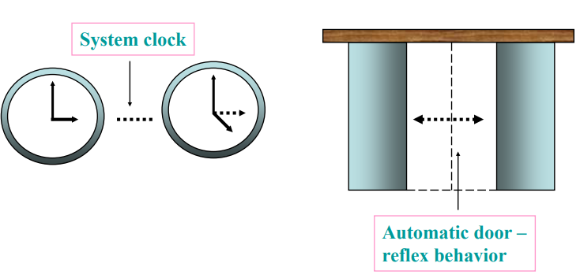

### 4.3 智能体行为

- 组成：感知 perception、情绪 emotions、行为 behavior、动作 actions
- **反射行为**：感知 → 动作（无情绪）
- **情绪行为**：感知 → 主观情绪 → 动作（不同智能体可不同）

### 4.4 人群行为

- **引导式人群**：用户指定路径
- **自主式人群**：群体感知环境并决定路径

## 5. 模型管理 (Model Management)

### 5.1 细节层次 (Level of Detail, LoD)

* **细节层次**: 根据对象与相机的距离选择合适的多边形数量。

    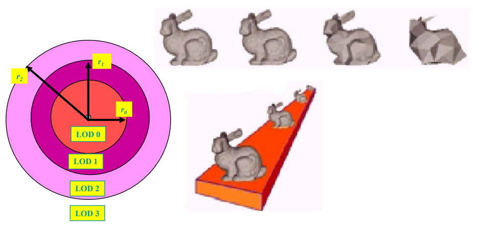

* **静态LoD**：根据距离选择预置模型（离散模型）

    - 问题：距离边界处“跳跃”

    - 解决：模型混合（过渡区同时渲染两个相邻LoD）

        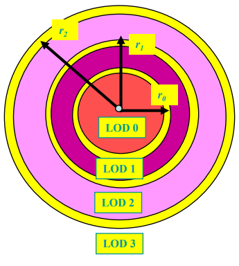

* **几何变形LoD**：单一复杂模型，通过边塌陷/顶点分裂动态调整

    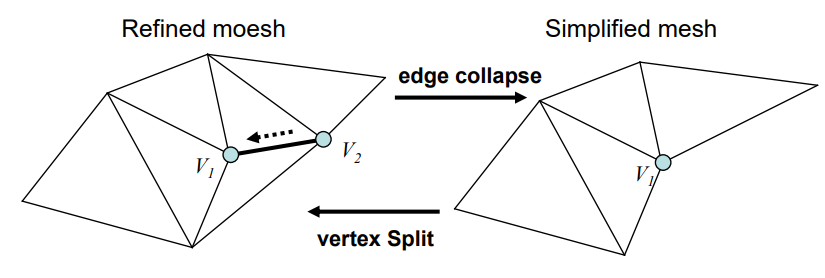

* **自适应LoD**：根据观察者位置和方向局部调整分辨率

### 5.2 时间关键渲染 (Time-Critical Rendering)

* 在给定截止时间内（由帧率决定）尽可能高质量渲染
* 效益-成本分析：每个物体的价值 = 效益 / 成本
    - 成本：多边形数、顶点数、像素数的加权组合
    - 效益：物体大小 × 精度 × 重要性 × 聚焦度 × 运动度 × 滞后
* 优先渲染高价值物体，删除不重要细节以保持恒定帧率

### 5.3 细胞分割 (Cell Segmentation)

- 用于建筑漫游，将大型模型预分割为“细胞”（近似房间）

- 在渲染复杂模型时，保持**交互性 interactivity **和**恒定帧率 onstant frame rates **是必要的。

- 只渲染当前可见的细胞

    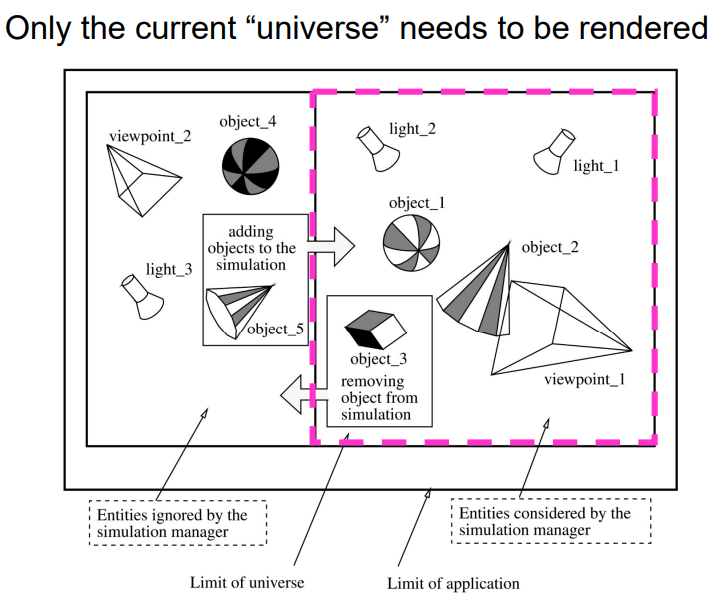

- 结合数据库管理，预取数据，减少页面错误

### 5.4 其他技术

* 光照和凹凸贴图
* 门户（portal）分隔环境区域
