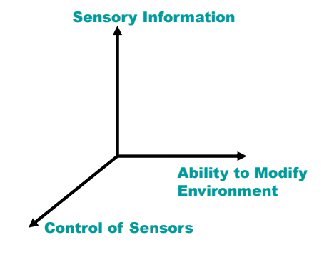

> 第六节课讲了存在感。后期补的内容。第七节讲的是VR应用，这内容全是案例，详见ppt，这里就不补了。

# VR-06 存在感

## 1. 存在感的定义与挑战

- **定义**：在虚拟环境中“身临其境” (feeling of being there) 的感觉
- **挑战**：需说服所有感官（视觉 visual、听觉 audio、触觉 tactile、运动 motion、嗅觉 smell）接受人工环境
- **当前VR局限**：
    - 角色与动作不够逼真
    - 感官信息缺失或错误
    - 传感器与人类能力不匹配
    - 必须佩戴线缆 wire 和小设备 gadget
- 但仍可达成一定程度的存在感

## 2. 开放问题

- 决定存在感的因素是什么？
- 是否存在主观和客观的量化测量方法？

### 2.1 Sheridan（1992）提出的三个物理变量

1. 感官信息范围：可用感官通道数量
2. 对传感器的控制能力：我们能在多大程度上改变传感器输入
3. 修改环境的能力

### 2.2 存在感的测量方法

#### 2.2.1. 主观测量

- 通过问卷让用户自我评分（如1-7分）
- 常见问卷：
    - Witmer & Singer（30+问题）
    - Steed Usoh Slater（7个李克特量表问题）
- 注意事项：仅用于相似环境比较，不适用于AR vs. VR等差异大的环境

#### 2.2.2. 心理物理测量

- 通常，心理物理技术用于将刺激的**物理强度** (physical magnitude) 与观察者对存在感的主观评分联系起来。（如分辨率、延迟）
- 示例：$R=f(S)$ ，其中 $S$ 为屏幕分辨率或延迟时间，$R$ 为1-7分的“在场感”。

#### 2.2.3. 客观测量

- **生理测量**：
    - 心血管、呼吸、紧张感、血液成分等
    - 逼真刺激应引起类似现实中的生理反应
- **表现测量**：
    - 完成任务的时间
    - 比较现实与虚拟环境中的任务表现

#### 2.2.4. 实验示例（综合三种测量）

设计一个实验去测试VR的存在感：

- 主观：事后问卷
- 心理物理：HMD分辨率、视场角、音频质量
- 生理：心率、血压

### 3. 增强存在感的因素

- 高视觉质量 High visual quality
- 大视场角 Large field of view
- 低延迟 Low latency
- 头部追踪 Head tracking
- 多感官刺激（音频、触觉）Multiple senses (Audio, Haptics)
- 交互性 Interactivity
- 能看到自己的身体部位 Able to see the user's own body parts

### 4. 削弱存在感的因素

- 感官不匹配（期望 vs. 体验不一致）Disjoint Senses
- 高延迟 High latency
- 交互性差 Poor interactivity
- 线缆束缚 Cables
- 低质量音频 Low quality audio
- 看不到自己的身体部位 Can't see the user's own body parts
