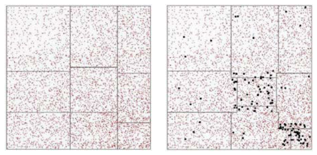
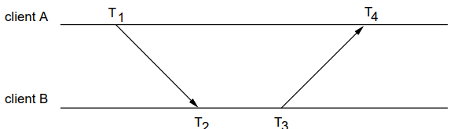

> 这节讲了分布式虚拟环境，其设计面临服务器负载分担、网络延迟及用户交互等一致性问题。通过用户分区、动态分区方法以及运动同步技术（如因果排序、死算和多项式预测器），可以改善 DVE 的性能并提高用户体验。肿么感觉在上操作系统。。。期末考了。

>最近摆烂了，先鸽两节，之后有空再补。🕊

# VR-08 分布式虚拟环境 

## 1. 定义

- **分布式虚拟环境 (Distributed Virtual Environments, DVEs)** 是一个共享的虚拟环境，允许远程用户通过网络与虚拟对象交互或协作完成任务。
- 支持多用户协同完成任务的 DVE 称为协作虚拟环境 (**Collaborative Virtual Environment, CVE**)。

- 主要应用包括：虚拟博物馆、网络游戏、Second Life、元宇宙等。

------

## 2. 多服务器分布式虚拟环境 (Multi-Server DVEs)

- DVEs 强调交互性。

- 在典型的客户端-服务器系统中，单一服务器需要处理所有用户请求，更新虚拟世界对象状态并分发同步信息。

    

- 当用户数量增加时，单一服务器会超载，无法及时响应用户请求。

- 解决方法

    - 增加服务器以分担负载。
    - 分区方法有：用户分区、区域分区、动态分区。

------

### 2.1 用户分区 (User Partitioning)

- **操作方式**：将用户分配到不同的服务器，例如在线游戏。
- **优点**：实现简单。
- **缺点**：不同服务器的用户无法交互，相当于运行了独立的虚拟环境。

------

### 2.2 区域分区 (Region Partitioning)

- **操作方式**：将虚拟环境划分为固定区域，每个区域由一台服务器负责。
- 划分过程在 DVE 开始前完成。
- 用户密集的区域可以分得更细，缺乏用户的区域可以更广泛。
- **问题**：如果某些冷门区域突然变得热门，负责该区域的服务器可能会超载。

------

### 2.3 动态分区 (Dynamic Partitioning)

- **操作方式**

    - 动态实时调整区域大小。
    - 区域负载过大时会切分成更小的区域，负载过小时则合并区域。

- **特性**：通常在相邻服务器之间局部完成分区调整。

- **实现过程**

    1. 超载服务器确定邻近服务器以分担额外负载。
    2. 与邻近服务器通信，根据负载情况进行分配。

- 示例

    - 左图为初始分区，右图展示某些区域在增加用户后动态调整的结果。

        

------

## 3. 运动同步 (Motion Synchronization)

### 3.1 网络延迟的影响 (Impact of Network Latency)

- DVEs 强调实时交互，网络延迟 (Latency) 对其影响很大。
- 示例延迟时间：
    - 本地局域网 (LAN)：0.64 ms
    - 区域互联网 (本地连接)：10 ms
    - 海外互联网 (美国-香港)：160 ms
    - 海外互联网 (英国-香港)：203 ms

### 3.2 分布式系统事件类型

- **离散事件 (discrete events)**：事件发生间隔时间远大于网络延迟，几乎不受网络延迟影响。（如 ATM 操作）
- **连续事件 (continuous)**：事件发生间隔小于网络延迟，网络延迟会显著影响体验。（如 3D 游戏交互）

### 3.3 场景示例：同步问题 

1. 用户 **A** 在时间 $t$ 看到对象位于位置 $p$。
2. 用户 **A** 将对象移动到位置 $p_A$，并立即发送一条更新消息通知用户 **B**。
3. 假设网络延迟为 0.2 秒，用户 **B** 在 $t+0.2$ 才知道对象被移动到 $p_A$ 。
4. 假设用户 **B** 在时间 $t+0.1$ 希望将对象从位置 $p$ 移动到位置 $p_B$。
5. 由于 **B** 的机器并不知道对象本应该位于 $p_A$ ，因此 **B** 成功地将对象从 $p$ 移动到 $p_B$ 。
6. **B** 马上发送更新信息给 **A** 表明这个改变。 

##### **问题 1**

在时间 $t+0.2$，当 **B** 收到来自 **A** 的更新消息，知道 **A** 在时间 $t$ 已将对象移动到 $p_A$，**B** 应该怎么办？

##### **问题 2**

在时间 $t+0.3$，当 **A** 收到来自 **B** 的更新消息，知道 **B** 在时间 $t+0.1$ 将对象移动到了 $p_B$，**A** 应该怎么办？

##### 典型解决方案——回滚 (roll-back)

- 通常的解决方法是将 **A** 视为“胜者”（Winner）。
- 当 **B** 的机器收到 **A** 的更新消息后，需要纠正情况。

- 游戏应用程序会强制将对象从非法位置 $p_B$ 移动到正确位置 $p_A$ 。
- 这种方法显然可能会导致玩家之间出现争议。

### 3.4 延迟同步方法 (Synchronization Techniques)

- 传统方法：因果顺序 (Causal Ordering)
    - 确保事件按照发生顺序执行。
    - **局限**：在多用户实时交互环境中，几乎难以完全实现。
- 对象锁定 (Object Locking)
    - 防止多个用户同时操作同一对象。

### 3.5 死算 (Dead Reckoning)

- 死算是连续事件同步的一种流行方法。
- 操作方式：
    - 发送节点和接收节点使用相同的运动预测模型 (motion predictor)。它根据最后一次更新消息中的数据推测运动对象的位置。该更新消息存储了对象的最后位置以及速度/加速度的信息。
    - 当误差超过允许阈值 (threshold) 时，发送更新消息；否则省略更新消息以节省带宽 (save bandwidth)。

## 4. 运动预测 (Motion Prediction)

在死算方案中，给出对象的最后位置以及速度/加速度，我们需要预测它现在的位置。这就是运动预测，通过以前的信息来更新对象现在的位置。

### 4.1 多项式预测器 (Polynomial Predictors)

- **一阶多项式 (FOP)**： $$ P_{\text{new}} = p + v \cdot t $$ 

- **二阶多项式 (SOP)**： $$ P_{\text{new}} = p + v \cdot t + \frac{1}{2}a \cdot t^2 $$ 

    其中：

    - $p$：最后一次更新的位置。
    - $p_{new}$：预测的位置。
    - $v$：运动速度。
    - $t$：预测时间（延迟）。
    - $a$：运动加速度。

- 多项式预测器通常与**死算 (Dead Reckoning)** 方法结合使用，用于运动预测。

- **优点**：非常简单，计算开销很小。

- **局限性**：它们并不是非常精确的预测工具。它们假定速度 $v$ 和加速度 $a$ 是已知的，并且在预测期间它们保持不变。

- **估算速度 $v$ **：需要收集对象的**两个**之前的位置。

    $$v=\frac{p(t)−p(t−1)}{Δt}$$

- **估算加速度 $a$ **：需要收集对象的**三个**之前的位置。

    $$a=\frac{p(t)−2p(t−1)+p(t−2)}{Δt^2}$$

- 基于这些对象的历史位置，可以求得 $v$ 和 $a$ 。然后将这些信息代入预测器，计算预测的位置。

- 然而，还需要知道网络延迟（即 $t$ 的值）。**网络延迟值**并非恒定，它会随着网络流量的变化而动态变化。

### 4.2 网络延迟估计 (Estimating Network Latency)

- 动态估算方法

    - 客户端发送消息，读取返回的消息，用往返时间 (Round-Trip Time) 计算延迟。 

        $$ \text{latency}_{\text{A→B}} = \frac{\text{RTT}}{2} $$

        

- **局限**：需要双向消息来获取延迟，消耗额外网络资源。

### 4.3 运动预测的问题 (Challenges in Prediction)

- 当对象从静止开始运动时，无法预测其运动轨迹。
- 大多数对象的运动参数（如速度和加速度）会不断变化，导致预测不准确。