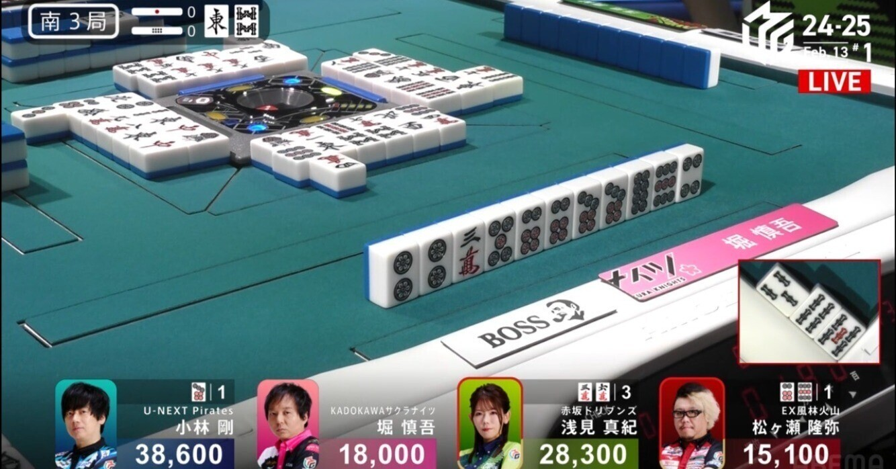
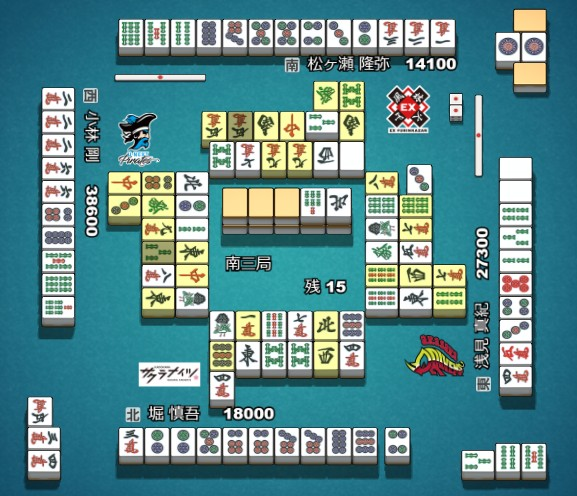
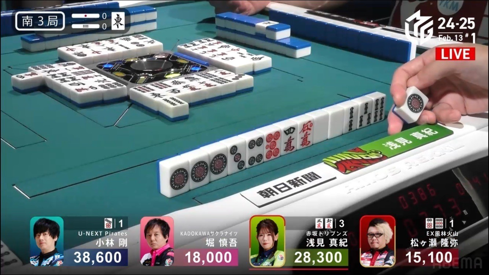
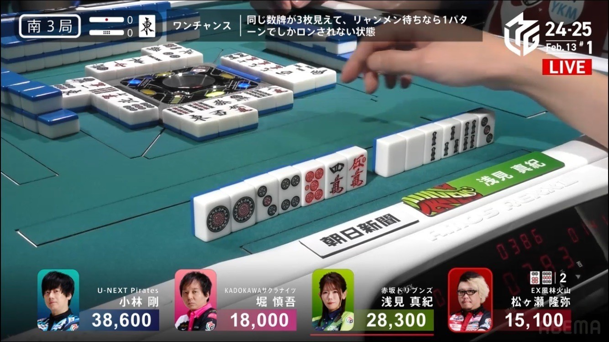
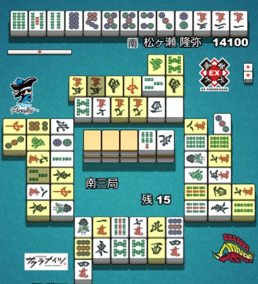
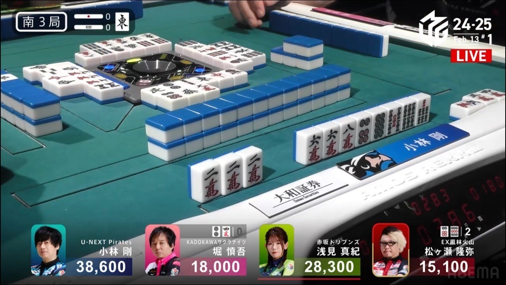
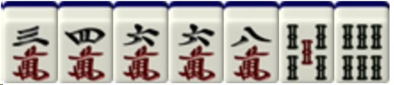
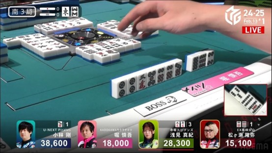
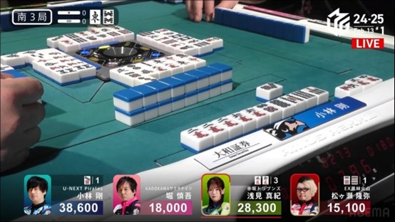

> 这场对局，堀慎吾面对三家围攻，手上没有安牌的情况下，电报了和了打点最低的小林刚选手，为自己后面避四和逆二争夺了机会。转载此文主要用于收藏学习，侵删。

原文链接：https://note.com/fuchan0722/n/nbde58b510bd5

译文链接：https://www.bilibili.com/opus/1034025574272598051

原作者：堀慎吾；译：AA；校对：若葉柚祈老师。

有能力的话，还是去原文链接支持一下新狗:heart_eyes:

提到的人名互译：

小林 刚 - 刚子（刚桑）；浅见 真纪 - 妈咪（浅见桑）；松ヶ瀬 隆弥 - 厨子（松）；

---

## これが地獄か

你好，我是堀。

在前几天的MLeague比赛中，我在比赛中被夹在两面立直和进攻之间，向刚桑放铳了1000点。

今天，我想详细解释一下当时的想法。

顺便说一下，我为什么突然想到要写这样的笔记呢？和平时一样，须田前辈这个对我研究颇为热心的前辈问起了我的想法。像往常一样，我在LINE上记录了当时的想法，结果写着写着发现字数越来越多，完全变成自己写文章的节奏了嘛！

须田前辈把我的想法整理成文字，再加上一些感伤的元素，写成一篇好文章。但问题是，竹◯房从中赚钱，我却一分钱也拿不到！这简直是不可接受的！

我感到非常愤怒。不过，如果仔细想想，这种愤怒可能有10%是因为这件事，而90%是因为我最近运气不好，没中竞马。不，如果考虑到愤怒本身可能也源于竞马的不顺，那么可以说，100%是因为竞马的不顺。

写这篇付费笔记这件事，基本上就等于我在竞马上栽了。我可不是因为生气才写笔记的，真正的原因是我最近在竞马上一直不顺。

首先，请看这个过于恶梦的场景。

场况是，我被两家立直夹在中间，而且场上也有1p的暗杠。更糟糕的是，我的手牌不仅没有一张现物，而且所有牌都不能过两家，简直陷入了地狱般的局面。这难道就是麻将人的墓地吗？

唯一的安慰是，除了红宝牌外，所有的dora已经显露出来了。而且刚子的牌河看起来很像听牌。

要是扑克的话，我肯定直接fold不玩了，但麻将可没这选项，只能一点点分析局势。

首先，妈咪在4位的厨子立直的一发巡就切了5万，然后切了3饼立直，之后又暗杠了1饼。

在这种情况下，我们无法确定1p原本是不是暗刻。可能是从113p摸到1p后听牌，也可能原本就有111p，而3p则是与其他牌组成面子的一部分。

仅凭这些信息，我们无法得到太多线索。但有一点可以确定的是，

从场况看，在厨子立直后一发巡，她打出了5m，而这张牌正好是两家无筋。这表明她很可能有一个比较完整的一向听形状。

也就是说，如果她是以113p的形状摸到1p而听牌的，那么剩下的部分应该是愚形，这意味着另一边的搭子几乎可以确定是两面搭子。

接下来我们来看一下先制立直的厨子

是的，就是这个……没办法，完全没有任何信息。唯一能知道的现物能过，真遗憾。

接下来是刚子。

顺便提一下，在麻将中，相比立直，**副露（吃、碰、杠）能提供更多的信息**。

原因是，门前清时，玩家通常是摸到一张牌后再打出一张，因此如果只是看出牌，很难判断他实际摸到了什么。

而在副露的情况下，会在鸣牌的瞬间就必须打出一张牌。也就是说，我们可以知道他拿到了什么牌，还能判断出哪张牌对他来说已经没用了。这些信息在门前清的情况下是几乎是无法得知的。

刚子用两面的34m吃了5m打出了8m

首先，思考“这张8m是什么？”是解读对手手牌时的最基本思路。如果详细分类的话，可能会有各种情况，但大致来说，只有以下三种可能性：

1. 关联牌

2. 安全牌，或者是手牌的形状已经确定了，只是根据安全度的优先级有意保留，或者说是无奈之下留下的牌

3. 虽然没有直接关联，但为了形成新的好搭子而保留的孤立牌。

基本上就是这三种情况，有时1和2的因素会同时存在，或者2和3的因素同时存在。

而这次刚子的情况，他在切8m之前先切了发，这是一张相对安全的现物牌，并且在这之前还切了6p这张孤牌，而6p比8m更优秀。

此外，他还吃了5m。如果他手里持有5678m这样的连搭，那么6p比8m更有价值作为孤张，这种可能性可以排除。

也就是说，上述三种分类中的2和3的情况被完全否定了，因此可以**100%确定这是关联牌**。

接下来就要思考它与什么有关。

由于7m现了3张，并且他用34m吃了5m，然后切了8m，所以很容易想到他可能持有两张6m，形成了668m的形状。

换句话说，他副露前的手牌形状很可能是34668m。

顺便说一下，以这种情况作为例子，假设：

这种25m和47s两面听牌的情况，基本上这个8m是不需要的，因此不会特意留下8m而去切掉更安全的发。

之所以特意加上“基本上”，是因为在某些特殊情况下是有可能发生的。

比如，当其中一组两面搭子非常弱的时候。

例如，如果摸到7m，可能会选择放弃薄弱的两面搭子，或者切掉6m，转为单骑听牌，这就是一种例外情况。

同样，如果56s部分是愚形搭子，那么也可能会出现类似的情况。

但这次，8s已经现了4张，且切了2p、6p、3s等，这些信息表明并不存在愚形搭子的部分。

为了让初学者也能理解，我来进一步解释：

在这种情况下，从34668万46饼或68饼这样的手牌中，是不会切掉6饼的。因为在这种情况下，8万是为了优化手牌形状而保留的牌，但如果在此时反而破坏手牌形状，就变成了让人费解的选择。

除非8m特别安全，否则这种情况不会发生。而这次，在切6p的时候，8m并不是一张安全的牌，因此可以断定，手牌中并不存在筒子的愚形搭子。

同样，索子方面，已经切了23s，且8s已经出现了4张，因此从**34668m 357s**这样的手牌中，几乎不会选择留下8m而切掉3s，从而缩小自己的听牌范围。所以，索子方面也几乎不存在坎张的愚形搭子。

更何况，即使存在愚形搭子，也不一定会选择留下8m。

虽然前面的说明有点长，但通过以上分析，可以推测8m是从**668m**中切掉的。所以，第一步就是去想6m会不会是双碰待牌。

是的，接下来就要用到我常说的双碰的另一边是？这个思考方式。在这种情况下，只有三种可能性。

是5s、7s、白板这三种。

为了方便初学者理解，我再详细解释一下。

初学者可能会想，如果某张牌只出现了两张，那么是不是任何牌都有可能作为双碰呢？比如5饼或7饼，如果手牌是34668万556p或者34668万677饼的一向听，那么除非做了奇怪的选择，比如特意切掉6饼，否则这种情况是不存在的。当然，正常情况下会切掉8万来保留两面听，对吧？

即使8m是安全牌，如果要保留它，也一定会确保两面听的形状。

那么4饼或8饼呢？这种情况也基本上不存在。因为切掉6饼的时候，7万已经切了两张。如果手牌是34668m446p或34668m688p，而7万已经切了两张，且5饼或7饼没有被切掉，那么正常情况下应该切掉8万，而不是6饼。

当然，这次的情况是6p和8m的安全性有所差异，并且4位的上家已经切掉了7m，基本可以预期他会继续切7m，因此不能说完全没有可能，但从概率上来看，这种情况仍然较低。

回到正题，我之前提到6m的双碰只有三种可能性，但这三种候选牌（5s、7s、白）中，白板之外的两张都只出现了一枚，并且是较为常见的搭子牌，因此概率相对较低。

另外，如果以5s或7s作为听牌目标，那么手牌的结构会变得非常局促和受限。

例如，若通过345m吃牌形成一组，再加上66m和55s两组，那么手牌的剩余部分会极为受限，因此这种可能性较低。

所以，我的第一反应是：刚桑可能是跟白组成双碰。

然而，双碰的待牌候选牌很少，仅凭这一点还不足以作为选择切牌的判断依据，因此我决定进一步关注其他可能性。

也就是说，是否有其他原因导致他留下了8m。想到这里，我脑海中浮现出了两种可能性：

第一种：**8m并不是668m的一部分，而是作为坎张的辅助牌的唯一一种情况，即手牌是344568m。**

第二种：**情况是，虽然手牌包含668m，但7m成为了关键进张，即手牌形态为22234668m。**

**存在这两种牌型真的很重要，因为原本在麻将中，去读这种用了很多张牌的牌型并不是有效的做法。**

**读牌是在可能成立的牌型越多，实际越容易真的读对牌型，而能被特定到的牌越多，这种牌型实际出现的概率越低。**

**依赖这种读牌，本质上就是依赖不确定的东西，这通常被称为“主观臆断”**

 

然而，这次的情况比较特殊：双碰听牌的候选牌很少，而且从枚数上来讲能用的牌不多，再加上在使用特定牌的数量较多的情况下，能够发现两种稀有的听牌形状，这一点非常重要。

为什么重要呢？因为如果刚桑的手牌是这两种形状之一，那么当他听牌时，除非是白板后付，否则几乎可以肯定他的听牌是6p的周围牌。原因很简单，因为其他几乎所有牌对小林刚来说都是安全的。

有人可能会问：“这有什么重要的？”

其实，在这个局面下，如果能通过点炮来结束这一局，我会非常乐意这么做。

我已经无法和牌了，如果让竞争对手和牌，我的局势只会更糟。现在我还面对着一个包含暗杠的两家立直的局面，而我的手牌简直是地狱一般。”

再看一下地狱吧（bushi）

进一步来说，如果小林刚的待牌是6P周围的牌话，那么这意味着从我的视角来看，6p已经出现了4张，7p变成了no chance，至少对于好型率很高的妈咪来说，7p不会成为铳牌。

假设小林刚是白板的后付，从手牌构成上来说，他很有可能持有另一张6p。此时，对我而言最好的结果就是让小林刚胡牌……怀抱着一丝希望，我切出了7p。拜托了 刚桑！希望能和到这张牌。

就算刚桑没和到，也希望不要从其他家哪里听到胡！的声音……拜托了……我闭上眼睛，切出了寄托着希望的7p。

「ロン」

我猛地一惊，但那声音源头毫无疑问是没有任何感情的机器人声音。

果然，麻将是戒不掉的啊

---

因为赛马失利，生气地来写付费专栏的hori真可爱呢！

想起第一次去赛马，哈哈挑的马跑了倒数第一，倒一也是一啊！当时和朋友算，14中1的概率已经是赛马里最高的了，大概是百分之7。买前三的组合的概率也很小，$C_{14}^3=\frac{1}{364}$，大约只有千分之2而已！当然，赛马有很多其他因素可以参考，但从概率上讲，咱们还是远离赌博 😄

回到这篇文章。当时看比赛直播的时候，觉得他好幸运，点了个最小的。没想到背后竟然有如此多的思考，而且这一打竟然是电报，真的很佩服。麻将真的很有趣！